# Introducción {#intro}


## Teoría de conjuntos

::: {.definition #unnamed-chunk-1}
Un **conjunto** es una colección bien definida de objetos, llamados sus elementos. Los conjuntos se simbolizan con letras mayúsculas $A$, $B$, $...$ Los objetos que componen el conjunto se denominan elementos y se denotan con letras minúsculas $a, b, ...$  [Tomado de [@zill2012algebra] pág $21$]
:::


::: {.definition #unnamed-chunk-2}
Para definir un **conjunto por extensión**, se enumeran todos sus elementos separándolos por comas y luego se encierran entre llaves. 

Para escribir un **conjunto por comprensión** se elige un elemento arbitrario $x$ y se señala que cumple la propiedad $P(x)$. Finalmente, se encierra toda la expresión entre llaves. [Tomado de [@zill2012algebra] pág $22$]
:::

$$
A=\{ x | x \ \ \text{cumple la propiedad} \ \ P(x)   \}
$$

::: {.definition #unnamed-chunk-3}
Diremos que dos conjutnos $A$ y $B$ son iguales si tienen los mismos elementos. Para indicar que $A$ y $B$ son iguales se escribe:[Tomado de [@zill2012algebra] pág $22$]
:::

$$
A=B
$$

::: {.remark}
Un conjunto que posee un número finito de elementos; se llaman **conjuntos finitos**.
  
Un conjunto que no tiene un número finito de elemenos se llaman **conjunto infinito**.

[Tomado de [@zill2012algebra] pág $23$]

:::


::: {.definition #unnamed-chunk-5}
El número de elementos de un conjunto finito es lo que se llama la **cardinalidad** de dicho conjunto. La cardinalidad de un conjunto finito $A$ se denota por: [Tomado de [@zill2012algebra] pág $24$]

:::


$$
Card(A) \ \ \ \text{ó}  \ \ \ |A|
$$

::: {.definition #unnamed-chunk-6}
Dos conjuntos finitos $X$ y $Y$ se dicen ser **equipotentes** si tienen exactamente el mismo número de elementos. [Tomado de [@zill2012algebra] pág $24$]
:::


::: {.definition #unnamed-chunk-7}
Un conjunto se dice **vacío** si no posee elementos. El conjunto vacío se denota como:
:::

$$
\{ \} \ \ \ \text{ó}  \ \ \ \Phi
$$

::: {.definition #unnamed-chunk-8}
El conjunto **universal** se define como el conjunto que posee todos los elementos de todos los conjunots, y se denota como:[Tomado de [@zill2012algebra] pág $25$]
:::

$$
\text{Conjunto universal:} \ \ \ U
$$

::: {.definition #unnamed-chunk-9}
Si cada elemento de un conjunto $A$ es también elemento de un conjunto $B$, entonces se dice que $A$ es un subconjunto de $B$. Se dice también que $A$ está contenido en $B$ o que $B$ contiene a $A$. La relación de subconjunto se denota como: [Tomado de [@zill2012algebra] pág $25$]
:::

$$
A \subset B  \ \ \ \text{ó}  \ \ \ B \supset A
$$


$$
A \subset B \ \  \ \text{si y sólo si  } \ \  \  \ \text{Para todo } x,  \ \  \ \ \  x \in A \ \  \ \text{entonces } \ \  \  x \in B
$$


<div class="figure" style="text-align: center">
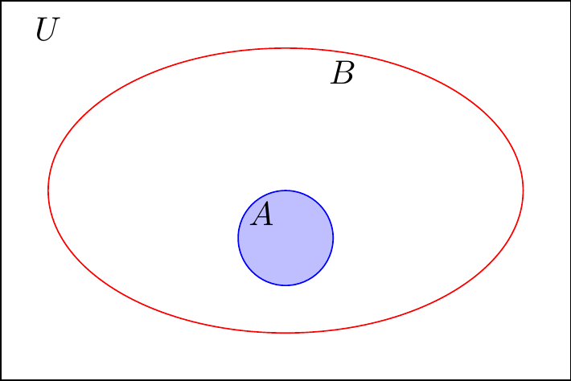
<p class="caption">(\#fig:SubConjuntos2A)Inclusión de conjuntos</p>
</div>


<!-- ```{r Figconjunto1, fig.cap="Relación de subconjunto [Imagen tomada de [@zill2012algebra] pág $26$]", fig.align='center' ,echo=FALSE, message=FALSE,  warning=FALSE} -->
<!-- 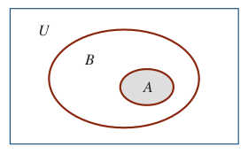 -->
<!-- ``` -->


::: {.definition #unnamed-chunk-10}
La unión de dos conjuntos $A$ y $B$ consta de todos los elementos que pertenecen a $A$ o a $B$. La unión de $A$ y $B$ se denota por $A \cup B$. [Tomado de [@zill2012algebra] pág $31$]

:::


$$
A \cup B = \{ x | x \in A \ \text{o} \ x \in B\}
$$


<!-- ```{r figConjunto1, echo=FALSE, message=FALSE,  warning=FALSE,  fig.height=2,fig.width=2,fig.align='center'} -->
<!-- library(venn) -->
<!-- venn("A+B", -->
<!--      lwd= 2, -->
<!--          sncs = 2, -->
<!--          ilcs = 2, -->
<!--          zcolor = "style") -->
<!-- text(899,1073,"U",col="blue",cex = 1.57) -->

<!-- ``` -->


<div class="figure" style="text-align: center">
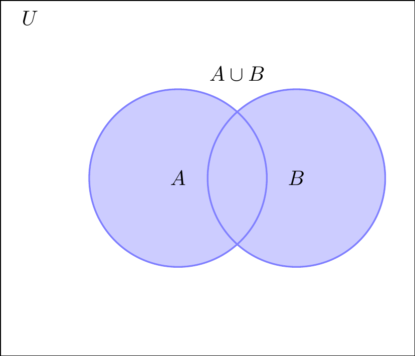
<p class="caption">(\#fig:Conjuntos2A)Unión de conjuntos</p>
</div>


<!-- ```{r FigUnionA, fig.cap="Relación de subconjunto [Imagen tomada de [@zill2012algebra] pág $32$]", fig.align='center' ,echo=FALSE, message=FALSE,  warning=FALSE} -->
<!-- 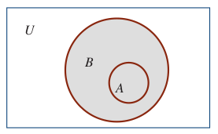 -->
<!-- 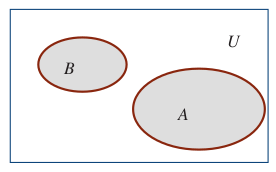 -->
<!-- 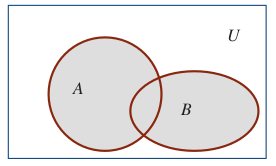 -->
<!-- ``` -->

<!-- ## Propiedades de la Unión -->


<!-- ```{r PropiedadesUnion, fig.cap="Propiedades de la unión [Imagen tomada de [@zill2012algebra] pág $32$]", fig.align='center' ,echo=FALSE, message=FALSE,  warning=FALSE} -->
<!-- 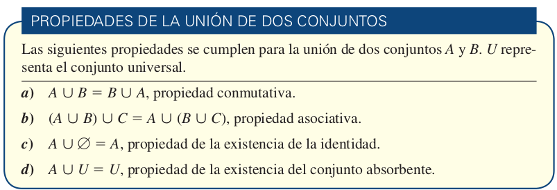 -->
<!-- ``` -->


<br></br>


## Propiedades de la Unión


\[
\begin{matrix}
(a) & A \cup B = B \cup A & \text{propiedad conmutativa}  \\
(b) & (A \cup B) \cup C = A \cup (B \cup C) & \text{propiedad asociativa}  \\
(c) & A \cup \Phi = A  & \text{propiedad de la existencia para la identidad}  \\
(d) & A \cup U = U & \text{propiedad de la existencia del conjunto absorbente}  
\end{matrix}
\]


<br></br>


::: {.definition #unnamed-chunk-11}
La intersección de dos conjuntos $A$ y $B$ consta de todos los elementos que pertenecen a $A$ y a $B$. La intersección de $A$ y $B$ se denota por $A \cap B$. [Tomado de [@zill2012algebra] pág $30$]

:::


$$
A \cap B = \{ x | x \in A \ \text{y} \ x \in B\}
$$


<!-- ```{r figConjunto2, echo=FALSE, message=FALSE,  warning=FALSE,  fig.height=2,fig.width=2,fig.align='center'} -->
<!-- library(venn) -->
<!-- venn("AB", -->
<!--      lwd= 2, -->
<!--          sncs = 2, -->
<!--          ilcs = 2, -->
<!--          zcolor = "style") -->
<!-- text(899,1073,"U",col="blue",cex = 1.57) -->

<!-- ``` -->


<div class="figure" style="text-align: center">
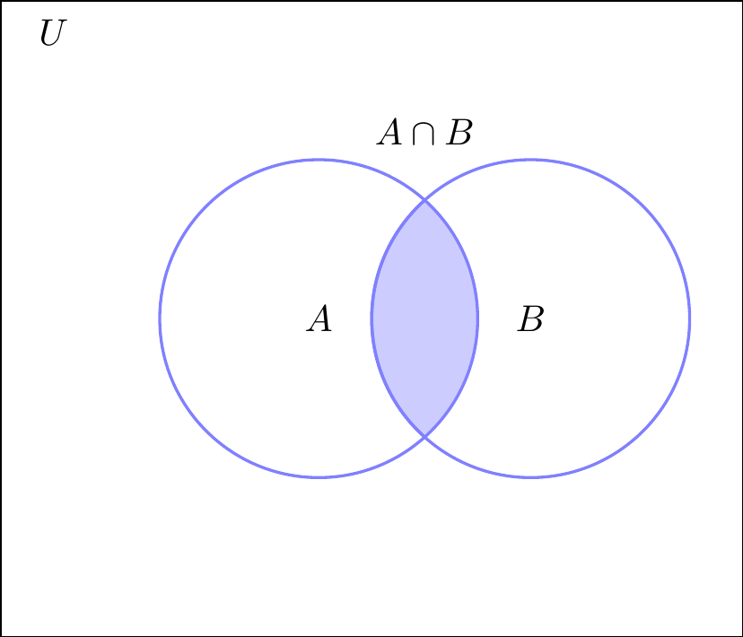
<p class="caption">(\#fig:Conjuntos2E)Intersección de conjuntos</p>
</div>


<!-- ```{r FigInterseccion, fig.cap="Intersección de conjuntos [Imagen tomada de [@zill2012algebra] pág $30$]", fig.align='center' ,echo=FALSE, message=FALSE,  warning=FALSE} -->
<!-- 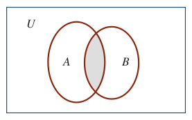 -->
<!-- ``` -->


<!-- ## Propiedades de la Intersección -->


<!-- ```{r PropiedadesInterseccion, fig.cap="Propiedades de la intersección [Imagen tomada de [@zill2012algebra] pág $30$]", fig.align='center' ,echo=FALSE, message=FALSE,  warning=FALSE} -->
<!-- 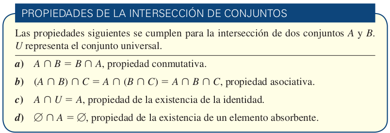 -->
<!-- ``` -->


<br></br>


## Propiedades de la Intersección

\[
\begin{matrix}
(a) & A \cap B = B \cap A & \text{propiedad conmutativa}  \\
(b) & (A \cap B) \cap C = A \cap (B \cap C) & \text{propiedad asociativa}  \\
(c) & A \cap U = A  & \text{propiedad de la existencia para la identidad}  \\
(d) & A \cap \Phi = \Phi & \text{propiedad de la existencia del conjunto absorbente}  
\end{matrix}
\]


<br></br>


## Propiedades de la unión y la intersección


<!-- ```{r FigUI, fig.cap="Propiedades de la unión y la intersección [Imagen tomada de [@zill2012algebra] pág $33$]", fig.align='center' ,echo=FALSE, message=FALSE,  warning=FALSE} -->
<!-- 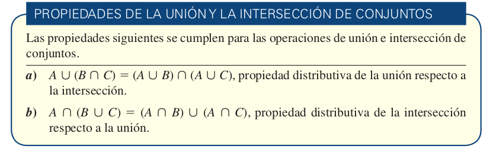 -->
<!-- ``` -->


\[
\begin{matrix}
(a) & A \cup (B \cap C) = (A \cup B) \cap (A \cup C) & \text{prop dist de la unión respecto a la intersección}  \\
(b) & A \cap (B \cup C) = (A \cap B) \cup (A \cap C) & \text{prop dist de la intersección respecto a la unión}
\end{matrix}
\]


<br></br>


## Diferencia entre dos conjuntos

::: {.definition #unnamed-chunk-12}
La diferencia de dos conjuntos $A$ y $B$ consta de todos los elementos que pertenecen a $A$ y no pertenecen a $B$. La diferencia de $A$ y $B$ se denota por $A - B$. [Tomado de [@zill2012algebra] pág $34$]

:::


$$
A - B = \{ x | x \in A \ \text{y} \ x \notin B\}
$$


<!-- ```{r figConjunto3, echo=FALSE, message=FALSE,  warning=FALSE,  fig.height=2,fig.width=2,fig.align='center'} -->
<!-- library(venn) -->
<!-- venn("A~B", -->
<!--      lwd= 2, -->
<!--          sncs = 2, -->
<!--          ilcs = 2, -->
<!--          zcolor = "style") -->
<!-- text(899,1073,"U",col="blue",cex = 1.57) -->

<!-- ``` -->


<div class="figure" style="text-align: center">
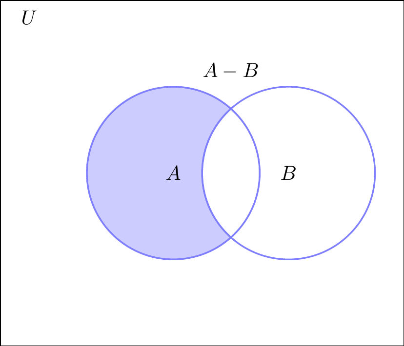
<p class="caption">(\#fig:Conjuntos2C)Diferencia de conjuntos</p>
</div>


$$
B - A = \{ x | x \in B \ \text{y} \ x \notin A\}
$$


<div class="figure" style="text-align: center">
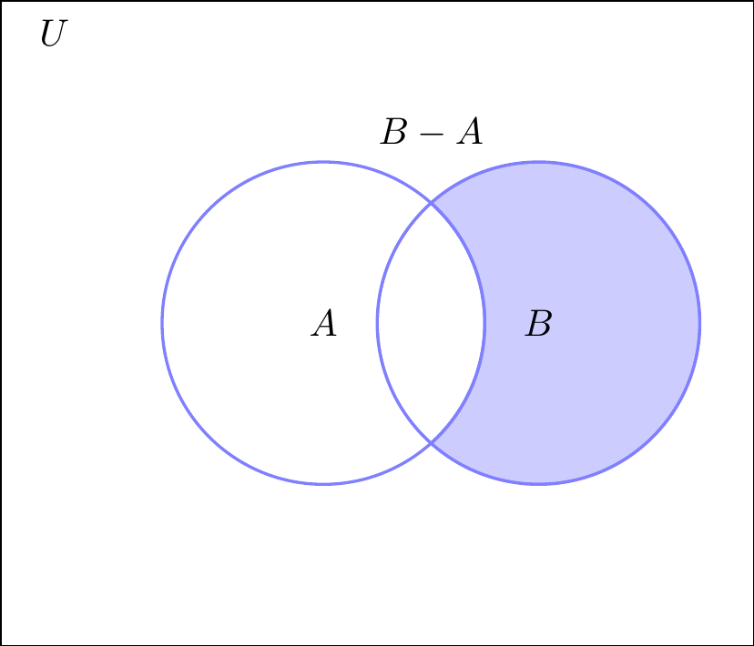
<p class="caption">(\#fig:Conjuntos2B)Diferencia de conjuntos</p>
</div>


<!-- ```{r FigDif, fig.cap="Diferencia entre conjuntos [Imagen tomada de [@zill2012algebra] pág $34$]", fig.align='center' ,echo=FALSE, message=FALSE,  warning=FALSE} -->
<!-- 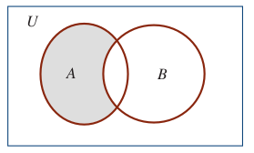 -->
<!-- ``` -->


## Complemento de un conjunto

::: {.definition #unnamed-chunk-13}
El complemento de un conjunto $A$ consta de todos los elementos del universo $U$, y que no pertenecen a $A$. El complemento de $A$ se denota por $A^{c}$. [Tomado de [@zill2012algebra] pág $34$]

:::


$$
A'=A^{c} = \{ x | x \notin A \}
$$


<div class="figure" style="text-align: center">
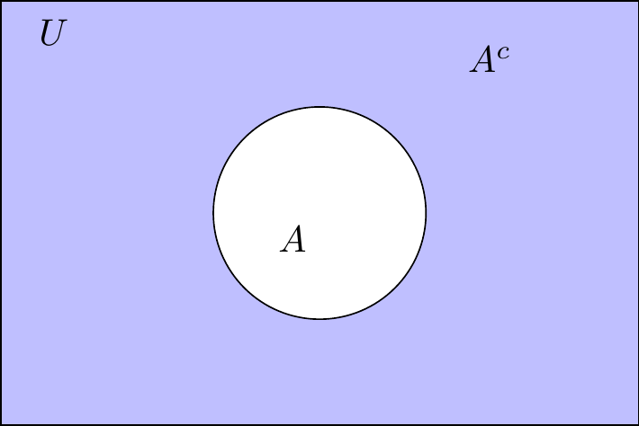
<p class="caption">(\#fig:Complemento0)Complemento de un conjunto</p>
</div>


<!-- ```{r figConjunto4, echo=FALSE, message=FALSE,  warning=FALSE, fig.height=2,fig.width=2,fig.align='center'} -->
<!-- library(venn) -->
<!-- venn("~A", -->
<!--      lwd= 2, -->
<!--          sncs = 2, -->
<!--          ilcs = 2, -->
<!--          zcolor = "style") -->
<!-- text(899,1073,"U",col="blue",cex = 1.57) -->

<!-- ``` -->


<!-- ```{r FigComplemento, fig.cap="Complemento de un conjunto [Imagen tomada de [@zill2012algebra] pág $34$]", fig.align='center' ,echo=FALSE, message=FALSE,  warning=FALSE} -->
<!-- 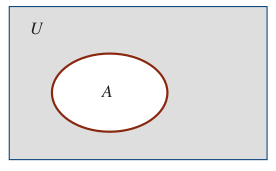 -->
<!-- ``` -->


<br></br>


## Diferencia simétrica de dos conjuntos

::: {.definition #unnamed-chunk-14}
La diferencia simétrica entre dos conjuntos $A$ y $B$ se define como el conjunto de todos los elementos del universo $U$, que pertenecen a $(A-B) \cup (B-A)$.

:::


<div class="figure" style="text-align: center">
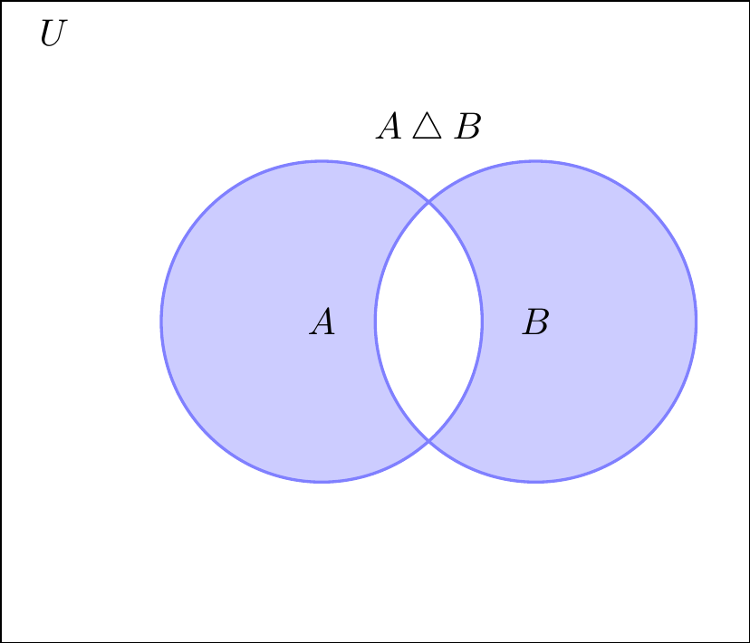
<p class="caption">(\#fig:Conjuntos2D)Diferencia simétrica de conjuntos</p>
</div>


<br></br>


## Propiedades del algebra de conjuntos


<!-- ```{r FigPropiedadesGeneral, fig.cap="Leyes del algebra de Conjuntos [Imagen tomada de [@zill2012algebra] pág $36$]", fig.align='center' ,echo=FALSE, message=FALSE,  warning=FALSE} -->
<!-- 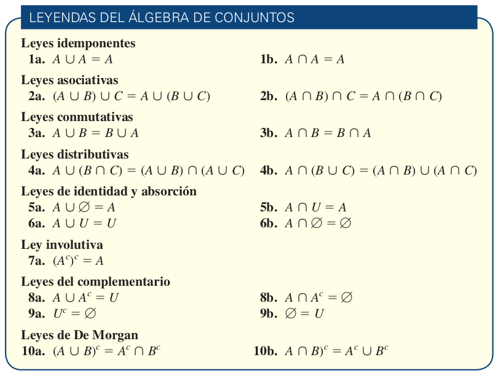 -->
<!-- ``` -->

\begin{equation}
\begin{matrix}
\text{Leyes de idemponentes} & &\\
(1a) \ \ A \cup A = A & (1b) \  \  A \cap A = A &\\
& & &\\

\text{Leyes asociativas} & &\\
(2a) \ \ (A \cup B) \cup C = A \cup (B \cup C) & (2b) \  \  (A \cap B) \cap C = A \cap (B \cap C) &\\
& & &\\

\text{Leyes conmutativas} & &\\
(3a) \ \ A \cup B = B \cup A & (3b) \ \ A \cap B = B \cap A &\\
& & &\\

\text{Leyes distributivas} & &\\
(4a) \ \ A \cup (B \cap C) = (A \cup B) \cap (A \cup C) & (4b) \ \ A \cap (B \cup C) = (A \cap B) \cup (A \cap C) &\\
& & &\\

\text{Leyes de identidad y absorción} & &\\
(5a) \ \ A \cup \Phi = A  & (5b) \ \ A \cap U = A &\\
(6a) \ \ A \cup U = U  & (6b) \ \ A \cap \Phi = \Phi &\\
& & &\\

\text{Ley involutiva} & &\\
(7a) \ \ (A^{c})^{c}=A & &\\
& & &\\

\text{Leyes del complementario} & &\\
(8a) \ \ A \cup A^{c} = U  & (8b) \ \ A \cap A^{c} = \Phi &\\
(9a) \ \ U^{c}  = \Phi  & (9b) \ \ {\Phi}^{c} = U \\
& & &\\

\text{Leyes de De Morgan} & &\\
(10a) \ \ (A \cup B)^{c}  = A^{c} \cap B^{c}  & (10b) \ \ (A \cap B)^{c} = A^{c}\cup B^{c}
\end{matrix}
\end{equation}


<br></br>


### Actividad Geogebra: Operaciones con conjuntos


Esta es una aplicación que muestra graficamente las operaciones entre tres conjuntos, el Autor:LikitMaths (https://www.geogebra.org/m/QWS4wDtE) las elaboro usando geogebra.

<!-- https://www.geogebra.org/m/QWS4wDtE -->


<meta name=viewport content="width=device-width,initial-scale=1">
<meta charset="utf-8"/>
<script src="https://www.geogebra.org/apps/deployggb.js"></script>
<div id="ggb-elementConjuntosA1"></div> 
<script>  
       var ggbAppConjuntosA1 = new GGBApplet({"material_id":"QWS4wDtE",
       "width": 800,
       "height": 400,
       "showToolBar": false,
       "showAlgebraInput": false,
       "showMenuBar": false },
       true);
       
         window.addEventListener("load", function() {  
           ggbAppConjuntosA1.inject('ggb-elementConjuntosA1');
      });
</script>


## Ejemplo1 


<div class="figure" style="text-align: center">
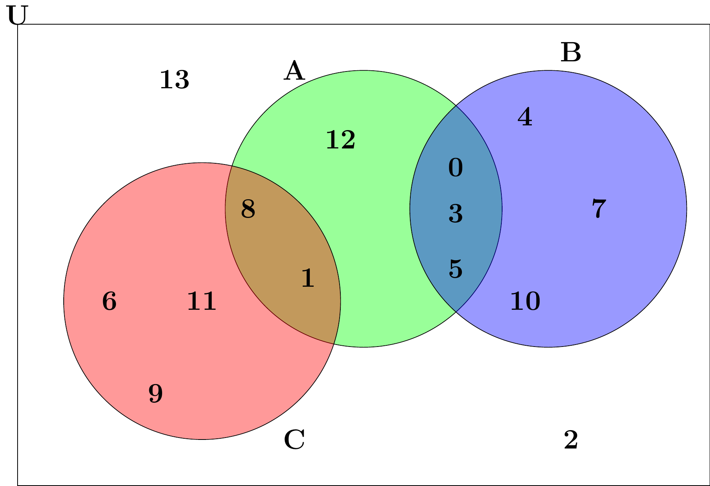
<p class="caption">(\#fig:Conjuntos3b)Ejemplo de operaciones entre conjuntos</p>
</div>


<!-- ```{r FigEjConjunto1, fig.cap="Ejemplo 1 de conjuntos [Imagen tomada de [@zill2012algebra] pág $33$]", fig.align='center' ,echo=FALSE, message=FALSE,  warning=FALSE, out.width = "40%"} -->
<!-- 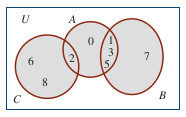 -->
<!-- ``` -->

A partir de la figura \@ref(fig:Conjuntos3b), obtener la solución a los enunciados de conjuntos

* Obtener $A \cup B=?$

* Obtener $A \cup C=?$

* Obtener $C \cup B=?$

* Obtener $A \cap B=?$

* Obtener $A \cap C=?$

* Obtener $C \cap B=?$

* Obtener $A - B=?$

* Obtener $B - A=?$

* Obtener $A - C=?$

* Obtener $C - B=?$

* Obtener $B - C=?$

* Obtener $(A\cap B) - C=?$

* Obtener $(C\cap B) - A=?$


## Ejemplo2 


<div class="figure" style="text-align: center">
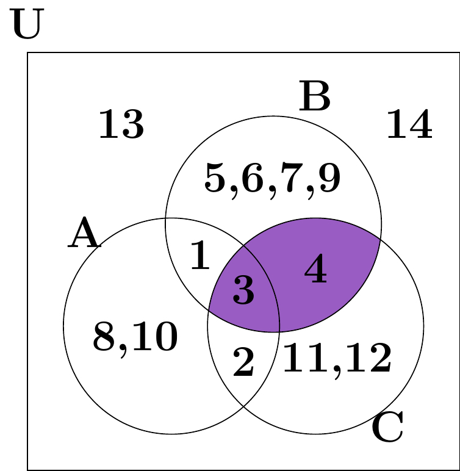
<p class="caption">(\#fig:FigEjConjunto2)Ejemplo de operaciones entre conjuntos</p>
</div>


<!-- ```{r FigEjConjunto2, fig.cap="Ejemplo 2 de conjuntos [Imagen tomada de [@zill2012algebra] pág $35$]", fig.align='center' ,echo=FALSE, message=FALSE,  warning=FALSE, out.width = "40%"} -->
<!-- 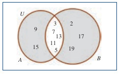 -->
<!-- ``` -->


A partir de la figura \@ref(fig:FigEjConjunto2), obtener la solución a los enunciados de conjuntos

* Obtener $A \cup B=?$

* Obtener $A \cap B=?$

* Obtener $A - B=?$

* Obtener $B - A=?$

* Obtener $B^{c} - A=?$

* Obtener $B^{c} - A^{c}=?$

* Obtener $(C \cap A  \cap B)^{c}=?$

* Obtener $(C \cup A)^{c}=?$

* Obtener $(C \cup B)^{c}=?$


## Ejemplo3 

<div class="figure" style="text-align: center">
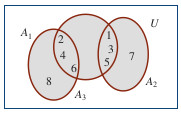
<p class="caption">(\#fig:FigEjConjunto3)Ejemplo 3 de conjuntos [Imagen tomada de [@zill2012algebra] pág $33$]</p>
</div>


A partir de la figura \@ref(fig:FigEjConjunto3), obtener la solución a los enunciados de conjuntos

* Obtener ${\bigcup}_{i=1}^{2}A_{i} =?$

* Obtener ${\bigcap}_{i=2}^{3}A_{i} =?$

* Obtener ${\bigcup}_{i=1}^{3}A_{i} =?$

* Obtener ${\bigcap}_{i=1}^{2}A_{i} =?$

* Obtener ${\bigcap}_{i=2}^{3}A'_{i} =?$

* Obtener ${\bigcap}_{i=1}^{3}A_{i} =?$

* Obtener $\left({\bigcup}_{i=1}^{2}A_{i}\right) - A_3=?$

* Obtener $A_1-\left({\bigcup}_{i=2}^{3}A_{i}\right)=?$


## Ejemplo4 


De un grupo de 80 personas de las cuales se tiene información de que 27 leían la revista A, pero no leían la revista B; 26 leían la revista B, pero no la C; 19 leían C pero no A; 2 las tres revistas mencionadas. ¿Cúantos preferían otras revistas?


<div class="figure" style="text-align: center">
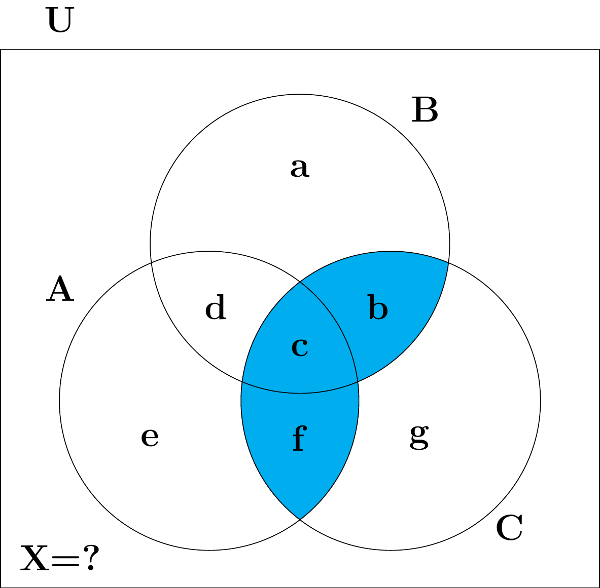
<p class="caption">(\#fig:ConjuntosProblema0)Gráfica para el planteo</p>
</div>


**Planteo y solución de la ecuación: **


A partir de la figura \@ref(fig:ConjuntosProblema0), y usando los conceptos de cardinalidad para un conjunto se logra obtener el sistema de ecuaciones:


\begin{equation}
\begin{split}

(1)\ \ \ 80 & = & \ \ a + b + c + d + e + f + g + X \\

(2)\ \ \ 27 & = & \ \  e + f \ \ \ \text{leían la revista A pero no la B}\\

(3)\ \ \ 26 & = & \ \  a + d \ \ \ \text{leían la revista B pero no la C}\\

(4)\ \ \ 19 & = & \ \  b + g \ \ \ \text{leían la revista C pero no la A}\\

(5)\ \ \ 2 & = & \ \  c \ \ \ \text{leían las tres revistas}\\

& & \text{sustituyendo } (2) , (3), (4), (5) \ \ \text{en } \ \ (1) \ \ \text{se tiene:}\\

80 & = & \ \  (e + f) + (a + d) + (b + g) + c + X\\

80 & = & \ \  27 + 26 + 19 + 2 + X\\

80 & = & \ \  74 + X\\

X & = & \ \  80 - 74\\

X & = & \ \  6

\end{split}
\end{equation}


**Respuesta: ** Son 6 el número de personas que preferían leer otras revistas.


## Ejemplos de cardinalidad

Suponer que para cada uno de los siguientes ejmplos el cardinal del universo (e.d $U$ ) es la suma de las magnitudes que representan los números en la gráfica.


### Primer ejemplo dos conjuntos


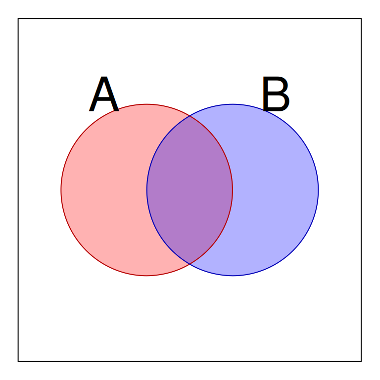


A partir de la gráfica, obtener la solución a los enunciados de conjuntos:

* Obtener el cardinal de $A \cup B=?$

* Obtener el cardinal de $A \cap B=?$

* Obtener el cardinal de $A - B=?$

* Obtener el cardinal de $B - A=?$

* Obtener el cardinal para el complemento de $B - A=?$

### Segundo ejemplo tres conjuntos


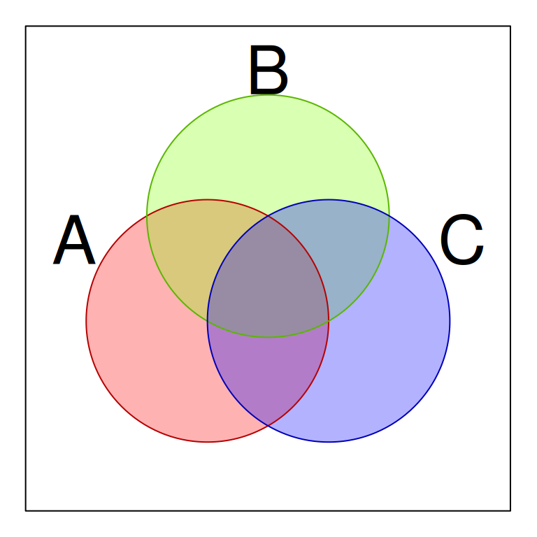


A partir de la gráfica, obtener la solución a los enunciados de conjuntos:

* Obtener el cardinal de $A=?$

* Obtener el cardinal de $B=?$

* Obtener el cardinal de $C=?$

* Obtener el cardinal  de $(A - B) \cup (B-A)=?$

* Obtener el cardinal  de $(C - B) \cup (B-C)=?$

* Obtener el cardinal  de $B \cap A \cap C=?$

* Obtener el cardinal para el complemento de $B - A=?$

* Obtener el cardinal de $A \cup B=?$

* Obtener el cardinal de $A \cap B=?$

* Obtener el cardinal de $A - B=?$

* Obtener el cardinal de $B - A=?$

* Obtener el cardinal para el complemento de $C - A=?$


### Tercer ejemplo cuatro conjuntos


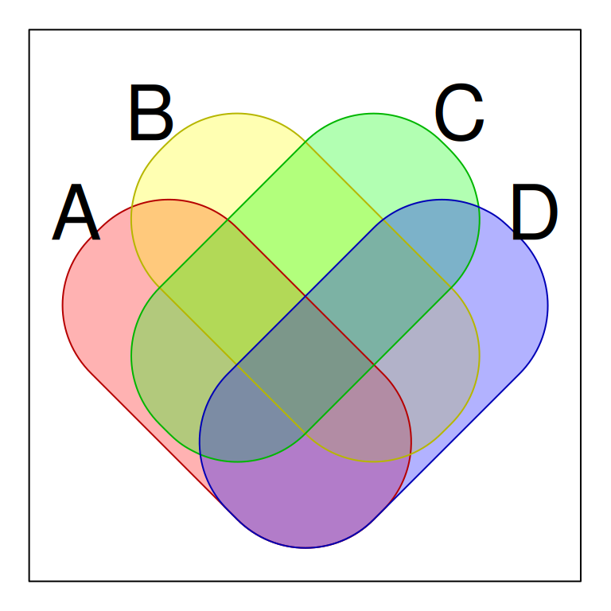


A partir de la gráfica, obtener la solución a los enunciados de conjuntos:

* Obtener el cardinal de $A=?$

* Obtener el cardinal de $B=?$

* Obtener el cardinal de $C=?$

* Obtener el cardinal de $D=?$

* Obtener el cardinal  de $(A - B) \cup (B-A)=?$

* Obtener el cardinal  de $(C - B) \cup (B-C)=?$

* Obtener el cardinal  de $(C - D) \cup (D-C)=?$

* Obtener el cardinal  de $D \cap A \cap C=?$

* Obtener el cardinal para el complemento de $C - A=?$

* Obtener el cardinal de $A \cup D=?$

* Obtener el cardinal de $D \cap B=?$

* Obtener el cardinal de $A - B=?$

* Obtener el cardinal de $C - A=?$

* Obtener el cardinal para el complemento de $D - A=?$


### Cuarto ejemplo (lectura de revistas)

En un grupo universal ($U$) para lectura se tienen tres subgrupos de lectura para las revistas $A$, $B$, y $C$.


A partir de la gráfica, obtener la solución a los enunciados de conjuntos:

* Obtener el cardinal de lectura para la revista $A=?$

* Obtener el cardinal de lectura para la revista $B=?$

* Obtener el cardinal de lectura para la revista $C=?$

* Qué significa el cardinal de $(A - B) \cup (B-A)$ para el grupo de lectura?. 

* Qué significa el cardinal  de $(C - B) \cup (B-C)$ para el grupo de lectura?.

* Qué significa el cardinal  de $B \cap A \cap C$ para el grupo de lectura?.

* Qué significa el cardinal del complemento $B - A$ para el grupo de lectura?.

* Cúal es el cardinal de los que no leen las tres revistas?


# Conjuntos numéricos

<div class="figure" style="text-align: center">
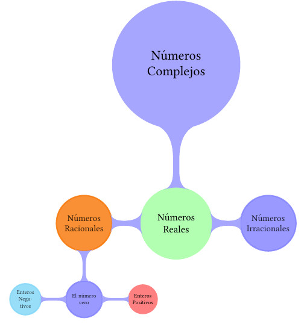
<p class="caption">(\#fig:FigPinumero)Conjuntos numéricos</p>
</div>


::: {.definition #unnamed-chunk-15}
El conjunto de los números naturales consta de:
:::


$$
N=\{ 1,2,3,4,...\}
$$


::: {.definition #unnamed-chunk-16}
El conjunto de los números enteros consta de:
:::


$$
Z=\{...,-3,-2,-1,0,1,2,3,4,...\}
$$

::: {.definition #unnamed-chunk-17}
El conjunto de los números racionales consta de todos los números que son cociente de dos enteros, siempre que el denominador sea diferente de cero. Es decir:
:::


$$
Q=\{ \dfrac{p}{q} | p \ \text{y} \ q \ \ \text{son números enteros,} \ \ q \ \neq \ 0\}
$$
::: {.definition #unnamed-chunk-18}
El conjunto de los números irracionales consta de todos los números que no son el cociente de dos enteros, siempre que el denominador sea diferente de cero. Es decir:
:::


$$
Q^{*}=\{x |   \ x \neq \ \dfrac{p}{q}, \ \ q \ \neq \ 0\   \}
$$
::: {.definition #unnamed-chunk-19}
El conjunto de los números reales consta de la unión entre el conjunto de los racionales y los irracionales. Es decir:
:::


$$
R=\{x |   \ x \in Q \ \text{o} \ x \in Q^{*} \}=Q \cup Q^{*}
$$


<!-- ```{r FigConjuntoN, fig.cap="Diagrama de los conjuntos numéricos [Imagen tomada de [@swokowski1996algebra] pág $3$]", fig.align='center' ,echo=FALSE, message=FALSE,  warning=FALSE} -->
<!-- 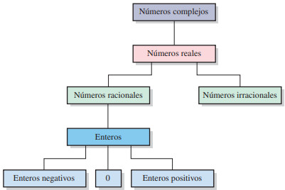 -->
<!-- ``` -->


<!-- ## Propiedades de los números Reales -->


<!-- ```{r FigPropiedadesReales, fig.cap="Propiedades de los números reales [Imagen tomada de [@zill2012algebra] pág $51$]", fig.align='center' ,echo=FALSE, message=FALSE,  warning=FALSE} -->
<!-- 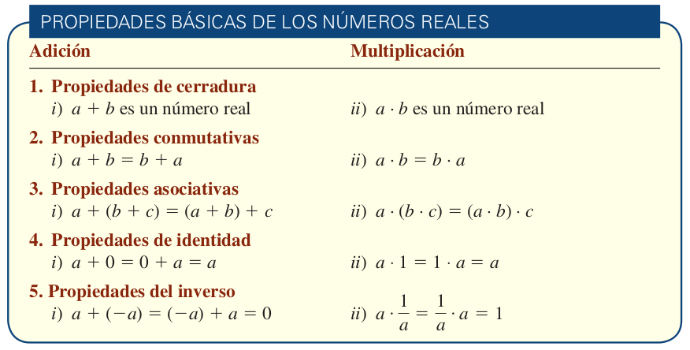 -->
<!-- ``` -->


<!-- ```{r FigPropiedadesRealesB, fig.cap="Propiedades de los números reales [Imagen tomada de [@zill2012algebra] pág $51$]", fig.align='center' ,echo=FALSE, message=FALSE,  warning=FALSE} -->
<!-- 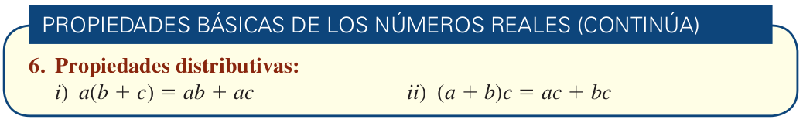 -->
<!-- ``` -->


<!-- ```{r FigPropiedadesRealesC, fig.cap="Propiedades de los números reales [Imagen tomada de [@zill2012algebra] pág $53$]", fig.align='center' ,echo=FALSE, message=FALSE,  warning=FALSE} -->
<!-- 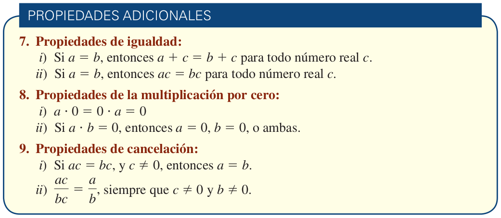 -->
<!-- ``` -->


<!-- ```{r FigPropiedadesRealesD, fig.cap="Propiedades de los números reales [Imagen tomada de [@zill2012algebra] pág $53$]", fig.align='center' ,echo=FALSE, message=FALSE,  warning=FALSE} -->
<!-- 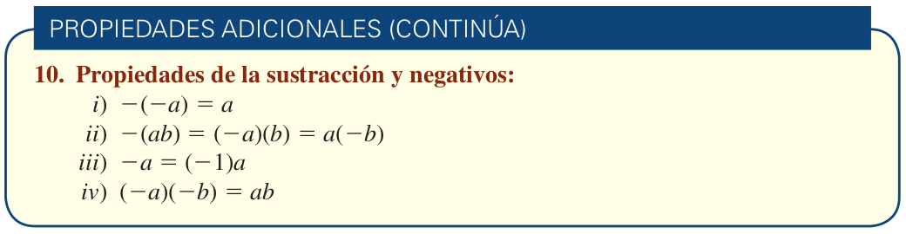 -->
<!-- ``` -->


<!-- ```{r FigPropiedadesRealesE, fig.cap="Propiedades de los números reales [Imagen tomada de [@zill2012algebra] pág $54$]", fig.align='center' ,echo=FALSE, message=FALSE,  warning=FALSE} -->
<!-- 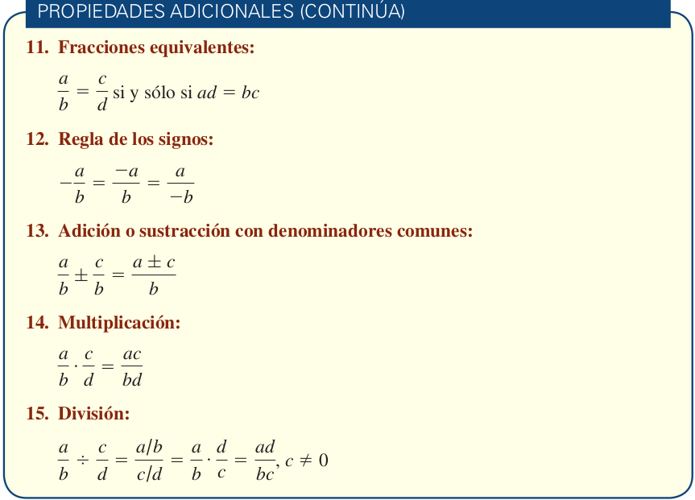 -->
<!-- ``` -->


<!-- ```{r FigPropiedadesRealesF1, fig.cap="Propiedades de los números reales [Imagen tomada de [@swokowski1996algebra] pág $8$]", fig.align='center' ,echo=FALSE, message=FALSE,  warning=FALSE} -->
<!-- 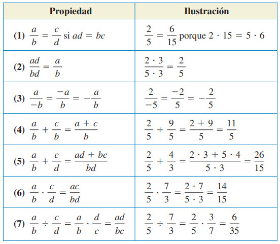 -->
<!-- ``` -->


<!-- ```{r FigPropiedadesRealesF, fig.cap="Propiedades de los números reales [Imagen tomada de [@zill2012algebra] pág $55$]", fig.align='center' ,echo=FALSE, message=FALSE,  warning=FALSE} -->
<!-- 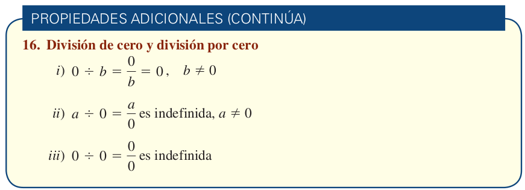 -->
<!-- ``` -->


## Propiedades de los números reales

\begin{equation}
\begin{matrix}
\text{Propiedad de cerradura} & &\\
(1a) \ \ a+b \ \text{es un número real} & (1b) \  \  a.b \ \text{es un número real} &\\
& & &\\

\text{Propiedad conmutativa} & &\\
(2a) \ \ a+b = b+a \  & (2b) \  \  a.b = b.a \  &\\
& & &\\

\text{Propiedad asociativa} & &\\
(3a) \ \ (a+b)+c = a+(b+c) \  & (3b) \  \  (a.b).c = a.(b.c) \  &\\
& & &\\


\text{Propiedad de identidad} & &\\
(4a) \ \ a+0 = 0+a = a \  & (4b) \  \  a.1 = 1.a = a \  &\\
& & &\\


\text{Propiedad del inverso} & &\\
(5a) \ \ a+(-a) = (-a)+a = 0 \  & (5b) \  \  a.\dfrac{1}{a} = \dfrac{1}{a}.a = 1, \ \ a \neq 0 &\\
& & &\\


\text{Propiedad distributiva} & &\\
(6a) \ \ a.(b + c) = ab + ac \  & (6b) \  \  (a + b).c = ac + bc \  &\\
& & &\\

\text{PROPIEDADES ADICIONALES} & &\\
& & &\\

\text{Propiedad de la igualdad} & &\\
(7a) \ \ \text{Si} \ a = b, \ \ \text{entonces} \ \ a + c = b + c, \  &  \  \  \text{para todo número real } c \  &\\
& & &\\
(7b) \ \ \text{Si} \ a = b, \ \ \text{entonces} \ \ a.c = b.c, \  &  \  \  \text{para todo número real } c \  &\\
& & &\\


\text{Propiedad de la multiplicación por cero} & &\\
(8a) \ \ \text{Si} \ a.0 = 0.a = 0, \ \ \ \ \  \  &  \  \  \text{para todo número real } a \  &\\
& & &\\
(8b) \ \ \text{Si} \ a.b = 0, \ \ \text{entonces} \ \ a = 0, \ \ \  b = 0, \  &  \  \  \text{ó ambas } \  &\\
& & &\\


\text{Propiedad de cancelación} & &\\
(9a) \ \ \text{Si} \ a.c = b.c, \ \ \text{y} \ \ c \neq 0, \ \ \text{entonces } a = c   &  \  \  \text{para todo número real } c \neq 0 \  &\\
& & &\\
(9b) \ \ \ \dfrac{a.c}{b.c} =  \dfrac{a}{b}, \ \ \text{siempre que} \ \ b \neq 0, \ \ \text{y } \ \  c \neq 0, \ \ \  &  \  \   &\\
& & &\\


\text{Propiedad para el manejo del signo} & &\\
(10a) \ \ -(-a) = a \  & (10b) \  \  -(a.b) = (-a).b = a.(-b) \  &\\
& & &\\
(10c) \ \ -a = (-1).a \  & (10d) \  \  (-a).(-b) = a.b  \  &\\
& & &\\


\text{Propiedad para el manejo de fracciones} & &\\
(11a) \ \ \dfrac{a}{b} = \dfrac{c}{d} \ \ \text{si y sólo si } \ \ ad = bc  & (11b) \  \  -\dfrac{a}{b} = \dfrac{-a}{b} = \dfrac{a}{-b}  \  &\\
& & &\\
(11c) \ \ \dfrac{a}{b} \pm \dfrac{c}{b}  = \dfrac{a \pm c}{b} \  & (11d) \  \  \dfrac{a}{b} \pm \dfrac{c}{d}  = \dfrac{ad \pm cb}{bd}  \  &\\
& & &\\
(11e) \ \ \dfrac{a}{b} \times \dfrac{c}{b}  = \dfrac{a.c}{b.d} \  & (11f) \  \  \dfrac{a}{b} \div \dfrac{c}{d}  = \dfrac{a}{b} \times \dfrac{d}{c} =\dfrac{a.d}{b.c}  \  &\\
& & &\\


\text{División de cero y División por cero} & &\\
(12a) \ \ \dfrac{a}{0} = a \div 0 = \text{IND}, \ \ a \neq 0  & (12b) \  \  \dfrac{0}{0} = 0 \div 0 = \text{IND} \  &\\
& & &\\
(12c) \ \ \dfrac{0}{a} = 0 \div a = 0, \ \ a \neq 0 \  &  \  \   \  &\\
& & &\\

\end{matrix}
\end{equation}


## Ejemplos de fracciones en los números reales


\begin{equation}
\begin{matrix}
\text{Igualdad de fracciones o proporciones} & \\ \text{Ejemplo de ilustración} &\\
(1a) \ \  \dfrac{a}{b} = \dfrac{c}{d} \ \ \text{si y sólo si } \ \ ad = bc & \\ (1b) \  \   \dfrac{2}{5} = \dfrac{6}{15} \ \ \text{ porque } \ \ (2).(15) = (5).(6) = 30 &\\
& & &\\

\text{Simplificación en una fracción o proporción} & \\ \text{Ejemplo de ilustración} &\\
(2a) \ \  \dfrac{a.d}{b.d} = \dfrac{a}{b} \ \ \text{ } \ \  & \\ (2b) \  \   \dfrac{6}{15} = \dfrac{(2).(3)}{(5).(3)} = \dfrac{2}{5} \ \ \text{  } \ \  &\\
& & &\\


\text{Manejo del signo en una fracción o proporción} & \\ \text{Ejemplo de ilustración} &\\
(3a) \ \  -\dfrac{a}{b} = \dfrac{-a}{b} = \dfrac{a}{-b} \ \ \text{ } \ \  & \\ (3b) \  \   -\dfrac{2}{5} = \dfrac{-2}{5} = \dfrac{2}{-5} \ \ \text{  } \ \  &\\
& & &\\


\text{Suma de fracciones homogeneas ó con igual denominador} & \\ \text{Ejemplo de ilustración} &\\
(4a) \ \  \dfrac{a}{b} + \dfrac{c}{b}  = \dfrac{a + c}{b} \ \ \text{ } \ \  & \\ (4b) \  \   \dfrac{3}{7} + \dfrac{9}{7}  = \dfrac{3 + 9}{7} = \dfrac{12}{7} \ \ \text{  } \ \  &\\
& & &\\


\text{Diferencia de fracciones homogeneas ó con igual denominador} & \\ \text{Ejemplo de ilustración} &\\
(5a) \ \  \dfrac{a}{b} - \dfrac{c}{b}  = \dfrac{a - c}{b} \ \ \text{ } \ \  & \\ (5b) \  \   \dfrac{3}{7} - \dfrac{9}{7}  = \dfrac{3 - 9}{7} = \dfrac{-6}{7} \ \ \text{  } \ \  &\\
& & &\\


\text{Suma de fracciones no homogeneas ó con diferentes denominadores} & \\ \text{Ejemplo de ilustración} &\\
(6a) \ \  \dfrac{a}{b} + \dfrac{c}{d}  = \dfrac{a.d + b.c}{b.d} \ \ \text{ } \ \  & \\ (6b) \  \   \dfrac{3}{5} + \dfrac{9}{7}  = \dfrac{(3)(7) + (5)(9)}{(5)(7)} = \dfrac{21 + 45}{35} = \dfrac{66}{35} \ \ \text{  } \ \  &\\
& & &\\


\text{Diferencia de fracciones no homogeneas ó con diferentes denominadores} & \\ \text{Ejemplo de ilustración} &\\
(7a) \ \  \dfrac{a}{b} - \dfrac{c}{d}  = \dfrac{a.d - b.c}{b.d} \ \ \text{ } \ \  & \\ (7b) \  \   \dfrac{3}{5} - \dfrac{9}{7}  = \dfrac{(3)(7) - (5)(9)}{(5)(7)} = \dfrac{21 - 45}{35} = \dfrac{-24}{35} \ \ \text{  } \ \  &\\
& & &\\


\text{Producto de fracciones no homogeneas ó con diferentes denominadores} & \\ \text{Ejemplo de ilustración} &\\
(8a) \ \  \dfrac{a}{b} \times \dfrac{c}{d}  = \dfrac{a.c}{b.d} \ \ \text{ } \ \  & \\ (8b) \  \   \dfrac{3}{5} \times \dfrac{9}{7}  = \dfrac{(3)(9)}{(5)(7)} = \dfrac{27}{35}  \ \ \text{  } \ \  &\\
& & &\\


\text{División de fracciones no homogeneas ó con diferentes denominadores} & \\ \text{Ejemplo de ilustración} &\\
(9a) \ \  \dfrac{a}{b} \div  \dfrac{c}{d}  = \dfrac{a}{b} \times \dfrac{d}{c}  = \dfrac{a.d}{b.c} \ \ \text{ } \ \  & \\ (9b) \  \   \dfrac{3}{5} \div \dfrac{9}{7}  = \dfrac{3}{5} \times \dfrac{7}{9} = \dfrac{(3)(7)}{(5)(9)} = \dfrac{21}{45} = \dfrac{7}{15}  \ \ \text{  } \ \  &\\
& & &\\


\end{matrix}
\end{equation}


## Evaluación (Conjuntos y recta real)


<iframe src="https://johnshinyuces2020.shinyapps.io/parcialSIMO02A/#section-conjuntos?showcase=0" width="672" height="2000px" data-external="1"></iframe>


# Recta real y desigualdades

<div class="figure" style="text-align: center">
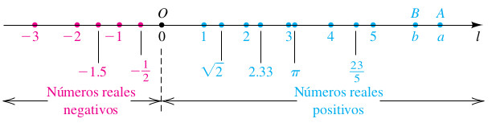
<p class="caption">(\#fig:FigRectaReal1A)Recta real [Imagen tomada de [@swokowski1996algebra] pág $9$]</p>
</div>

<div class="figure" style="text-align: center">
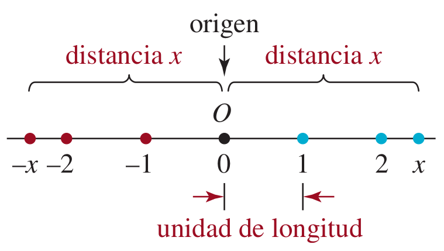
<p class="caption">(\#fig:FigRectaRealA)Distancia en la recta real [Imagen tomada de [@zill2012algebra] pág $58$]</p>
</div>


<div class="figure" style="text-align: center">
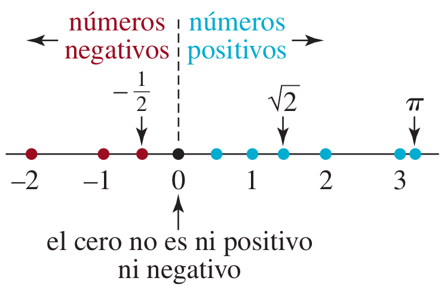
<p class="caption">(\#fig:FigRectaRealB)Signo de la recta real [Imagen tomada de [@zill2012algebra] pág $58$]</p>
</div>


::: {.definition #unnamed-chunk-21}
Se dice que el número real $a$ es menor que $b$, lo que se escribe $a<b$, si y sólo si la diferencia $b-a$ es positiva. En símbolos: [Tomado de [@zill2012algebra] pág $58$]
:::


$$
a<b \ \ \ \text{si y sólo si} \ \ \ (b-a)>0
$$


\begin{equation}
\begin{matrix}
 & \text{Notación } & \text{Definición } & \text{Terminología } & \text{Significado en la recta} R\\
  & & & \\
(1a) & a > b & a - b \ \text{ es positivo } & a \ \text{es mayor que } \ b & a \ \text{está a derecha de } \ b \\  

(2a) & a < b & a - b \ \text{ es negativo } & a \ \text{es menor que } \ b & a \ \text{está a izquierda de } \ b\\

\end{matrix}
\end{equation}


<!-- ```{r NotacionDesigualdades1, fig.cap="Notación de desigualdades[Imagen tomada de [@swokowski1996algebra] pág $9$]", fig.align='center' ,echo=FALSE, message=FALSE,  warning=FALSE,out.width = "50%"} -->
<!-- 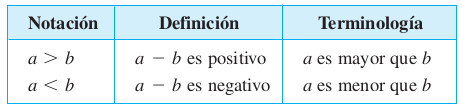 -->
<!-- ``` -->


\begin{equation}
\begin{matrix}


 \text{Propiedad } & \text{Ejemplo } & \\
& & \\
(1a)  \text{Si } \ a < b \ \text{y} \ b < c, \text{entonces } a < c & \text{Si } \ -1 < 3, \ \text{y} \ 3 < 7, \\ \text{entonces } -1 < 7   & \\  
& & \\
(2a)  \forall c, \ \ \text{Si } \ a < b,  \text{entonces } a + c < b + c & \text{Si } \ -1 < 4, \text{entonces } -1 + 3 < 4 + 3, \\ \text{e.d.} \ 2 < 7  & \\  
& & \\
(3a)  \forall c, \ \ \text{Si } \ a < b,  \text{entonces } a - c < b - c & \text{Si } \ -1 < 4, \text{entonces } -1 - 3 < 4 - 3, \\ \text{e.d.} \ -4 < 1 & \\  
& & \\
(4a)  \forall c>0, \ \ \text{Si } \ a < b,  \text{entonces } a.c < b.c & \text{Si } \ -1 < 2, \text{entonces } (-1).(3) < (2).(3) , \\ \text{e.d.} \ -3 < 6 & \\
& & \\
(5a) \forall c>0, \ \ \text{Si } \ a < b,  \text{entonces } \dfrac{a}{c} < \dfrac{b}{c} & \text{Si } \ -1 < 2, \text{entonces } \dfrac{-1}{3} < \dfrac{2}{3} , \\ \text{e.d.} \ -\dfrac{1}{3} < \dfrac{2}{3} & \\  
 & & \\
(6a) \forall c<0, \ \ \text{Si } \ a < b \ \text{entonces } a.c > b.c & \text{Si } \ -1 < 2, \text{entonces } (-1).(-3) > (2).(-3) , \\ \text{e.d.} \ 3 > -6 & \\
 & & \\
(7a) \forall c<0, \ \ \text{Si } \ a < b \ \text{entonces } \dfrac{a}{c} > \dfrac{b}{c} & \text{Si } \ -1 < 2, \text{entonces } \dfrac{-1}{-3} > \dfrac{2}{-3} , \\ \text{e.d.} \ \dfrac{1}{3} > -\dfrac{2}{3} & \\
 & & \\
(8a) \ \text{Si } \ 0 < a < b \ \text{entonces } \dfrac{1}{a} > \dfrac{1}{b} & \text{Si } \ 0 < \dfrac{1}{x} < 4, \text{entonces } \dfrac{1}{1/x} > \dfrac{1}{4} , \\ \text{e.d.} \ x > -\dfrac{1}{4} & \\
& & \\
(9a) \ \text{Si } \ 0 < a < b \ \text{entonces } 0 < a^2 < b^2 &  \text{Si } \ 0 < \sqrt{x} < 4, \text{entonces } 0 < (\sqrt{x})^2 < {4}^2 , \\ \text{e.d.} \ 0 < x < 16 & \\
 & & \\
(10a) \ \text{Si } \ a < b \ \text{entonces } 0 < \sqrt{a} < \sqrt{b} & \text{Si } \ 0 < x^2 < 4, \text{entonces } 0 < \sqrt{x^2} < \sqrt{4} , \\ \text{e.d.} \ 0 < |x| < 2 & \\
\end{matrix}
\end{equation}


<br></br>


<!-- ```{r FigRectaReal1C, fig.cap="Propiedades de desigualdades[Imagen tomada de [@swokowski1996algebra] pág $114$]", fig.align='center' ,echo=FALSE, message=FALSE,  warning=FALSE,out.width = "70%"} -->
<!-- 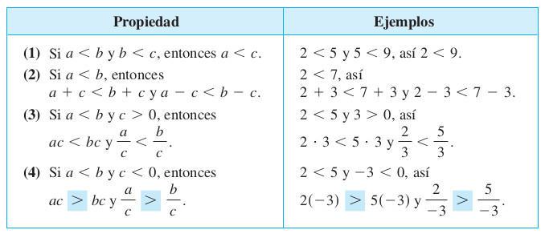 -->
<!-- ``` -->


<!-- ```{r FigRectaReal2C, fig.cap="Propiedades de desigualdades extras[Imagen tomada de [@swokowski1996algebra] pág $127$]", fig.align='center' ,echo=FALSE, message=FALSE,  warning=FALSE,out.width = "100%"} -->
<!-- 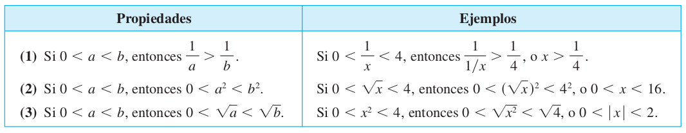 -->
<!-- ``` -->


### Actividad Geogebra:  Desigualdades y conjuntos de intervalos en la recta real


Esta es una aplicación que muestra graficamente las desigualdades y los intervalos en la recta real, el Autor:Javier Cayetano Rodríguez (https://www.geogebra.org/m/ck59naqz) las elaboro usando geogebra.

<!-- https://www.geogebra.org/m/ck59naqz -->

<meta name=viewport content="width=device-width,initial-scale=1">
<meta charset="utf-8"/>
<script src="https://www.geogebra.org/apps/deployggb.js"></script>
<div id="ggb-elementConjuntosA2"></div> 
<script>  
       var ggbAppConjuntosA2 = new GGBApplet({"material_id":"ck59naqz",
       "width": 800,
       "height": 400,
       "showToolBar": false,
       "showAlgebraInput": false,
       "showMenuBar": false },
       true);
       
         window.addEventListener("load", function() {  
           ggbAppConjuntosA2.inject('ggb-elementConjuntosA2');
      });
</script>


<!-- ## Intersección de conjuntos de intervalos en la recta numérica -->

<!-- Author: Javier Cayetano Rodríguez -->


<!-- <iframe scrolling="no" title="Intersección de conjuntos de intervalos en la recta numérica" src="https://www.geogebra.org/material/iframe/id/gxwbxwnz/width/675/height/417/border/888888/sfsb/true/smb/false/stb/false/stbh/false/ai/false/asb/false/sri/false/rc/false/ld/false/sdz/false/ctl/false" width="675px" height="417px" style="border:0px;"> </iframe> -->


## Ejemplos para la solución de desigualdades usando las propiedades básicas

### **Ejemplo 1**

Obtener el conjunto solución para la desigualdad $8x+4<16+5x$

**Solución**

\begin{equation}
\begin{split}
8x+4 &<& 16+5x\\
8x+4+(-4) &<& 16+5x+(-4) \\
8x & < & 5x+16-4 \\
8x & < & 5x+12 \\
8x -5x & < & 5x-5x+12 \\
8x -5x & < & 12 \\
3x & < & 12 \\
3x\left(\dfrac{1}{3}\right) & < & 12\left(\dfrac{1}{3}\right) \\
\dfrac{3x}{3} & < & \dfrac{12}{3}\\
x & < & 4
\end{split}
\end{equation}


**Respuesta**: El conjunto solución para la desigualdad es:

$$
x \in (-\infty, 4)
$$

**Verificación**: Por sustitución

Como los valores de $x$ deben ser menores que $4$, entonces se puede tomar $x=3$. Por lo tanto al sustituir en la desigualdad inicial se debe cumplir dicha desigualdad.

\begin{equation}
\begin{split}
8x+4 &<& 16+5x\\
8(3)+4 &<& 16+5(3)\\
24+4 &<& 16+15\\
28 &<& 31\\
\end{split}
\end{equation}


### **Ejemplo 2**

Obtener el conjunto solución para la desigualdad $\dfrac{1}{2}-3x \leq \dfrac{5}{2}$

**Solución**

\begin{equation}
\begin{split}
\dfrac{1}{2}-3x & \leq & \dfrac{5}{2}\\
-\dfrac{1}{2}+\dfrac{1}{2}-3x & \leq & \dfrac{5}{2}-\dfrac{1}{2}\\
-3x & \leq & \dfrac{5-1}{2} \\
-3x & \leq & \dfrac{4}{2} \\
-3x & \leq & 2 \\
-3x\left(\dfrac{1}{3}\right) & \leq & 2\left(\dfrac{1}{3}\right) \\
\dfrac{-3x}{3} & \leq & \dfrac{2}{3}\\
-x & \leq & \dfrac{2}{3}\\
x & \geq & \dfrac{-2}{3}
\end{split}
\end{equation}


**Respuesta**: El conjunto solución para la desigualdad es:

$$
x \in \left [-\dfrac{2}{3}, +\infty \right)
$$


<div class="figure" style="text-align: center">
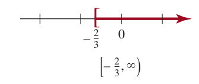
<p class="caption">(\#fig:FigDesigualdad2)Respuesta en la recta real ejemplo 1[Imagen tomada de [@zill2012algebra] pág $146$]</p>
</div>


### **Ejemplo 3**

Obtener el conjunto solución para la desigualdad $-7 \leq 2x+1 < 19$

**Solución**

\begin{equation}
\begin{split}
-7 & \leq 2x+1 <  19\\
-7-1 & \leq 2x+1-1 <  19-1\\
-8 & \leq 2x <  18\\
-8\left(\dfrac{1}{2}\right) & \leq 2x\left(\dfrac{1}{2}\right) <  18\left(\dfrac{1}{2}\right)\\
\left(\dfrac{-8}{2}\right) & \leq \left(\dfrac{2x}{2}\right) <  \left(\dfrac{18}{2}\right)\\
-4 & \leq x <  9\\
\end{split}
\end{equation}

**Respuesta**: El conjunto solución para la desigualdad es:

$$
x \in [-4,9)
$$


<div class="figure" style="text-align: center">
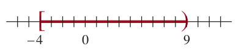
<p class="caption">(\#fig:FigDesigualdad3)Respuesta en la recta real ejemplo 3[Imagen tomada de [@zill2012algebra] pág $148$]</p>
</div>


### **Ejemplo 4**


Obtener el conjunto solución para la desigualdad

$$
2x^2-x<3
$$

**Solución**

$$
\begin{split}
2x^2-x &<& 3\\
2x^2-x -3 &<& 0\\
(x+1)(2x-3) &<& 0\\
\end{split}
$$
Los factores $(x+1)$ y $(2x-3)$ son cero en $-1$ y $\dfrac{3}{2}$, respectivamente.


<div class="figure" style="text-align: center">
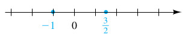
<p class="caption">(\#fig:FigDesigualdad6)Respuesta en la recta real ejemplo[Imagen tomada de [@swokowski1996algebra] pág $122$]</p>
</div>


<div class="figure" style="text-align: center">
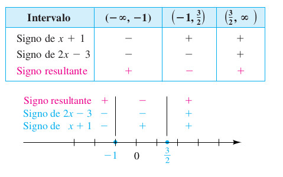
<p class="caption">(\#fig:FigDesigualdad7)Respuesta en la recta real ejemplo[Imagen tomada de [@swokowski1996algebra] pág $122$]</p>
</div>


**Respuesta**: El conjunto solución para la desigualdad es:

$$x\in \left(-1,\dfrac{3}{2}\right)$$


<br></br>


### Actividad Geogebra: Inecuación polinómica: Interpretación gráfica


Author: José María Arias Cabezas


<iframe scrolling="no" title="Inecuación polinómica: Interpretación gráfica" src="https://www.geogebra.org/material/iframe/id/HbrSDnt6/width/800/height/600/border/888888/sfsb/true/smb/false/stb/false/stbh/false/ai/false/asb/false/sri/true/rc/false/ld/false/sdz/true/ctl/false" width="800px" height="600px" style="border:0px;"> </iframe>


<br></br>


[link método de Po Shen Loh](https://jestradacasasept2022.shinyapps.io/MetodoPoShenLohV3/)


### **Ejemplo 5**

Obtener el conjunto solución para la desigualdad $x^2 \geq -2x+15$

**Solución**


Para la solución de desigualdades con expresiones cuadráticas es necesario retomar los conceptos de expresión cuadrática y fórmula del estudiante.

\begin{equation}
\begin{split}
x^2 & \geq & -2x+15\\
x^2 +2x-15 & \geq  0\\
(x+5)(x-3) & \geq  0\\
\end{split}
\end{equation}

usando la fórmula del estudiante tenemos

$A=1$; $B=2$; $C=-15$

$$
x=\dfrac{-B \pm \sqrt{B^2-4AC}}{2A}
$$


<!-- \sqrt{{2}^2-4 -->

$$
x=\dfrac{-2  \pm \sqrt{({2})^2-4({1})({-15})}}{2({1})}
$$

$$
x_1=3
$$

$$
x_2=-5
$$

**Respuesta**: El conjunto solución para la desigualdad es:

$$x\in (-\infty,-5]\cup [3,+\infty)$$

[link método de Po Shen Loh](https://jestradacasasept2022.shinyapps.io/MetodoPoShenLohV3/)


### **Ejemplo 6**

 $$
 \Large \dfrac{x-3}{x+2} < 0
 $$
 
 **Proceso de solución**
 
 <span style="color:blue">**Primero:**</span> Igualar el factor de arriba a cero
 
 
 $$
 x-3=0
 $$
 Después despejar $x$
 
$$
 x=3
$$ 
 
 <span style="color:blue">**Segundo:**</span> Igualar el factor de abajo a cero
 
 $$
 x+2=0
 $$
 Despejar $x$
 
 $$
 x=-2
 $$
 
 
 **Respuesta**: El conjunto solución para la desigualdad es:
 
 $$x \in (-2,3)$$
 
 
 

### **Ejemplo 7**

 
$$
 \Large \dfrac{2x+4}{x-2} > 0
$$
 
 
 **Solución**
 
 **Procedimiento**
 
$$
 2x+4=0
$$
 Despejar $x$
 
$$
 2x=-4
$$

 
$$
 x=\dfrac{-4}{2}=-2
$$

 
$$
 x-2=0
$$
 
$$
 x=2
$$

 
 <!-- **Respuesta**: El conjunto solución para la desigualdad es: -->
 
 $$ x \in (-\infty,-2)\cup (2,+\infty)$$
 
 
 **Prueba** ó verificación del conjunto solución
 
 Sustituir en la desigualdad inical $x=-3$
 
 $$
  \Large \dfrac{2(-3)+4}{(-3)-2} > 0
 $$
 
 $$
  \Large \dfrac{2}{5} > 0
 $$
 
  Sustituir en la desigualdad inical $x=3$
 
 
 
$$
 \Large \dfrac{2(3)+4}{(3)-2} > 0
$$
 
$$
 \Large 10 > 0
$$
 
 
 
 
### **Ejemplo 8**
 
 
 $$
 \Large \dfrac{x-4}{x-3}\geq 2
 $$
 
\begin{equation}
\begin{split}
\dfrac{x-4}{x-3} & \geq & 2\\
\dfrac{x-4}{x-3} -2 & \geq & 0 \\
\dfrac{x-4}{x-3} -\dfrac{2}{1} & \geq & 0\\
\dfrac{(x-4).1-2.(x-3)}{(x-3).1} & \geq & 0\\
\dfrac{x-4-2x+6}{x-3} & \geq & 0\\
\dfrac{x-2x-4+6}{x-3} & \geq & 0\\
\dfrac{2-x}{x-3} & \geq & 0
\end{split}
\end{equation} 
 
 **Solución**
 
Igualar a cero el factor de arriba
$$
2-x=0
$$

$$
2=x
$$

Igualar a cero el factor de abajo

$$
x-3=0
$$
$$
x=3
$$
**Respuesta**: Los $x$ solución son: $x \in [2,3)$


### **Ejemplo 9**
 
$$
\Large \dfrac{2x+4}{x-3}\leq 2
$$


**Solución**

**Procedimiento**

<span style="color:red">**Primero**:</span>

Dejar el valor de cero de un lado en la desigualdad, y realizar las operaciones necesarias hasta obtener una sola fracción del lado contrario al cero de la desigualdad. Así

\begin{equation}
\begin{split}
\dfrac{2x+4}{x-3}  & \leq & 2\\
\dfrac{2x+4}{x-3} -2 & \leq 0\\
\dfrac{2x+4}{x-3} -\dfrac{2}{1} & \leq 0\\
\dfrac{(2x+4).(1)-(2)(x-3)}{(x-3).(1)} & \leq 0\\
\dfrac{2x+4-2x+6}{x-3} & \leq 0\\
\dfrac{2x-2x+4+6}{x-3} & \leq 0\\
\dfrac{4+6}{x-3} & \leq 0\\
\dfrac{10}{x-3} & \leq 0\\
\end{split}
\end{equation}


<span style="color:red">**Segundo**:</span>

$$
\boxed{\dfrac{10}{x-3} \leq 0} \ \ \ \text{Como se ve es una desigualdad  menor ó igual a cero }
$$
Por lo tanto el signo final deseado en el proceso de las cruces, debe ser <span style="color:red">**la región que arroja signo negativo**</span>.


<span style="color:red">**Tercero**:</span>

Aplicar la herramienta de la cruceta, y obtener la solución del problema.

**Respuesta**: El conjunto solución son los valores en el conjunto

$$
x \in(-\infty,3)
$$


<br></br>


### Actividad Geogebra: Inecuación racional: Interpretación gráfica


Author: José María Arias Cabezas


<iframe scrolling="no" title="Inecuación racional: Interpretación gráfica" src="https://www.geogebra.org/material/iframe/id/GnMYk2mM/width/800/height/600/border/888888/sfsb/true/smb/false/stb/false/stbh/false/ai/false/asb/false/sri/true/rc/false/ld/false/sdz/true/ctl/false" width="800px" height="600px" style="border:0px;"> </iframe>


<br></br>


### **Ejemplo 10**

Obtener el conjunto solución para la siguiente desigualdad


$$
3x-8<5x+5
$$
**Solución**

\begin{equation}
\begin{split}
3x-8 & < & 5x+5\\
3x-5x & < & 5+8\\
-2x & < & 13\\
x & > & \dfrac{13}{-2}\\
x & > & -\dfrac{13}{2}\\
\end{split}
\end{equation}


**Respuesta**: El conjunto solución para la desigualdad es:
$$ x \in \left(-\dfrac{13}{2},+\infty \right)$$


### **Ejemplo 11**

$$
\frac{2x+1}{8}<\frac{3x-4}{3}
$$
**Solución**

\begin{equation}
\begin{split}
\frac{2x+1}{8} & < & \frac{3x-4}{3}\\
24\left(\frac{2x+1}{8}\right) & < & 24\left(\frac{3x-4}{3}\right)\\
3\left(2x+1\right) & < & 8\left(3x-4\right)\\
6x+3 & < & 24x-32\\
3+32 & < & 24x-6x\\
35 & < & 18x\\
\dfrac{35}{18} & < & x\\
x & > & \dfrac{35}{18}\\
\end{split}
\end{equation}

**Respuesta**: El conjunto solución para la desigualdad es:

$$x \in \left(\dfrac{35}{18},+\infty\right)$$


<span style="color:red">**Algoritmo para resolver un problema**:</span>

* <span style="color:blue">Primero:</span> Leer el problema mínimo tres veces

* <span style="color:blue">Segundo:</span> Verificar si recuerdas el enunciado del problema

**sugerencia**: Repite el enunciado sin ir al texto donde esta escrito el problema.

* <span style="color:blue">Tercero:</span> Realizar un esquema (ó dibujo)  del problema donde se pueda escribir los datos conocidos y los datos por conocer del problema.

* <span style="color:blue">Cuarto:</span> Escirbir como ecuaciones, las relaciones observadas entre los datos conocidos y por conocer, expresados en el paso tres.

* <span style="color:blue">Quinto:</span> Resolver las ecuaciones planteadas en el paso cuarto.

* <span style="color:blue">Sexto:</span> Verificar la solución obtenida.


### **Ejemplo 12**

En general, se considera que una persona tiene fiebre si tiene una temperatura oral mayor que $98.6°F$.
¿Qué temperatura en la escala Celsius indica fiebre? [Pista: recuerde que $T_{F}=\frac{9}{5}T_{c}+32$, donde $T_{C}$ es grados Celsius y $T_{F}$ es
grados Fahrenheit].

**Planteo del problema**

Sea $T_{C}$ la temperatura en grados Celsius

Sea $T_{F}$ la temperatura en grados Fahrenheit

Entonces

$$
T_{F}>98.6
$$
Como deseamos saber que temperatura en grados Celsius sería registrada para tener fiebre, sustituimos $T_{F}=\frac{9}{5}T_{c}+32$ en la desigualdad anterior, así:


\begin{equation}
\begin{split}
T_{F} &>& 98.6\\
\frac{9}{5}T_{c}+32 &>& 98.6\\
\frac{9}{5}T_{c} &>& 98.6 -32\\
9T_{c} &>& (98.6 -32)(5)\\
9T_{c} &>& (66.6)(5)\\
9T_{c} &>& 333\\
T_{c} &>& \dfrac{333}{9}\\
T_{c} &>& 37\\
\end{split}
\end{equation}


**Respuesta** Para que una persona tenga fiebre en grados Celsius debe registrar una temperatura mayor a $37C$.


### **Ejemplo 13**

La temperatura en escala Fahrenheit y Celsius (centigrados) están relacionados por la fórmula $C=\frac{5}{9}(F-32)$. ¿A qué temperatura Fahrenheit corresponde una temperatura en escala centígrada que se encuentra? $40\leq C \leq 50$

**Proceso de solución**

\begin{equation}
\begin{split}
40  & \leq C \leq  50\\
40  & \leq \frac{5}{9}(F-32) \leq  50\\
(40)(9)  & \leq (9)\frac{5}{9}(F-32) \leq  (50)(9)\\
360  & \leq \frac{5}{1}(F-32) \leq  450\\
\dfrac{360}{5}  & \leq \frac{5}{5}(F-32) \leq  \dfrac{450}{5}\\
72  & \leq F-32 \leq  90\\
72+32  & \leq F-32+32 \leq  90+32\\
104  & \leq F \leq  122\\
\end{split}
\end{equation}

**Respuesta**: La temperatura equivalente en grados Fahrenheit es

$$
T_{F} \in [104,122]
$$

### **Ejemplo 14**

Un carnaval tiene dos planes de boletos.
Plan $A$: tarifa de entrada de $5$ dólares y $25$ centavos cada vuelta en los juegos.
Plan $B$: tarifa de entrada de $2$ dólares y $50$ centavos cada vuelta en los juegos.
¿Cuántas vueltas tendria que dar para que el plan $A$ resultara menos caro que el plan $B$?


**Planteo del problema**

Sea $x$ el número de vueltas en los juegos.

Entonces

Costo del plan $A$:

$$
5+0.25x
$$
Costo del plan $B$:

$$
2+0.50x
$$

Plan $A$ menos caro que el plan $B$, por lo tanto:

\begin{equation}
\boxed{5+0.25x < 2+0.50x}
\end{equation}


\begin{equation}
\begin{split}
5+0.25x & < & 2+0.50x\\
5-2 & < & 0.50x-0.25x \\
3 & < & 0.25x \\
\dfrac{3}{0.25} & < & x \\
12 & < & x\\
x & > & 12
\end{split}
\end{equation}


**Respuesta**: El conjunto solución para el problema es:

$$
x \in (12,+\infty)
$$
**Verificación**

Tomemos $x=13$ que pertenece al intervalo solución $(12,+\infty)$

Entonces sustituyendo en la desigualdad original tenemos:

\begin{equation}
\begin{split}
5+0.25(13) & < & 2+0.50(13)\\
8.25 & < & 8.5 \ \ \text{Cumple!!}
\end{split}
\end{equation}


### **Ejemplo 15A**


Obtener el conjunto solución para la desigualdad

$$
\dfrac{(x+2)(3-x)}{(x+1)(x^2+1)} \leq 0
$$


<div class="figure" style="text-align: center">
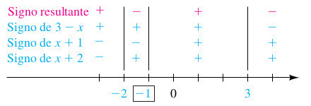
<p class="caption">(\#fig:FigDesigualdad8)Respuesta en la recta real ejemplo[Imagen tomada de [@swokowski1996algebra] pág $124$]</p>
</div>


### **Ejemplo 15B**

$$
\dfrac{(2x+1)^2(x-1)}{x(x+1)(x-1)} \geq 0
$$


<div class="figure" style="text-align: center">
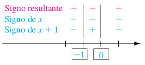
<p class="caption">(\#fig:FigDesigualdad9)Respuesta en la recta real ejemplo[Imagen tomada de [@swokowski1996algebra] pág $125$]</p>
</div>

### **Ejemplo 16A**

Los lados de un cuadrado se extienden para formar un rectángulo. Como se muestra en la Figura \@ref(fig:Rectangulo1), un lado se extiende $2 cm$ y el otro $5 cm$. Si el área del rectángulo resultante es menor de $130 cm^2$, cuál es la posible longitud de un lado del cuadrado original?


<div class="figure" style="text-align: center">
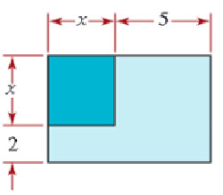
<p class="caption">(\#fig:Rectangulo1)Rectángulo que extiende dos de sus lados [Imagen tomada de [@zill2012algebra] pág $197$]</p>
</div>

**Proceso de solución**


Sea $x$ la longitud del cuadrado original

Sea $x+2$ uno de los lados del rectángulo resultante después de extender el cuadrado original.

Sea $x+5$ el otro lado del rectángulo resultante después de extender el cuadrado original.


Entonces el área del rectángulo resultante es:


$$
(x+2)(x+5)
$$

Por lo tanto esta área debe ser menor a $130 cm^2$, es decir

$$
(x+2)(x+5)< 130
$$

de donde

$$
\begin{split}
(x+2)(x+5)-130 &< 0\\
x(x+5)+2(x+5)-130 &< 0\\
x^2+5x+2x+10-130 & < 0\\
x^2+7x-120 & < 0\\
\end{split}
$$


$$
x=\dfrac{-7  \pm \sqrt{({7})^2-4({1})({-120})}}{2({1})}
$$

$$
x_1=8
$$

$$
x_2=-15
$$


**Respuesta**: El conjunto solución es:

$$
x \in \left(0,8\right)
$$

[link método de Po Shen Loh](https://jestradacasasept2022.shinyapps.io/MetodoPoShenLohV3/)


### **Ejemplo 16B**


Un grupo de estudiantes decide asistir a un concierto. el costo de contratar a un autobús para que los lleve al concierto es de 450 dólares, lo cual se debe repartir en forma uniforme entre los estudiantes. Los promotores del concierto ofrecen descuentos a grupos que lleguen en autobús. Los boletos cuestan normalmente 50 dólares cada uno, pero se reducen $10$ centavos de dólar del precio del boleto por cada persona que vaya en el grupo (hasta la capacidad máxima del autobús).¿Cuántos estudiantes deben ir en el grupo para que el costo total por estudiante sea menor a 54 dólares?

**Proceso de solución**

Planteo


Sea $x$ el número de estudiantes que usará el autobús.

Sea $\dfrac{450}{x}$ el costo del pasaje para cada estudiante.

Sea $0.10x$ el descuento que se hará a los estudiantes que usaron autobús.

Costo total para cada estudiante

$$
\dfrac{450}{x}+50-0.10x
$$
Como se pide que el costo de cada estudiante no pase de $54$ dólares.

Entonces


$$
\dfrac{450}{x}+50-0.10x<54
$$

$$
\begin{split}
\dfrac{450}{x}+50-0.10x &< 54\\
\dfrac{450}{x}+50-0.10x -54 &< 0\\
\dfrac{450}{x}-0.10x -4 &< 0\\
x\left(\dfrac{450}{x}-0.10x -4\right) &<0\\
450-0.10x^2 -4x &< 0\\
-0.10x^2 -4x+450 &< 0\\
-10\left(-0.10x^2 -4x+450 \right) &> (-10)0\\
x^2+40x-4500 &>0\\
\end{split}
$$


$$
x=\dfrac{-40  \pm \sqrt{({40})^2-4({1})({-4500})}}{2({1})}
$$

$$
x_1=50
$$

$$
x_2=-90
$$


**Respuesta**: El conjunto solución para la desigualdad es:


$$
x \in \left(50,\text{Capacidad máxima del autobús}\right]
$$

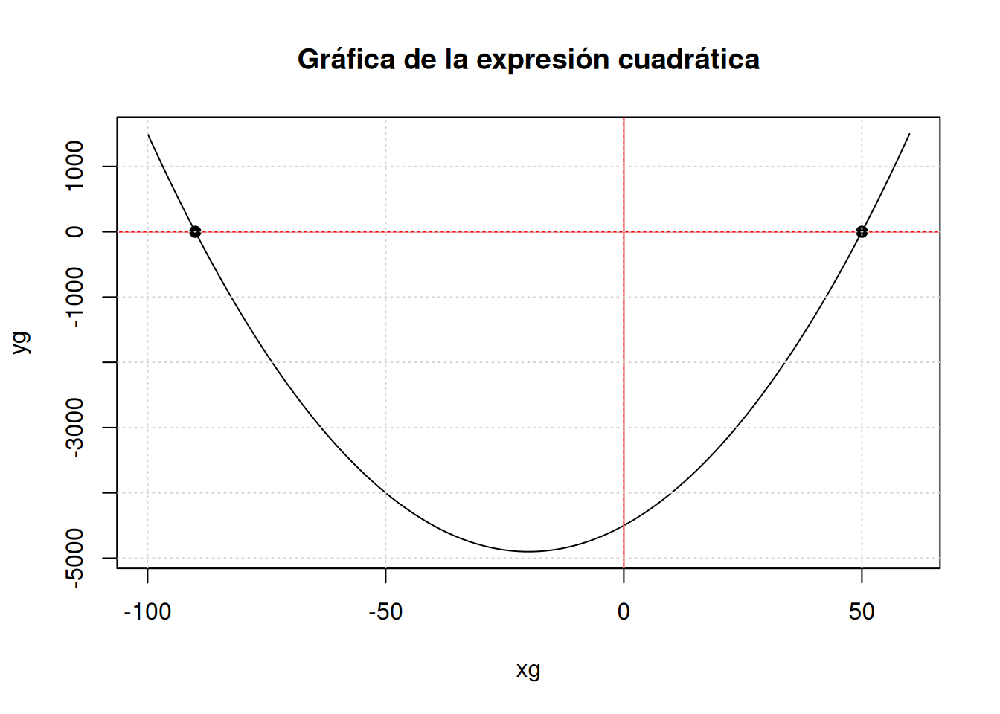


[link método de Po Shen Loh](https://jestradacasasept2022.shinyapps.io/MetodoPoShenLohV3/)


### **Ejemplo 16C**

Como se muestra en la figura \@ref(fig:Opticafisica1), si una lente convexa tiene longitud focal de $f$ centímetros y si un objeto se coloca a una distancia de $p$ centímetros de la lente con $p>f$, entonces la distancia $q$ desde la lente a la imagen está relacionada a $p$ y $f$ mediante la fórmula

$$
\dfrac{1}{p}+\dfrac{1}{q}=\dfrac{1}{f}
$$


<div class="figure" style="text-align: center">
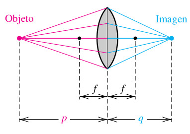
<p class="caption">(\#fig:Opticafisica1)Rectángulo que extiende dos de sus lados [Imagen tomada de [@swokowski1996algebra] pág $117$]</p>
</div>

Si $f=5 cm$, ¿qué tan cerca debe estar el objeto desde la lente para que la imagen esté a más de $12$ centímetros de la lente?

**Proceso de solución**:

$$
\dfrac{1}{p}+\dfrac{1}{q}=\dfrac{1}{5}
$$
Deseamos determinar los valores de $q$ tales que $q>12$

Primero se despeja $q$ como sigue:

$$
\begin{split}
\dfrac{1}{p}+\dfrac{1}{q} &=\dfrac{1}{5}\\
\dfrac{q1+1p}{pq} &=\dfrac{1}{5}\\
5q+5p &= pq\\
5q-pq &= -5p\\
q(5-p) &= -5p\\
q &= \dfrac{-5p}{(5-p)}\\
q &= \dfrac{5p}{(p-5)}\\
\end{split}
$$
Entonces

$$
q>12 \ \ \ \ \ \text{es equivalente a: }\ \ \ \ \ \ \dfrac{5p}{p-5}>12
$$

Solución de la nueva desigualdad $\frac{5p}{p-5}>12$

$$
\begin{split}
\dfrac{5p}{p-5} &>12\\
5p &>12(p-5)   \ \ \ \ \ \text{ya que } \ \ \ \ \ p>f=5 \ \ \ \ \ \text{es decir} \ \ \ \ \ p-5>0\\
5p &>12p-60\\
60 &>12p-5p\\
60 &>7p\\
\dfrac{60}{7} &>p\\
p &<\dfrac{60}{7} \ \ \ \ \text{equivalentemente}
\end{split}
$$


**Respuesta**: como $p>5$ y $p<\dfrac{60}{7}$, entonces su equivalente es

$$
5<p<\dfrac{60}{7}
$$


[Link para regla de la cruces](https://johnjairoshiny.shinyapps.io/DESIGUALDADV3/)


<div class="figure" style="text-align: center">
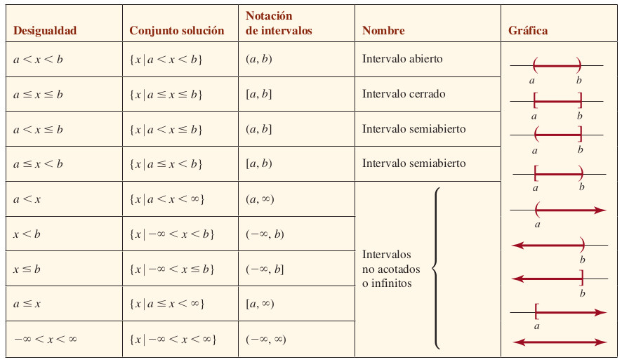
<p class="caption">(\#fig:FigRectaRealC)Intervalos básicos en la línea real [Imagen tomada de [@zill2012algebra] pág $147$]</p>
</div>


## Evaluación (Fórmula del Estudiante, Parábola y Línea Recta)

<iframe src="https://johnshinyv2uces.shinyapps.io/parcialSIM003a/?showcase=0" width="672" height="2000px" data-external="1"></iframe>


## Concepto de valor absoluto


::: {.definition #unnamed-chunk-24}
Sea $x$ un número real, se define el valor absoluto de $x$ como:
:::


\[
|x|=\left\{
x , \text{si} \ \ x>0 \atop
-x , \text{si} \ \ x \leq 0 
\right. \ \ \ \ \text{equivalentemente} \ \ \ \ 
|x|=\left\{
x , \text{si} \ \ x \geq 0 \atop
-x , \text{si} \ \ x < 0 
\right.
\]

De forma equivalente

* Si $x>0$, entonces $|x|=x$

* Si $x<0$, entonces $|x|=-x$

* Si $x=0$, entonces $|0|=0$

**OBSERVACIÓN**:

El valor absoluto de un número real $x$ cualquiera (es decir arbitrario) mide la distancia de ese número $x$ al origen (ó cero real).

En otras palabras $|x|$ mide distancia entre $x$ y el cero real.


### Ejemplo 1

Obtener el valor absoluto indicado

(1) $|-3|=-(-3)=3$

(2) $|\pi|=\pi$

(3) $|\pi-3.5|=-(\pi-3.5)=3.5-\pi$

(4) $|3-\sqrt{2}|=3-\sqrt{2}$


::: {.theorem #unnamed-chunk-25}
Sean $x$ y $y$ números reales. Entonces

(1) $|x| \geq 0$

(2) $|x|=|-x|$

(3) $|x|=0$ si y sólo si $x=0$
  
(4) $|xy|=|x||y|$ 
  
(5) $\left|\dfrac{x}{y}\right|=\dfrac{|x|}{|y|}$

(6) $|x+y| \leq |x|+|y|$

:::


### Ejemplo 2

Usando el concepto de valor absoluto es decir su definición, obtener la respuesta para los siguientes enunciados de forma simplificada.

(1) Si $x>-3$, entonces $|x+3|=?$

(2) Si $x<3$, entonces $|3-x|=?$

**Proceso de solución para (1)**:

Como $x>-3$ es equivalente a $x+3>0$

Entonces $|x+3|=x+3$


**Proceso de solución para (2)**:

Como $x<3$ es equivalente a $0<3-x$

por lo tanto $0<3-x$ es equivalente a $3-x>0$

Entonces $|3-x|=3-x$


::: {.theorem #TMAValor1}
Sea $a \in R^{+}$ y $|x| \leq a$. Entonces

$|x| \leq a$ es equivalente a:
  
(1) $-a \leq x \leq a$

  ó

(2) $x \geq -a$  y  $x \leq a$
:::


### Ejemplo 3

Obtener el conjunto solución para la siguiente desigualdad usando el teorema apropiado

 $$\Large \mid x-3\mid<8$$

**Proceso de solución**:

Usando el teorema (\@ref(thm:TMAValor1)) se puede expresar la desigualdad con el valor absoluto $\mid x-3\mid<8$ como:

$$
\begin{split}
-8 & < x-3 <  8\\
-8+3 & < x-3+3 <  8+3\\
-5 & < x <  11\\
\end{split}
$$

**Respuesta**: El conjunto solución para la desigualdad es:

$$
x \in (-5,11)
$$

**Verificación**

La verificación se realiza usando uno o mas elementos del conjunto solución. Si al sustituir (ó reemplazar) en la desigualdad origianal se llega a una afirmación lógica verdadera, diremos que cumple la desigualdad.

Tomemos un elemento $x$ del conjunto $(-5,11)$, por decir $x=2$, entonces 

$$
\begin{split}
|2-3| & < & 8\\
|-1| & < & 8\\
1 & < & 8\\ \ \ \ \text{Cumple!!! el valor absoluto}
\end{split}
$$

### Ejemplo 4

Obtener el conjunto solución para la desigualdad

$$
\left|\dfrac{x+2}{3-x} \right| \leq 2  
$$
**Proceso**

Aplicando la otra forma del teorema (\@ref(thm:TMAValor1)) podemos expresar el enunciado así:

$$
\begin{split}
\left(\dfrac{x+2}{3-x}\right) \geq -2 \ \ \ \ & \text{y} & \ \ \ \ \left(\dfrac{x+2}{3-x}\right) \leq 2\\
\left(\dfrac{x+2}{3-x}\right)+2 \geq 0 \ \ \ \ & \text{y} & \ \ \ \ \left(\dfrac{x+2}{3-x}\right) -2 \leq 0\\
\left(\dfrac{x+2}{3-x}\right)+\dfrac{2}{1} \geq 0 \ \ \ \ & \text{y} & \ \ \ \ \left(\dfrac{x+2}{3-x}\right) -\dfrac{2}{1} \leq 0\\
\dfrac{(x+2).1+2(3-x)}{(3-x).1} \geq 0 \ \ \ \ & \text{y} & \ \ \ \ \dfrac{(x+2).1-2(3-x)}{(3-x).1} \leq 0\\
\dfrac{x+2+6-2x}{3-x} \geq 0 \ \ \ \ & \text{y} & \ \ \ \ \dfrac{x+2-6+2x}{3-x} \leq 0\\
\dfrac{x-2x+2+6}{3-x} \geq 0 \ \ \ \ & \text{y} & \ \ \ \ \dfrac{x+2x+2-6}{3-x} \leq 0\\
\dfrac{8-x}{3-x} \geq 0 \ \ \ \ & \text{y} & \ \ \ \ \dfrac{3x-4}{3-x} \leq 0\\
\dfrac{8-x}{3-x} \geq 0 \ \ \ \ & \text{y} & \ \ \ \ \dfrac{3x-4}{x-3} \geq 0\\
\end{split}
$$


**Respuesta** El conjunto solución para la desigualdad es:


$$
Sol_{Izq}:x \in (-\infty,3) \cup [8,+\infty)\\
Sol_{Der}:x \in \left(-\infty,\dfrac{4}{3}\right] \cup (3,+ \infty)\\
Sol_{Final}=Sol_{Izq} \cap Sol_{Der}\\
Sol_{Final}=x \in \left(-\infty,\dfrac{4}{3}\right] \cup [8,+\infty)
$$

::: {.theorem #TMAValor2}
Sea $a \in R^{+}$ y $|x| \geq a$. Entonces

$|x| \geq a$ es equivalente a $x \leq -a \ \ \ \text{ó} \ \ \ x \geq a$
:::

### Ejemplo 5

Obtener el conjunto solución para la siguiente desigualdad usando el teorema apropiado

$$\Large \mid x-6\mid>6$$


**Proceso de solución**:

Usando el teorema (\@ref(thm:TMAValor2)) se puede expresar la desigualdad con el valor absoluto $\mid x-6\mid>6$ como:


$$
\begin{split}
(x-6) < -6 \ \ \ &\text{ó}& \ \ \ (x-6) > 6\\
x < -6+6 \ \ \ &\text{ó}& \ \ \ x> 6+6\\
x < 0 \ \ \ &\text{ó}& \ \ \ x> 12\\
\end{split}
$$

**Respuesta**: El conjunto solución para la desigualdad es:

$$
x \in (-\infty,0) \cup (12,+\infty)
$$


### Ejemplo 6

Obtener el conjunto solución para la siguiente desigualdad usando el teorema apropiado

$$\left| \dfrac{x+1}{x-3}\right|>2$$
$$
\begin{split}
\dfrac{x+1}{x-3} < -2 \ \ \ &\text{ó}& \ \ \ \dfrac{x+1}{x-3} > 2\\
\dfrac{x+1}{x-3}+2 <0 \ \ \ &\text{ó}& \ \ \ \dfrac{x+1}{x-3}-2> 0\\
\dfrac{x+1}{x-3}+\dfrac{2}{1} < 0 \ \ \ &\text{ó}& \ \ \ \dfrac{x+1}{x-3}-\dfrac{2}{1}> 0\\
\dfrac{1(x+1)+2(x-3)}{1(x-3)} < 0 \ \ \ &\text{ó}& \ \ \ \dfrac{1(x+1)-2(x-3)}{1(x-3)} > 0\\
\dfrac{x+1+2x-6}{1(x-3)} < 0 \ \ \ &\text{ó}& \ \ \ \dfrac{x+1-2x+6}{1(x-3)} > 0\\
\dfrac{x+2x+1-6}{1(x-3)} < 0 \ \ \ &\text{ó}& \ \ \ \dfrac{x-2x+1+6}{1(x-3)} > 0\\
\dfrac{3x-5}{(x-3)} < 0 \ \ \ &\text{ó}& \ \ \ \dfrac{7-x}{(x-3)} > 0\\
\dfrac{3x-5}{(x-3)} < 0 \ \ \ &\text{ó}& \ \ \ \dfrac{x-7}{(x-3)} < 0\\
\end{split}
$$

**Respuesta** El conjunto solución para la desigualdad es:


$$
Sol_{Izq}=\left(\dfrac{5}{3},3\right)\\
Sol_{Der}= (3,7)\\
Sol_{Final}=Sol_{Izq} \cup Sol_{Der}\\
Sol_{Final}=\left(\dfrac{5}{3},3\right) \cup (3,7)
$$


::: {.definition #unnamed-chunk-26}
Sean $a$ y $b$ dos números en la recta de los números reales, la distancia de $a$ a $b$ está dada por:

$$d(a,b)=|b-a|$$
:::


### Ejemplo 7

Hallar la distancia entre los números reales indicados en el enunciado:

(1) $d(-2,3)=5$

(1) $d(1,4)=3$

(1) $d(-5,-1)=4$


<iframe src="https://johnestradanclase.shinyapps.io/ValorAbsoluto1/?showcase=0" width="672" height="1000px" data-external="1"></iframe>


## Evaluación (Desigualdades y Valor absoluto)


<iframe src="https://johnshinyuces2020.shinyapps.io/parcialSIMO02B/?showcase=0" width="672" height="2000px" data-external="1"></iframe>


## Evaluación (Problemas con desigualdades)


<iframe src="https://johnshinyuces2020.shinyapps.io/parcialSIMO04ProblasConDesigualdades?showcase=0" width="672" height="2000px" data-external="1"></iframe>


<!-- ## Razón de cambio en un cono invertido  -->

<!-- <meta name=viewport content="width=device-width,initial-scale=1"> -->
<!-- <meta charset="utf-8"/> -->
<!-- <script src="https://www.geogebra.org/apps/deployggb.js"></script> -->
<!-- <div id="ggb-element"></div>  -->
<!-- <script>   -->
<!--        var ggbApp = new GGBApplet({"material_id":"gDDvkMAm", "width": 800, "height": 600, "showToolBar": true, "showAlgebraInput": true, "showMenuBar": true }, true); -->
<!--          window.addEventListener("load", function() {   -->
<!--            ggbApp.inject('ggb-element'); -->
<!--       }); -->
<!-- </script> -->


