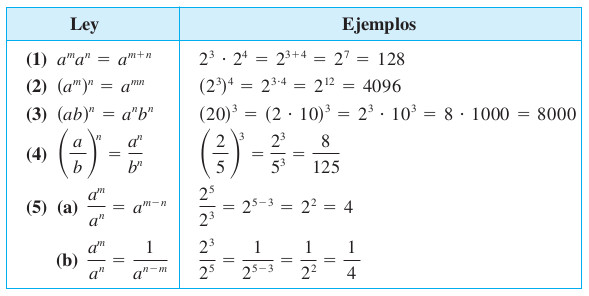
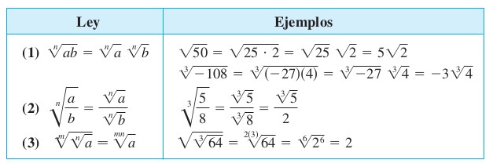

# Potenciación y Radicales {#Potenciacion-y-radicales}

**Podcast**
[Introducción](https://soundcloud.com/john-estrada-920356121/introduccion1)

## Propiedades potenciación

(\#fig:FigPotenciacion1)Propiedades de la potenciación [Imagen tomada de [@swokowski1996algebra] pág $20$]

(1) $a^nb^n=(a.b)^n$

(2) $(a^n)^m=a^{nm}$

$(2^1)^{3}=2^{(1)(3)}=2^3$

(3) $\left( \dfrac{a}{b} \right)^n=\frac{a^n}{b^n}$

(4) $a^{-n}=\dfrac{1}{a^n}$

(5) $\left( \dfrac{a}{b} \right)^{-n}=\left( \dfrac{b}{a} \right)^{n}$

(6) $1^n=1$

(7) $(-1)^n=1, \text{ siempre que n sea par}$

Ejemplo:  $(-1)^2=1$

Ejemplo:  $(-1)^4=1$

Ejemplo:  $(-1)^6=1$

(8) $(-1)^n=-1, \text{ siempre que n sea impar}$

Ejemplo:  $(-1)^1=-1$

Ejemplo:  $(-1)^3=-1$

Ejemplo:  $(-1)^5=-1$

Ejemplo:  $(-1)^7=-1$

(9) $a^0=1, \text{ siempre que } a\neq 0$

Ejemplo:  $(1)^0=1$

Ejemplo:  $(-1)^0=1$

Ejemplo:  $(3)^0=1$

Ejemplo:  $(5)^0=1$

(10) $0^0=\text{indeterminado}=IND$

**Podcast**
[Propiedades de Potenciación](https://soundcloud.com/john-estrada-920356121/propiedadesdepotenciacion)

## Propiedades de radicales

(\#fig:FigRadicales1)Propiedades de los radicales [Imagen tomada de [@swokowski1996algebra] pág $24$]

(1) $\sqrt[n]{a.b}=\sqrt[n]{a}.\sqrt[n]{b}$

(2) $\sqrt[m]{\sqrt[n]{a}}=\sqrt[n.m]{a}$

(3) $\sqrt[n]{\dfrac{a}{b} }=\frac{\sqrt[n]{a}}{\sqrt[n]{b}}$

(4) $\sqrt[n]{a}=a^{\frac{1}{n}}$

(5) $\sqrt[n]{1}=1$

(6)$\sqrt[n]{-1}=\text{ es un número complejo si n es par}$

NOTA: $\sqrt{-1}=i$ Unidad imaginaría 

Ejemplo: $\sqrt[4]{-1}=\sqrt[2]{\sqrt[2]{-1}}=\sqrt[2]{i}$

Ejemplo: $\sqrt[6]{-1}=\sqrt[3]{\sqrt[2]{-1}}=\sqrt[3]{i}$

(7) $\sqrt[n]{-1}=-1, \text{ si el número n es impar}$

Ejemplo: $\sqrt[3]{-1}=-1$

Ejemplo: $\sqrt[5]{-1}=-1$

Ejemplo: $\sqrt[6]{-2}=\sqrt[3]{\sqrt[2]{-2}}=\sqrt[3]{\sqrt[2]{(-1)2}}=\sqrt[3]{\sqrt[2]{-1}\sqrt[2]{2}}=\sqrt[3]{i\sqrt[2]{2}}$

**Podcast**
[Propiedades de los Radicales](https://soundcloud.com/john-estrada-920356121/propiedadesdelosradicales)

## Ejemplo (ejercicio del taller)

Simplificar $\left(-8 \right)^{\frac{1}{3}}$

**Proceso de solución:**

(1)  Sabemos que $8=2^3$ y $-x=(-1)x$

(2) $\left(-8 \right)^{\frac{1}{3}}=\left(-2^3 \right)^{\frac{1}{3}}$

aclaración $-2^3=(-1)(2^3)$

aclaración $\left(-2^3\right)=(-1)^3.(2)^3=((-1).2)^3$

aclaración $\left(-2^3\right)=\left(-2\right)^3$

(*) $\left(-8 \right)^{\frac{1}{3}}=\left((-1)^3.2^3 \right)^{\frac{1}{3}}=\left(((-1).2)^3 \right)^{\frac{1}{3}}$

(3) $\left(-8 \right)^{\frac{1}{3}}=\left(-2 \right)^{\frac{3}{3}}$

(4) $\left(-8 \right)^{\frac{1}{3}}=\left(-2 \right)^1$

(5) $\left(-8 \right)^{\frac{1}{3}}=-2$

## Ejemplo (ejercicio del taller)

Simplificar $\left(-32 \right)^{\frac{1}{5}}=\sqrt[5]{-32}$

**Proceso de solución:**

(1)  Sabemos que $32=2^5$ y $-x=(-1)x$

(2) $\left(-32 \right)^{\frac{1}{5}}=\left(-2^5 \right)^{\frac{1}{5}}$

aclaración $-2^5=(-1)(2^5)$

aclaración $\left(-2^5\right)=(-1)^5.(2)^5$

aclaración $\left(-2^5\right)=\left(-2\right)^5$

(*) $\left(-32 \right)^{\frac{1}{5}}=\left((-1)^5.2^5 \right)^{\frac{1}{5}}$

 $\left(-32 \right)^{\frac{1}{5}}=\left(-2 \right)^{\frac{5}{5}}$

(3) $\left(-32 \right)^{\frac{1}{5}}=\left(-2 \right)^{\frac{5}{5}}$

(4) $\left(-32 \right)^{\frac{1}{5}}=\left(-2 \right)^1$

(5) $\left(-32 \right)^{\frac{1}{5}}=-2$

## Ejemplo

Simplificar 

$$
\dfrac{2.2^{3n}-4.4^{n}}{{(2.2^{n})}^3-8.2^{2n+1}}
$$

Proceso de solución

Sabemos que $4=2^2$ y que $8=2^3$

Entonces debemos sustituir estas dos igualdades en la expresión a simplifcar como sigue:

(1) $\dfrac{2.2^{3n}-2^2.{(2^2)}^{n}}{{(2.2^{n})}^3-2^3.2^{2n+1}}$

(2) $\dfrac{2.2^{3n}-2^2.{(2^2)}^{n}}{{(2.2^{n})}^3-2^3.2^{2n+1}}$

aclaración $2^{2n+1}=2^{2n}.2^1$

(3) $\dfrac{2.2^{3n}-2.2.{(2^{2n})}}{2^3.2^{3n}-2^3.2^{2n}.2^{1}}$

aclaración $2^{3n}=2^{2n}.2^n$

(4) $\dfrac{2.2^{2n}.2^{n}-2.{2^{2n}.2}}{2^3.2^{2n}.2^{n}-2^3.2^{2n}.2^{1}}$

(5) $\dfrac{2.2^{2n}(2^{n}-2)}{2^3.2^{2n}(2^n-2)}$

(6) $\dfrac{2.2^{2n}}{2^3.2^{2n}}$

(7) $\dfrac{2}{2^3}$

(8) $\dfrac{1}{2^2}$

(9) $\dfrac{1}{4}$

  

### Actividad Geogebra: Potencias y raíces de fracciones

Author: Javier Cayetano Rodríguez

<iframe scrolling="no" title="Practica" src="https://www.geogebra.org/material/iframe/id/tz3pn2ad/width/602/height/440/border/888888/sfsb/true/smb/false/stb/false/stbh/false/ai/false/asb/false/sri/false/rc/false/ld/false/sdz/false/ctl/false" width="602px" height="440px" style="border:0px;"> </iframe>

  

### Actividad Geogebra: Propiedades de las potencias

Author: Javier Cayetano Rodríguez

<iframe scrolling="no" title="Propiedades de las potencias (fácil)" src="https://www.geogebra.org/material/iframe/id/sr7wanbc/width/675/height/417/border/888888/sfsb/true/smb/false/stb/false/stbh/false/ai/false/asb/false/sri/false/rc/false/ld/false/sdz/false/ctl/false" width="675px" height="417px" style="border:0px;"> </iframe>

  

## Ley distributiva

(\#fig:LeyDist1)Grafica ley distributiva [Imagen tomada de [@swokowski1996algebra] pág $17$]

$$\left(b+c \right)a=ba+ca$$
$$a\left(b+c \right) =ab+ac$$

## Ejemplos ley distributiva

Realizar el producto de la siguiente expresión

$$\left( ax+b\right) \left(cx+d \right)=ax.cx+ax.d+b.cx+b.d $$

$$\left( ax+b\right) \left(cx+d \right)=acx^2+(ad+bc)x+bd $$
