# Solución de Ecuaciones {#SolucionDeEcuaciones}

## Propiedades de las ecuaciones

(1) Cuando se suma o resta un número a ambos lados de la igualdad, la igualdad se mantiene.

(2) Cuando se multiplica o divide por un mismo número, distinto de cero, en ambos lados de la igualdad, la igualdad se mantiene.

(3) Cuando se eleva a una potencia distinta de cero ambos miembros de la igualdad, la igualdad se mantiene.

(4) Cuando se extrae la misma raíz, en ambos lados de la igualdad, la igualdad se mantiene.

## Ley distributiva

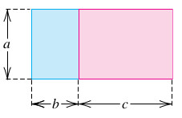

(\#fig:LeyDist1)Grafica ley distributiva [Imagen tomada de [@swokowski1996algebra] pág $17$]

$$\left(b+c \right)a=ba+ca \ \ \ \ \text{la } a \text{ se distribuye a derecha del factor } \ \ (b+c)$$
$$a\left(b+c \right) =ab+ac \ \ \ \ \text{la } a \text{ se distribuye a izquierda del factor } \ \ (b+c)$$

## Factorización (Tema1)

**Definición de Factorización**

Es el arte de tomar una expresión algebraica compuesta, y llevarla a una forma equivalente de sólo productos de factores.

**Podcast**
[Definición de que es factorizar](https://soundcloud.com/john-estrada-920356121/factorizacion1)

### Ejemplo1 (F.C. letra)

Factorizar la expresión

$$
3x^2+xy
$$
\begin{equation} \label{eq14}
\begin{split}
3x^2+xy & = 3.x.x+x.y\\
 & = x(3x+y) \ \ \ \bf{\text{Respuesta esperada}}

\end{split}
\end{equation}

### Ejemplo2 (F.C. letra)

Factorizar la expresión

$$
1x^2y^3+x^3y^5
$$
\begin{equation} \label{eq15}
\begin{split}
x^2y^3+x^3y^5 & =1.x^2.y^3+x^2.x.y^3.y^2 \\
& =1.x^2.y^3+x^2.y^3.x.y^2 \\
 & = x^2y^3(1+xy^2) \ \ \ \bf{\text{Respuesta esperada}}
\end{split}
\end{equation}

### Ejemplo3 (F.C. número)

Factorizar la expresión

$$
12x^2y+4w^3z^3
$$
\begin{equation} \label{eq16}
\begin{split}
12x^2y+4w^3z^3 & = \\
(3).(4).x^2.y+(4).w^2.w.z^3 & = 4(3x^2y+w^3z^3) \ \ \ \bf{\text{Respuesta esperada}}
\end{split}
\end{equation}

### Ejemplo4 (F.C. número y letra)

Factorizar la expresión

$$
16w^2y+4w^3x^3
$$
\begin{equation} \label{eq17}
\begin{split}
16w^2y+4w^3x^3 & = \\
(4).(4).w^2.y+(4)w^2.w.x^3 & = 4w^2(4y+wx^3) \ \ \ \bf{\text{Respuesta esperada}}
\end{split}
\end{equation}

### Ejemplo5 (F.C. por agrupación)

Factorizar la expresión

$$
2uv-5wz+2uz-5wv
$$
\begin{equation} \label{eq18}
\begin{split}
2uv-5wz+2uz-5wv & = (2uv+2uz)+(-5wz-5wv) \\
& = 2u.(v+z)-5w.(z+v) \\
& = 2u.(v+z)-5w.(v+z) \\
& = (2u-5w).(v+z) \ \ \ \bf{\text{Respuesta esperada}}
\end{split}
\end{equation}

### Ejemplo6 (F.C. por agrupación)

Factorizar la expresión

$$
2p^3-p^2+2p-1
$$
\begin{equation} \label{eq19}
\begin{split}
2p^2.p-p^2+2p-1 & = (2p^3-p^2)+(2p-1) \\
& = p^2.(2p-1)+1.(2p-1) \\
& =  (p^2+1).(2p-1)  \ \ \ \bf{\text{Respuesta esperada}}
\end{split}
\end{equation}

### Factorizar $x^2+Bx+C$

$$
x^2+Bx+C=(x+a)(x+b)
$$

#### Ejemplo 1

Factorizar $x^2+7x+10$

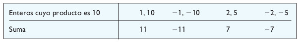

(\#fig:Factorizacion1)Factorización ejemplo 1 [Imagen tomada de [@sullivan2006algebra] pág $46$]

**Solución**:

La factorización de la expresión cuadrática $x^2+7x+10$ es:

$$
x^2+7x+10=(x+2)(x+5)
$$

#### Ejemplo 2

Factorizar $x^2-6x+8$

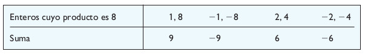

(\#fig:Factorizacion2)Factorización ejemplo 2 [Imagen tomada de [@sullivan2006algebra] pág $46y47$]

**Solución**:

La factorización de la expresión cuadrática $x^2-6x+8$ es:

$$
x^2-6x+8=(x-2)(x-4)
$$

### Factorizar $Ax^2+Bx+C$

$$
Ax^2+Bx+C=(ax+b)(cx+d)=acx^2+(ad+bc)x+bd
$$

#### Ejemplo 1

Factorizar la expresión cuadrática 

$$ 2x^2+5x+3 $$

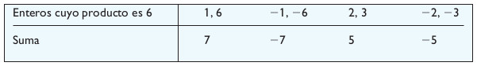

(\#fig:Factorizacion3)Factorización ejemplo 1 [Imagen tomada de [@sullivan2006algebra] pág $49$]

**Solución**:

Por agrupación se tiene:

$$
\begin{split}
2x^2+5x+3 &=& 2x^2+2x+3x+3\\
&=& 2x(x+1)+3(x+1)\\
&=& (2x+3)(x+1)
\end{split}
$$
**Respuesta**:  La factorización de la expresión cuadrática $2x^2+5x+3$ es:

$$
2x^2+5x+3=(2x+3)(x+1)
$$

#### Ejemplo 2

Factorizar la expresión cuadrática 

$$ 2x^2-x-6 $$

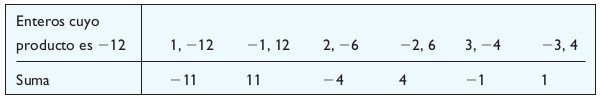

(\#fig:Factorizacion4)Factorización ejemplo 2 [Imagen tomada de [@sullivan2006algebra] pág $49y50$]

**Solución**:

Por agrupación

$$
\begin{split}
2x^2-x-6 &=& 2x^2-4x+3x-6\\
&=& (2x^2-4x)+(3x-6)\\
&=& 2x(x-2)+3(x-2)\\
&=& (2x+3)(x-2)
\end{split}
$$

**Respuesta**: La factorización de la expresión cuadrática $2x^2-x-6$ es:

$$
2x^2-x-6=(2x+3)(x-2)
$$

##  Método de Po Shen Loh

[link método de Po Shen Loh](https://jestradacasasept2022.shinyapps.io/MetodoPoShenLohV3/)

## Método de la cruceta

[link método de la cruceta](https://johnproyectos2020v1.shinyapps.io/CRUCETA/)

Deducción del método

Supongamos que la expresión cuadrática $Ax^2+Bx+C$ de puede facotorizar como:

$$Ax^2+Bx+C=\left(mx+p \right).\left(nx+q \right) $$
Realizando el producto de los factores $\left(mx+p \right).\left(nx+q \right)$ y agrupando

obtenemos:

$$Ax^2+Bx+C=mnx^2+mxq+pnx+pq$$
$$Ax^2+Bx+C=m.nx^2+(m.q+p.n)x+p.q$$
A partir de este resultado podemos afirmar que

El coeficiente $A$

puede obtenerse como el producto de dos números $m$ y $n$ es decir:

$$A=m.n$$

y el coeficiente (ó término independiente) $C$ puede obtenerse como el producto de dos números $p$ y $q$ es decir:

$$C=pq$$

Y por último el coeficiente $B$ es:

$$B=m.q+n.p$$
El esquema para la **CRUCETA** es:

$$
\begin{array}{cccc}
 A &  & C  \\ 
 m &  & p  \\
 \vdots & \searrow & \vdots  \\
 n &  & q & \Rightarrow B=mq+np
\end{array}
$$

$$ \text{entonces la factorización de: } \ \ Ax^2+Bx+C= \left(mx+p \right).\left(nx+q \right) $$

**Podcast**
[Deducción Técnica de la Cruceta](https://soundcloud.com/john-estrada-920356121/deducciontecnicadelacruceta)

## Condición para aplicar la técnica llamada **CRUCETA**

**Podcast**
[Condicción para aplicar la Técnica de la Cruceta](https://soundcloud.com/john-estrada-920356121/condiciontecnicadelacruceta)

Si la raíz del discriminante $D$ es exacta, se puede aplicar el esquema de la **CRUCETA**

### Ejemplo (Si la raíz de $D\geq 0$ es exacta)

**Ejemplo 1** Factorizar $2x^2+11x+12$ usando el esquema de la cruceta

solución: $A=2$; $B=11$; $C=12$

$$
\begin{array}{cccc}
 A &  & C  \\ 
 m:1 &  & p:4  \\
 \vdots & \searrow & \vdots  \\
 n:2 &  & q:3 & \Rightarrow \text{como }B=11=mq+np=(1)(3)+(2)(4)=3+8=11
\end{array}
$$

$$
 \text{entonces la factorización de:} \ \  2x^2+11x+12= \left(1x+4 \right).\left(2x+3 \right)
$$

**Podcast**
[Ejemplo 1 Regla de la Cruceta caso raíz exacta](https://soundcloud.com/john-estrada-920356121/ejemplo1regladelacruceta)

### Ejemplo 2 

Factorizar $2x^2+11x-6$ usando el esquema de la cruceta

solución: $A=2$; $B=11$; $C=-6$

$$
\begin{array}{cccc}
 A &  & C  \\ 
 m:2 &  & p:-1  \\
 \vdots & \searrow & \vdots  \\
 n:1 &  & q:6 & \Rightarrow \text{como }B=11=mq+np=(2)(6)+(1)(-1)=12-1=11
\end{array}
$$

$$
 \text{entonces la factorización de:} \ \  2x^2+11x-6= \left(2x-1 \right).\left(1x+6 \right)
$$

**Podcast**
[Ejemplo 2 Regla de la Cruceta caso raíz exacta](https://soundcloud.com/john-estrada-920356121/ejemplo2regladelacruceta)

### Ejemplo 3

Factorizar $x^2-6x+9$ usando el esquema de la cruceta

solución: $A=1$; $B=-6$; $C=9$

$$
\begin{array}{cccc}
 A &  & C  \\ 
 m:1 &  & p:-3  \\
 \vdots & \searrow & \vdots  \\
 n:1 &  & q:-3 & \Rightarrow \text{como }B=-6=mq+np=(1)(-3)+(1)(-3)=-3+(-3)=-6
\end{array}
$$

$$
 \text{entonces la factorización de:} \ \  x^2-6x+9= \left(1x-3 \right).\left(1x-3 \right)=\left(1x-3 \right)^2
$$

### Ejemplo 4

Factorizar $8x^2+2x-3$ usando el esquema de la cruceta

solución: $A=8$; $B=2$; $C=-3$

$$
\begin{array}{cccc}
 A &  & C  \\ 
 m:4 &  & p:3  \\
 \vdots & \searrow & \vdots  \\
 n:2 &  & q:-1 & \Rightarrow \text{como }B=2=mq+np=(4)(-1)+(2)(3)=-4+6=2
\end{array}
$$

$$
 \text{entonces la factorización de:} \ \  8x^2+2x-3= \left(4x+3 \right).\left(2x-1 \right)
$$

### Ejemplo 5

Factorizar $-3x^2-5x+12$ usando el esquema de la cruceta

solución: $A=-3$; $B=-5$; $C=12$; $D=169$; $\sqrt{D}=\sqrt{169}=13$ es exacta la raíz del discriminante

$$
\begin{array}{cccc}
 A &  & C  \\ 
 m:1 &  & p:3  \\
 \vdots & \searrow & \vdots  \\
 n:-3 &  & q:4 & \Rightarrow \text{como }B=-5=mq+np=(1)(4)+(-3)(3)=4-9=-5
\end{array}
$$

$$
 \text{entonces la factorización de:} \ \  -3x^2-5x+12= \left(1x+3 \right).\left(-3x+4 \right)
$$

## Método factorización forzada

[link método factorización forzada](https://johnproyectos2020v1.shinyapps.io/Fforzada/)

La solución para la ecuación
$$
Ax^2+Bx+C=0
$$
Está dada por

$$
x=\dfrac{-B \pm\sqrt{B^2-4AC}}{2A}
$$

En caso de que la raíz del discriminante $D$ no sea exacta, pero $D>0$ se aplica la factorización forzada que se expresa como:

$$
Ax^2+Bx+C=A\left(x- \dfrac{-B+\sqrt{B^2-4AC}}{2A} \right)\left(x- \dfrac{-B-\sqrt{B^2-4AC}}{2A} \right)
$$

### Ejemplo 1

**(Si la raíz de $D>0$ no es exacta)**

Factorizar $-3x^2+4x+12$ usando la factorización forzada

Solución: $A=-3$; $B=4$; $C=12$; $D=160$; $\sqrt{D}=\sqrt{160}\simeq 12.64911$  no es exacta la raíz del discriminante $D$

$$
-3x^2+4x+12=-3\left(x- \dfrac{-(4)+\sqrt{(4)^2-4(-3)(12)}}{2(-3)} \right)\left(x- \dfrac{-(4)-\sqrt{(4)^2-4(-3)(12)}}{2(-3)} \right)
$$
$$
-3x^2+4x+12=-3\left(x- \dfrac{-4+\sqrt{16+144}}{-6} \right)\left(x- \dfrac{-4-\sqrt{16+144}}{-6} \right)
$$
$$
-3x^2+4x+12=-3\left(x- \dfrac{-4+\sqrt{160}}{-6} \right)\left(x- \dfrac{-4-\sqrt{160}}{-6} \right)
$$

### Ejemplo 2

Factorizar $8x^2+x-6$ usando la factorización forzada

Solución: $A=8$; $B=1$; $C=-6$; $D=193$; $\sqrt{D}=\sqrt{193}\simeq 13.8924$  no es exacta la raíz del discriminante $D$

$$
8x^2+x-6=8\left(x- \dfrac{-(1)+\sqrt{(1)^2-4(8)(-6)}}{2(8)} \right)\left(x- \dfrac{-(1)-\sqrt{(1)^2-4(8)(-6)}}{2(8)} \right)
$$

$$
8x^2+x-6=8\left(x- \dfrac{-1+\sqrt{1+192}}{16} \right)\left(x-\dfrac{-1-\sqrt{1+192}}{16} \right)
$$

$$
8x^2+x-6=8\left(x- \dfrac{-1+\sqrt{193}}{16} \right)\left(x-\dfrac{-1-\sqrt{193}}{16} \right)
$$

## Ejemplo (Si $D<0$)

La expresión cuadrática $Ax^2+Bx+C$ no se puede factorizar
en el conjunto de los números reales.

Es decir no se puede aplicar la regla de la cruceta y tampoco la factorización forzada.

## Productos notables básicos

### Suma al cuadrado

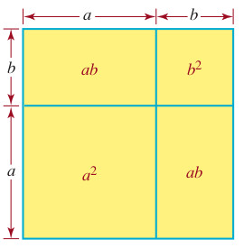

(\#fig:ProductoNotable1)Suma al cuadrado [Imagen tomada de [@zill2012algebra] pág $98$]

$$\left(a+b \right)^2=a^2+2ab+b^2$$

**Podcast**
[Suma al cuadrado](https://soundcloud.com/john-estrada-920356121/sumaalcuadrado-1)

### Diferencia al cuadrado

$$\left(a-b \right)^2=a^2-2ab+b^2$$

**Podcast**
[Diferencia al cuadrado](https://soundcloud.com/john-estrada-920356121/diferenciaalcuadrado)

### Diferencia de cuadrados

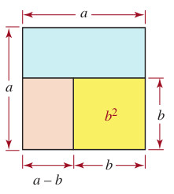

(\#fig:ProductoNotable2)Diferencia de cuadrados [Imagen tomada de [@zill2012algebra] pág $98$]

$$a^2-b^2=\left(a-b \right) \left(a+b \right) $$

**Podcast**
[Diferencia de cuadrados](https://soundcloud.com/john-estrada-920356121/diferenciadecuadrados)

### Suma al cúbo

$$\left( a+b\right)^3=a^3+3a^2b+3ab^2+b^3$$

**Podcast**
[Suma al cúbo](https://soundcloud.com/john-estrada-920356121/sumaalcubo)

<!-- https://www.geogebra.org/m/dbrjxhzk -->

<meta name=viewport content="width=device-width,initial-scale=1">
<meta charset="utf-8"/>

 

### Diferencia al cúbo

$$\left( a-b\right)^3=a^3-3a^2b+3ab^2-b^3 $$

### Suma de cúbos

$$a^3+b^3=\left(a+b \right) \left(a^2-ab+b^2 \right) $$

### Diferencia de cúbos

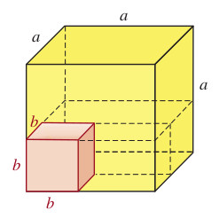

(\#fig:ProductoNotable3)Diferencia de cúbos [Imagen tomada de [@zill2012algebra] pág $98$]

$$a^3-b^3=\left(a-b \right) \left(a^2+ab+b^2 \right) $$

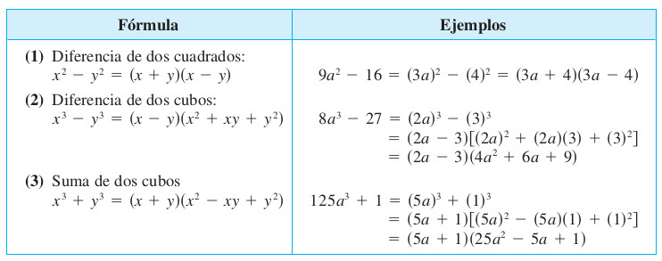

(\#fig:ProductosNotables1)Ejemplos de productos notables [Imagen tomada de [@swokowski1996algebra] pág $38$]

  

### Actividad Geogebra: Fórmula del binomio de Newton

Author: José María Arias Cabezas

<iframe scrolling="no" title="Fórmula del binomio de Newton" src="https://www.geogebra.org/material/iframe/id/E6U3uMmd/width/800/height/600/border/888888/sfsb/true/smb/false/stb/false/stbh/false/ai/false/asb/false/sri/true/rc/false/ld/false/sdz/true/ctl/false" width="800px" height="600px" style="border:0px;"> </iframe>

  

## Operaciones con polinomios

::: {.definition #unnamed-chunk-1}
Un **Polinomio** $P(x)$ es una expresión de la forma
$$
  P(x)=a_nx^n+a_{n-1}x^{n-1}+...+a_{2}x^2+a_{1}x^1+a_{0}
$$

donde $a_n$, $a_{n-1}$,...,$a_0$ son los coeficientes del polinomio los cuales pertenecen al conjunto de los númerios reales. Diremos que el grado del polinomio es $n$, si y sólo si $a_n\neq 0$
:::

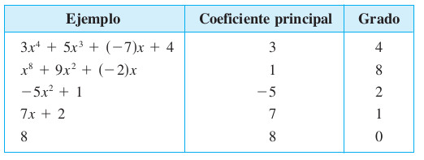

(\#fig:ClasificacionPolinomios1)Clasificación de Polinomios por grado [Imagen tomada de [@swokowski1996algebra] pág $33$]

### **Suma de polinomios**

Halle la suma de los polinomios

$$
x^4-3x^2+7x-8 \ \ \ y \ \ \ 2x^4+x^2+3x
$$

**[Solución]**  Agrupar términos semejantes según el exponente de la variable $x$

**OBS:** Tener mucha atención en el manejo de signos para la agrupación de términos según la semejanza

\begin{equation} \label{eq1}
\begin{split}
(x^4-3x^2+7x-8) + (2x^4+x^2+3x) & = x^4 + 2x^4 -3x^2 + x^2 + 7x + 3x -8 \\
 & = (1+2)x^4 +(-3 + 1)x^2 + (7 + 3)x -8 \\
 & = 3x^4 - 2x^2 + 10x - 8 \ \ \ \bf{\text{Respuesta esperada}} 
\end{split}
\end{equation}

### **Diferencia de polinomios**

Reste $2x^3-3x-4$ de $x^3+5x^2-10x+6$

**[Solución]** Agrupar según lo indica la diferencia entre polinomios.

\begin{equation} \label{eq2}
\begin{split}
(x^3+5x^2-10x+6) - (2x^3-3x-4) & = x^3+5x^2-10x+6-2x^3+3x+4\\
& = x^3-2x^3+5x^2-10x+3x+6+4\\
 & = (1-2)x^3 +5x^2 + (3 - 10)x +(6+4) \\
 & = -1x^3 +5x^2 -7x +10 \\
 & = -x^3 +5x^2 -7x +10 \ \ \ \bf{\text{Respuesta esperada}} 
\end{split}
\end{equation}

### **Producto de dos polinomios**

Multiplique $x^3+3x-1$ y $2x^2-4x+5$

\begin{equation} \label{eq3}
\begin{split}
(x^3+3x-1)(2x^2-4x+5) & ={\bf(x^3+3x-1)}(2x^2)+{\bf(x^3+3x-1)}(-4x)+{\bf(x^3+3x-1)}(5) \\
& = 2x^5 + 6x^3-2x^2 -4x^4-12x^2+4x+5x^3+15x-5 \\
 & = 2x^5 + (-4)x^4 +(6+5)x^3 +(-2-12)x^2+ (4+15)x^1+(-5) \\
 & = 2x^5 - 4x^4 + 11x^3 - 14x^2 + 19x^1 -5 \ \ \ \bf{\text{Respuesta esperada}} 
\end{split}
\end{equation}

  

### Actividad Geogebra: **División de polinomios**

Author: José María Arias Cabezas

<iframe scrolling="no" title="División de polinomios" src="https://www.geogebra.org/material/iframe/id/qr3kgyzq/width/800/height/600/border/888888/sfsb/true/smb/false/stb/false/stbh/false/ai/false/asb/false/sri/true/rc/false/ld/false/sdz/true/ctl/false" width="800px" height="600px" style="border:0px;"> </iframe>

  

### Actividad Geogebra: Valor numérico de un polinomio

Author: José María Arias Cabezas

<iframe scrolling="no" title="Valor numérico de un polinomio" src="https://www.geogebra.org/material/iframe/id/rfjeuys8/width/800/height/600/border/888888/sfsb/true/smb/false/stb/false/stbh/false/ai/false/asb/false/sri/true/rc/false/ld/false/sdz/true/ctl/false" width="800px" height="600px" style="border:0px;"> </iframe>

  

# Simplificación

## Ejemplo1 (Simplificación)

Simplificar la expresión racional

$$
\dfrac{2x^2-x-1}{x^2-1}
$$

\begin{equation} \label{eq4}
\begin{split}
\dfrac{2x^2-x-1}{x^2-1} & =\dfrac{(2x+1)(x-1)}{(x-1)(x+1)} \\
 & =  \dfrac{(2x+1)}{(x+1)}\\
 \dfrac{2x^2-x-1}{x^2-1} & = \dfrac{(2x+1)}{(x+1)} \ \ \ \bf{\text{Respuesta esperada}} 
\end{split}
\end{equation}

## Ejemplo2 (Simplificación)

Simplificar la expresión racional

$$
\dfrac{4x^2+11x-3}{2-5x-12x^2}
$$

\begin{equation} \label{eq5}
\begin{split}
\dfrac{4x^2+11x-3}{2-5x-12x^2} & =\dfrac{4x^2+11x-3}{-12x^2-5x+2} \\
 & =  \dfrac{(4x-1).(x+3)}{(1-4x).(2+3x)}\\
 & = \dfrac{(4x-1).(x+3)}{-(4x-1).(3x+2)} \ \ \ \text{Recordar:} \ \ \ \ -(b-a)=a-b \\
 \dfrac{4x^2+11x-3}{2-5x-12x^2} & = \dfrac{(x+3)}{-(3x+2)} \ \ \ \text{Recordar:} \ \ \ \ -\dfrac{a}{d}=\dfrac{a}{-d} =\dfrac{-a}{d}\\
 \dfrac{4x^2+11x-3}{2-5x-12x^2} & = -\dfrac{(x+3)}{(3x+2)} \ \ \ \bf{\text{Respuesta esperada}}
\end{split}
\end{equation}

## Ejemplo3 (Simplificación)

Simplificar la expresión racional

$$
\dfrac{x}{5x^2+21x+4}.\dfrac{25x^2+10x+1}{3x^2+x}
$$

\begin{equation} \label{eq6}
\begin{split}
\dfrac{x}{5x^2+21x+4}.\dfrac{25x^2+10x+1}{3x^2+x} & =\dfrac{x(25x^2+10x+1)}{(5x^2+21x+4)(3x^2+x)} \ \ \ \text{Recordar:} \ \ \ \ \dfrac{a.b}{c.d}=\dfrac{a}{c}.\dfrac{b}{d} \\
 & =  \dfrac{x.(5x+1).(5x+1)}{(5x+1).(x+4).x.(3x+1)}\\
 & = \dfrac{(5x+1)}{(x+4).(3x+1)}\ \ \ \bf{\text{Respuesta esperada}}
\end{split}
\end{equation}

## Ejemplo4 (Simplificación)

Simplificar la expresión racional

$$
\dfrac{2x^2+9x+10}{x^2+4x+3}\div\dfrac{2x+5}{x+3}=\dfrac{\dfrac{2x^2+9x+10}{x^2+4x+3}}{\dfrac{2x+5}{x+3}}
$$

\begin{equation} \label{eq7}
\begin{split}
\dfrac{2x^2+9x+10}{x^2+4x+3}\div\dfrac{2x+5}{x+3} & =\dfrac{2x^2+9x+10}{x^2+4x+3}\times \dfrac{x+3}{2x+5} \ \ \ \text{Recordar:} \ \ \ \ \dfrac{\dfrac{a}{c}}{\dfrac{b}{d}}=\dfrac{a}{c}\times\dfrac{d}{b} \\
 & =  \dfrac{(2x+5).(x+2).(x+3)}{(x+3).(x+1).(2x+5)}\\
 & = \dfrac{x+2}{x+1}\ \ \ \bf{\text{Respuesta esperada}}
\end{split}
\end{equation}

## Ejemplo5 (Simplificación)

Simplificar la expresión racional

$$
\dfrac{\dfrac{1}{x}-\dfrac{x}{x+1}}{1+\dfrac{1}{x}}
$$

**Primero: Se realiza la resta en el numerador**

\begin{equation} \label{eq9}
\begin{split}
\dfrac{1}{x}-\dfrac{x}{x+1} & = \dfrac{1.(x+1)-x.x}{x.(x+1)} \ \ \ \text{Recordar:} \ \ \ \ \dfrac{a}{b} \pm \dfrac{c}{d} =\dfrac{ad \pm bc}{bd}\\
& = \dfrac{x+1-x^2}{x.(x+1)} \\
& = \dfrac{-x^2+x+1}{x.(x+1)} \ \ \ \text{donde se ordeno los términos del numerador} \\
\end{split}
\end{equation}

**Segundo: Se realiza la suma en el denominador**

\begin{equation} \label{eq10}
\begin{split}

1+\dfrac{1}{x} & = \dfrac{1}{1}+\dfrac{1}{x} \\
& = \dfrac{1.x+1.1}{1.x} \ \ \ \text{Recordar:} \ \ \ \ \dfrac{a}{b} \pm \dfrac{c}{d} =\dfrac{ad \pm bc}{bd}\\
& = \dfrac{x+1}{x} \\
\end{split}
\end{equation}

**Tercero: Se sustituyen el nuevo numerador y el nuevo denominador**

\begin{equation} \label{eq11}
\begin{split}
\dfrac{\dfrac{-x^2+x+1}{x.(x+1)}}{\dfrac{x+1}{x}} & =\dfrac{-x^2+x+1}{x.(x+1)}\times \dfrac{x}{x+1} \ \ \ \text{Recordar:} \ \ \ \ \dfrac{\dfrac{a}{c}}{\dfrac{b}{d}}=\dfrac{a}{c}\times\dfrac{d}{b} \\
 & =  \dfrac{(-x^2+x+1).x}{x.(x+1).(x+1)}\\
 & =  \dfrac{(-x^2+x+1)}{(x+1).(x+1)}\\
 & = \dfrac{-x^2+x+1}{(x+1)^2}\ \ \ \bf{\text{Respuesta esperada}}
\end{split}
\end{equation}

## Ejemplo6 (Simplificación)

Simplificar la expresión

$$
(a^{-1}+b^{-1})^{-1}=\dfrac{1}{a^{-1}+b^{-1}}
$$

\begin{equation} \label{eq12}
\begin{split}

\dfrac{1}{a^{-1}+b^{-1}} & = \dfrac{1}{\dfrac{1}{a}+\dfrac{1}{b}} \\
& = \dfrac{\dfrac{1}{1}}{\dfrac{1.b+1.a}{a.b}} \ \ \ \text{Recordar:} \ \ \ \ \dfrac{a}{b} \pm \dfrac{c}{d} =\dfrac{ad \pm bc}{bd}\\
& = \dfrac{1}{1} \times \dfrac{ab}{b+a} \ \ \ \text{Recordar:} \ \ \ \ \dfrac{\dfrac{a}{c}}{\dfrac{b}{d}}=\dfrac{a}{c}\times\dfrac{d}{b} \\
& = \dfrac{ab}{b+a}\ \ \ \bf{\text{Respuesta esperada}}
\end{split}
\end{equation}

## Ejemplo7 (Simplificación)

Simplificar la expresión

$$
\dfrac{x}{\sqrt{y}}+\dfrac{y}{\sqrt{x}}
$$

\begin{equation} \label{eq13}
\begin{split}
\dfrac{x}{\sqrt{y}}+\dfrac{y}{\sqrt{x}} & =\dfrac{x.\sqrt{x}+y.\sqrt{y}}{\sqrt{x}.\sqrt{y}} \\
 & =  \dfrac{x.\sqrt{x}+y.\sqrt{y}}{\sqrt{x.y}} \\
 & =  \dfrac{(x.\sqrt{x}+y.\sqrt{y}).\sqrt{x.y}}{\sqrt{x.y}.\sqrt{x.y}} \\
 & =  \dfrac{(x.\sqrt{x}+y.\sqrt{y}).\sqrt{x}.\sqrt{y}}{(\sqrt{x.y})^2} \\
 & =  \dfrac{x.(\sqrt{x})^2\sqrt{y}+y.(\sqrt{y})^2\sqrt{x}}{(\sqrt{x.y})^2} \\
 & =  \dfrac{(x^2.\sqrt{y}+y^2.\sqrt{x})}{(\sqrt{x.y})^2} \\
 \dfrac{x}{\sqrt{y}}+\dfrac{y}{\sqrt{x}} & = \dfrac{x^2.\sqrt{y}+y^2.\sqrt{x}}{x.y} \ \ \ \bf{\text{Respuesta esperada}} 
\end{split}
\end{equation}

## Despeje de variable (Tema1)

### Ejemplo1 (Despeje de variable)

Despejar la letra $r$ en la ecuación
$$
C=2\pi r
$$
\begin{equation} \label{eq20}
\begin{split}
\text{lado Izquierdo}& = \text{lado Derecho}\\
C & = 2\pi r  \\
\dfrac{C}{2\pi}& =r  \ \ \ \bf{\text{Respuesta esperada}}
\end{split}
\end{equation}

### Ejemplo2 (Despeje de variable)

Despejar la letra $x$ en la ecuación
$$
3x+5=0
$$
\begin{equation} \label{eq21}
\begin{split}
\text{lado Izquierdo}& = \text{lado Derecho}\\
3x+5 & = 0  \\
3x & =-5  \\
x& =  \dfrac{-5}{3}\ \ \ \bf{\text{Respuesta esperada}}\\
\dfrac{1x^1}{1}& = x\ \ \ \text{El significado de que}\ \ \ x \ \ \ \text{esta despejada}
\end{split}
\end{equation}

\begin{equation} \label{eq25}
\boxed{x =  \dfrac{-5}{3}}
\end{equation}

### Ejemplo3 (Despeje de variable)

Despejar la letra $l$ en la ecuación
$$
P=2w+2l
$$
\begin{equation} \label{eq22}
\begin{split}
\text{lado Izquierdo}& = \text{lado Derecho}\\
P & = 2w+2l  \\
P-2w & =2l  \\
\dfrac{P-2w}{2}& = l  \ \ \ \bf{\text{Respuesta esperada}}\\
\dfrac{1l^1}{1}& =l \ \ \  \text{El significado de que}\ \ \ l \ \ \ \text{esta despejada}
\end{split}
\end{equation}

\begin{equation} \label{eq26}
\boxed{\dfrac{P-2w}{2} = l }
\end{equation}

### Ejemplo4 (Despeje de variable)

Despejar la letra $t$ en la ecuación
$$
l=Prt
$$
\begin{equation} \label{eq23}
\begin{split}
\text{lado Izquierdo}& = \text{lado Derecho}\\
l & = Prt  \\
\dfrac{l}{Pr}& = t  \ \ \ \bf{\text{Respuesta esperada}}\\
\dfrac{1t^1}{1}& =t \ \ \  \text{El significado de que}\ \ \ t \ \ \ \text{esta despejada}
\end{split}
\end{equation}

\begin{equation} \label{eq27}
\boxed{\dfrac{l}{Pr} = t}
\end{equation}

### Ejemplo5 (Despeje de variable)

Despejar la letra $h$ en la ecuación
$$
S=2\pi rh
$$
\begin{equation} \label{eq24}
\begin{split}
\text{lado Izquierdo}& = \text{lado Derecho}\\
S & = 2\pi rh  \\
\dfrac{S}{2\pi r}& = h  \ \ \ \bf{\text{Respuesta esperada}}\\
\dfrac{1h^1}{1}& =h \ \ \  \text{El significado de que}\ \ \ h \ \ \ \text{esta despejada}
\end{split}
\end{equation}

\begin{equation} \label{eq28}
\boxed{\dfrac{S}{2\pi r} = h}
\end{equation}

### Ejemplo6 (Despeje de variable)

Despejar la letra $r$ en la ecuación
$$
V=\dfrac{1}{3}\pi r^2h
$$
\begin{equation} \label{eq29}
\begin{split}
\text{lado Izquierdo}& = \text{lado Derecho}\\
V & = \dfrac{1}{3}\pi r^2h  \\
3V& = \pi r^2h \\
\dfrac{3V}{\pi h} & = r^2 \\
\pm \sqrt{\dfrac{3V}{\pi h}} & = r \ \ \ \bf{\text{Recordar}} \sqrt{r^2}=r\\
\sqrt{\dfrac{3V}{\pi h}} & = r  \ \ \ \bf{\text{Respuesta esperada ya que }} r>0 \\
\dfrac{1r^1}{1}& =r \ \ \  \text{El significado de que}\ \ \ r \ \ \ \text{esta despejada}
\end{split}
\end{equation}

\begin{equation} \label{eq30}
\boxed{\sqrt{\dfrac{3V}{\pi h}} = r}
\end{equation}

### Ejemplo7 (Despeje de variable)

Despejar la letra $m$ en la ecuación
$$
F=g\dfrac{mM}{d^2}
$$
\begin{equation} \label{eq31}
\begin{split}
\text{lado Izquierdo}& = \text{lado Derecho}\\
F & = g\dfrac{mM}{d^2}  \\
F & = \dfrac{g}{1}.\dfrac{mM}{d^2}  \\
F & = \dfrac{gmM}{d^2}  \\
Fd^2 & = gmM  \\
\dfrac{d^2F}{gM} & = m \ \ \ \bf{\text{Respuesta esperada}}\\
\dfrac{1m^1}{1}& =m \ \ \  \text{El significado de que}\ \ \ m \ \ \ \text{esta despejada}\\
\end{split}
\end{equation}

\begin{equation} \label{eq32}
\boxed{\dfrac{d^2F}{gM} = m}
\end{equation}

### Ejemplo8 (Despeje de variable)

Despejar la letra $t$ en la ecuación
$$
s=\dfrac{1}{2}gt^2+v_0t
$$
\begin{equation} \label{eq33}
\begin{split}
\text{lado Izquierdo}& = \text{lado Derecho}\\
s & = \dfrac{1}{2}gt^2+v_0t  \\
2s & = gt^2+2v_0t  \\ 
0 & = gt^2+2v_0t-2s  \\
0 & = At^2+Bt+C  \ \ \  \text{donde}\ \ \   A=g \ \ B=2v_0 \ \ C=-2s \\
  & = \ \ \text{Ahora aplicamos la fórmula del estudiante}\\
t & = \dfrac{-B \pm \sqrt{B^2-4AC}}{2A}  \ \ \ \text{Recordar: Fórmula del estudiante} \\
t & = \dfrac{-2v_0 \pm \sqrt{(2v_0)^2-4g(-2s)}}{2g} \\
t & = \dfrac{-2v_0 \pm \sqrt{4(v_0)^2+8gs}}{2g} \\
t & = \dfrac{-2v_0 \pm \sqrt{4\left((v_0)^2+2gs\right)}}{2g} \\
t & = \dfrac{-2v_0 \pm \sqrt{4}\sqrt{(v_0)^2+2gs}}{2g} \\
t & = \dfrac{-2v_0 \pm 2\sqrt{(v_0)^2+2gs}}{2g} \\
t & = \dfrac{2(-v_0 \pm \sqrt{(v_0)^2+2gs})}{2g} \\
t & = \dfrac{-v_0 \pm \sqrt{(v_0)^2+2gs}}{g} \ \ \ \bf{\text{Respuesta esperada}}\\
\dfrac{1t^1}{1}& = t \ \ \  \text{El significado de que}\ \ \ t \ \ \ \text{esta despejada}
\end{split}
\end{equation}

\begin{equation} \label{eq34}
\boxed{t = \dfrac{-v_0 \pm \sqrt{(v_0)^2+2gs}}{g}}
\end{equation}

### Ejemplo9 (Despeje de variable)

Despejar la letra $C$ en la ecuación
$$
A=B\sqrt[3]{\dfrac{C}{D}}-E
$$

\begin{equation} \label{eq35}
\begin{split}
\text{lado Izquierdo}& = \text{lado Derecho}\\

A & = B\sqrt[3]{\dfrac{C}{D}}-E \\
A + E & = B\sqrt[3]{\dfrac{C}{D}} \\
\dfrac{A + E}{B} & = \sqrt[3]{\dfrac{C}{D}} \\
\left(\dfrac{A + E}{B}\right)^3 & = \left(\sqrt[3]{\dfrac{C}{D}}\right)^3 \\
\left(\dfrac{A + E}{B}\right)^3 & = \dfrac{C}{D} \\
D\left(\dfrac{A + E}{B}\right)^3 & = C \ \ \ \bf{\text{Respuesta esperada}}
\end{split}
\end{equation}

\begin{equation} \label{eq36}
\boxed{D\left(\dfrac{A + E}{B}\right)^3 = C}
\end{equation}

### Ejemplo10 (Despeje de variable)

Despejar la letra $B$ en la ecuación
$$
A=B\sqrt[3]{\dfrac{C}{D}}-E
$$

\begin{equation} \label{eq37}
\begin{split}
\text{lado Izquierdo}& = \text{lado Derecho}\\

A & = B\sqrt[3]{\dfrac{C}{D}}-E \\

A + E & = B\sqrt[3]{\dfrac{C}{D}} \\

\dfrac{A + E}{\sqrt[3]{\dfrac{C}{D}}} & = B \ \ \ \bf{\text{Respuesta esperada}}

\end{split}
\end{equation}

\begin{equation} \label{eq38}
\boxed{\dfrac{A + E}{\sqrt[3]{\dfrac{C}{D}}} = B}
\end{equation}

## Resolución de ecuaciones

### Ceros de una ecuación

**Ceros (ó corte) con el eje $X$ de función (ó ecuación)**

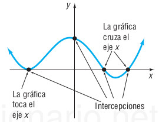

(\#fig:CerosDeEcu1)Ceros (ó corte) de una función con el eje $X$ [Imagen tomada de [@swokowski1996algebra] pág $169$]

::: {.definition #unnamed-chunk-2}
Se define $x=r$ como un cero (ó raíz) de una función $f(x)=0$, si y sólo si $f(r)=0$. Además el cero (ó raíz) de una función es la intersección entre el eje $X$ y la gráfica de $f(x)$.
:::

  

### Actividad Geogebra: Ecuaciones con paréntesis (soluciones enteras)

Author: Javier Cayetano Rodríguez

<iframe scrolling="no" title="Ecuaciones con Paréntesis. Soluciones Enteras." src="https://www.geogebra.org/material/iframe/id/xskf2udt/width/675/height/417/border/888888/sfsb/true/smb/false/stb/false/stbh/false/ai/false/asb/false/sri/false/rc/false/ld/false/sdz/false/ctl/false" width="675px" height="417px" style="border:0px;"> </iframe>

  

### Link Shiny para gráficar ecuaciones y apróximar raíces irracionales

[Gráficas y raíces apróximadas](https://septiembreestradajohnjairo2021uces.shinyapps.io/EjemploCEROSDEUNAECUACIONmateUnoA/)

[Método de Newton Raphson](https://nuevoucesjohnestradaalvarez.shinyapps.io/MetodoDeNewtonRapsonA_1/)

[Criterio de Primera y Segunda derivada con ceros irracionales usando el Método de Newton Raphson](https://johnucesoficina2022.shinyapps.io/funcionDerivadasYTablasVb1/)

[Método de Bisección](https://estradajohncasa16feb2023.shinyapps.io/MetodoDeBiseccionVa1/)

### Fórmula del estudiante

La solución para la ecuación
$$
Ax^2+Bx+C=0
$$

Está dada por

$$
x=\dfrac{-B \pm\sqrt{B^2-4AC}}{2A}
$$

[Link para la solución cuadrática](https://procesouces2020.shinyapps.io/FormulaEstudianteV2/)

#### Ejemplo 1

Obtener la solución para la ecuación cuadrática

$$
3x^2+x-10=0
$$
**Solución**:

Reemplazar en la fórmula del estudiante $A=3$, $B=1$, y $C=-10$

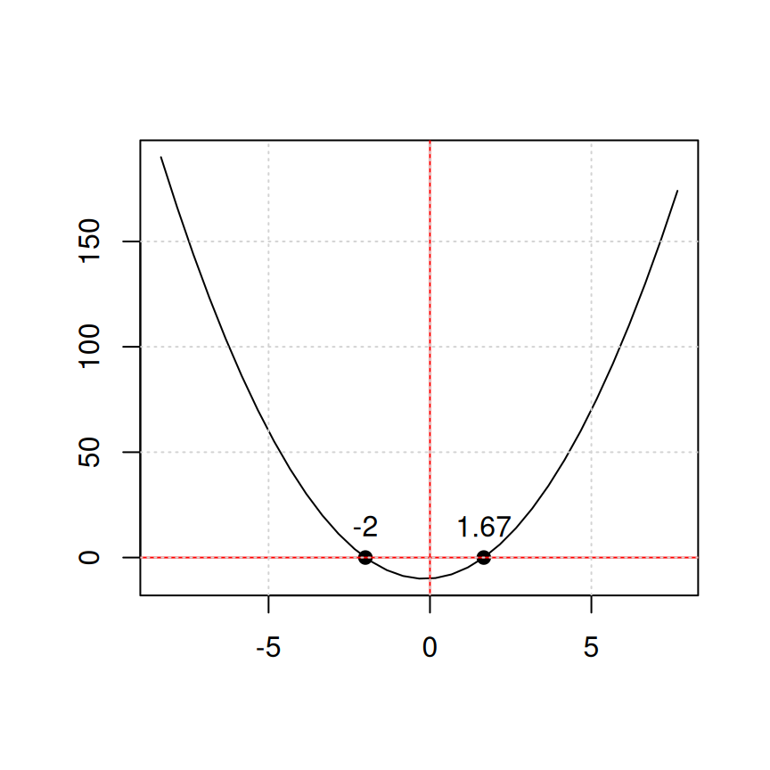

#### Ejemplo 2

Obtener la solución para la ecuación cuadrática conociendo los coieficientes $A$, $B$, y $C$

$$
x^2-5x+3=0
$$
**Solución**:

Reemplazar en la fórmula del estudiante $A=1$, $B=-5$, y $C=3$

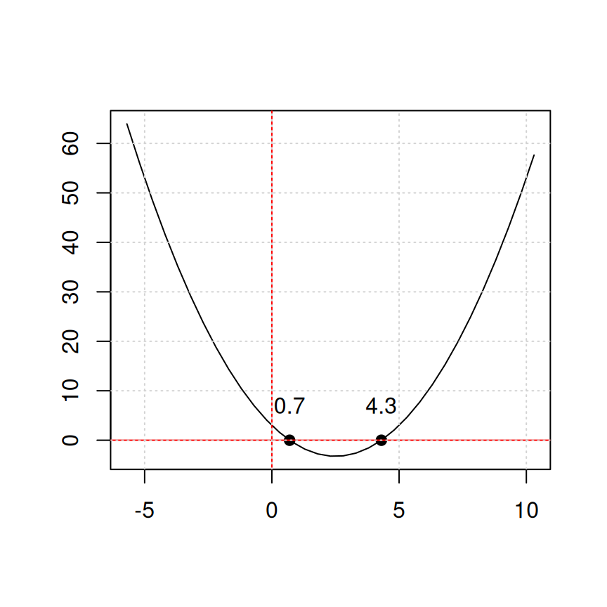

### Ejemplo1 (Solución de Ec)

Resolver para $x$ en la ecuación
$$
2x-7=5x+6
$$

Primero ver la solución usando el concepto de cero (ó raíz) de una función. Para lograr esto igualamos todo a cero.

$$
\begin{split}
0 &=&-2x+7+5x+6\\
0 &=& (5x-2x)+(7+6)\\
0 &=& 3x+13\\
0 &=& f(x)
\end{split}
$$

En este caso $f(x)=3x+13$ es una recta y buscamos donde la recta se vuelve cero ó equivalentemente donde la recta corta al eje de las $X$. Ese valor de corte es la solución de la ecuación planteada.

Graficando tenemos:

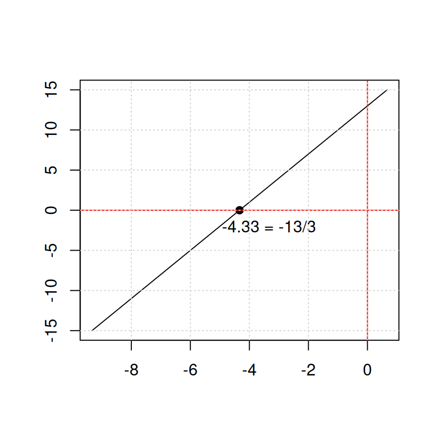

\begin{equation} \label{eq39}
\begin{split}
\text{lado Izquierdo} & = \text{lado Derecho}\\
2x-5x & = 6 + 7\\
-3x & = 6 + 7 \\
-3x & = 13 \\
x &=\dfrac{13}{-3}\\
x &=-\dfrac{13}{3}\ \ \ \text{Recordar:} \ \ \ \ -\dfrac{a}{d}=\dfrac{a}{-d} =\dfrac{-a}{d}\\
\end{split}
\end{equation}

\begin{equation} \label{eq40}
\boxed{x =-\dfrac{13}{3}} \ \ \ \bf{\text{Respuesta esperada}}
\end{equation}

 **Verificar la respuesta**

\begin{equation} \label{eq41}
\begin{split}
&= \ \ \ \text{Recordar:} \ \ \ \ \dfrac{a}{b} \pm \dfrac{c}{d} =\dfrac{ad \pm bc}{bd}\\
&=\ \ \ \text{Recordar:} \ \ \ \ \dfrac{a.b}{c.d}=\dfrac{a}{c}.\dfrac{b}{d} \\
\text{lado Izquierdo}& = \text{lado Derecho}\\
2\left(\dfrac{-13}{3}\right)- 7 & = 5\left(\dfrac{-13}{3}\right)+ 6\\
\dfrac{2}{1}\left(\dfrac{-13}{3}\right)-\dfrac{7}{1}& =  \dfrac{5}{1}\left(\dfrac{-13}{3}\right) + \dfrac{6}{1}\\
\left(\dfrac{-26}{3}\right)-\dfrac{7}{1}& =  \left(\dfrac{-65}{3}\right) + \dfrac{6}{1}\\
\dfrac{-26-(3)(7)}{3}& =  \dfrac{-65+(3)(6)}{3}\\
\dfrac{-26-21}{3}& =  \dfrac{-65+18}{3}\\
\dfrac{-47}{3}& =  \dfrac{-47}{3}\\
\end{split}
\end{equation}

**NOTA**: En general cuando se realiza la **verificación** de la respuesta obtenida en una ecuación, 
el **resultado de la derecha`** es equivalente al **resultado de la izquierda**, esto muestra que  se obtuvo el resultado apropiado para la ecuación.

### Ejemplo2 (Solución de Ec)

Resolver para $z$ en la ecuación
$$
2- \dfrac{1}{z+1}=\dfrac{z}{z+1}
$$

\begin{equation} \label{eq42}
\begin{split}
\text{lado Izquierdo} & = \text{lado Derecho}\\
(z+1)\left( 2 - \dfrac{1}{z+1}\right) & = (z+1)\left(\dfrac{z}{z+1}\right) \\
(z+1).(2)-(z+1).\left(\dfrac{1}{z+1}\right) & = (z+1)\left(\dfrac{z}{z+1}\right) \\
(z+1).(2)- 1 & =  z \\
2z + 2 - 1 & =  z \\
2z + 1 & =  z \\
2z - z & =  -1 \\
z & =  -1 \ \ \ \bf{\text{Respuesta esperada}}
\end{split}
\end{equation}

\begin{equation} \label{eq43}
\boxed{z  =  -1} \ \ \ \bf{\text{Respuesta esperada}}
\end{equation}

**Verificar la respuesta**

\begin{equation} \label{eq44}
\begin{split}
\text{lado Izquierdo} & = \text{lado Derecho}\\
2 - \dfrac{1}{-1+1} & = \dfrac{-1}{-1+1} \\
2 - \dfrac{1}{0} & = \dfrac{-1}{0} \\
IND & =  IND \ \ \ \bf{\text{Respuesta la ec no tiene solución}}
\end{split}
\end{equation}

### Ejemplo3 (Solución de Ec)

Resolver para $x$ en la ecuación
$$
\dfrac{1}{x} + \dfrac{1}{x-4}=\dfrac{2}{x^2-4x}
$$

\begin{equation} \label{eq45}
\begin{split}
\text{lado Izquierdo} & = \text{lado Derecho}\\
\dfrac{1}{x} + \dfrac{1}{x-4} & = \dfrac{2}{x^2-4x} \\
x.(x-4)\left(\dfrac{1}{x} + \dfrac{1}{x-4}\right) & = x.(x-4)\left(\dfrac{2}{x(x-4)}\right) \\
x.(x-4).\dfrac{1}{x} + x.(x-4).\dfrac{1}{x-4} & = x.(x-4).\dfrac{2}{x(x-4)} \\
(x-4) + x.1 & = 2 \\
x+x-4 & = 2 \\
2x-4 & = 2 \\
2x & = 4+2 \\
2x & = 6 \\
x & = \dfrac{6}{2}\\
x & =  3 \ \ \ \bf{\text{Respuesta esperada}}
\end{split}
\end{equation}

\begin{equation} \label{eq46}
\boxed{x  =  3} 
\end{equation}

**Verificar la respuesta**

\begin{equation} \label{eq47}
\begin{split}
\text{lado Izquierdo} & = \text{lado Derecho}\\
\dfrac{1}{x} + \dfrac{1}{x-4} & =\dfrac{2}{x^2-4x} \\
           \text{Sustituir }x=3                   &\\
\dfrac{1}{3} + \dfrac{1}{3-4} & = \dfrac{2}{(3)^2-4(3)} \\
\dfrac{1}{3} + \dfrac{1}{-1} & = \dfrac{2}{9-12} \\
\dfrac{1}{3} - \dfrac{1}{1} & = \dfrac{2}{-3} \\
\dfrac{1}{3} - \dfrac{3}{3} & = -\dfrac{2}{3} \\
\dfrac{1-3}{3} & = -\dfrac{2}{3} \\
\dfrac{-2}{3} & = -\dfrac{2}{3} \\
-\dfrac{2}{3} & = -\dfrac{2}{3} \\
\end{split}
\end{equation}

### Ejemplo4 (Solución de Ec)

Resolver para $x \neq 0$ en la ecuación
$$
\dfrac{1}{2\sqrt{x}} - \dfrac{2}{\sqrt{x}}=\dfrac{5}{\sqrt{x}}
$$

\begin{equation} \label{eq48}
\begin{split}
\text{lado Izquierdo} & = \text{lado Derecho}\\
\dfrac{1}{2\sqrt{x}} - \dfrac{2}{\sqrt{x}} & =\dfrac{5}{\sqrt{x}}\\
\sqrt{x}.\left( \dfrac{1}{2\sqrt{x}} - \dfrac{2}{\sqrt{x}} \right) & = \sqrt{x}.\left( \dfrac{5}{\sqrt{x}} \right)\\
\sqrt{x}.\dfrac{1}{2\sqrt{x}} - \sqrt{x}.\dfrac{2}{\sqrt{x}} & =\sqrt{x}.\dfrac{5}{\sqrt{x}}\\
\dfrac{1}{2} - \dfrac{2}{1} & =\dfrac{5}{1}\\
\dfrac{1}{2} - \dfrac{4}{2} & = 5\\
\dfrac{1-4}{2} & = 5\\
\dfrac{-3}{2} & = 5\\
\text{Absurdo!} & \\
\text{La ecuación no tiene solución} & \ \ \ \bf{\text{Respuesta esperada}}
\end{split}
\end{equation}

  

### Actividad Geogebra: Ecuaciones de 1º grado con una incógnita: Interpretación gráfica

Author:José María Arias Cabezas

<iframe scrolling="no" title="Ecuaciones de 1º grado con una incógnita: Interpretación gráfica" src="https://www.geogebra.org/material/iframe/id/xYwu2BVR/width/800/height/600/border/888888/sfsb/true/smb/false/stb/false/stbh/false/ai/false/asb/false/sri/true/rc/false/ld/false/sdz/true/ctl/false" width="800px" height="600px" style="border:0px;"> </iframe>

  

### Actividad Geogebra: Problemas de ecuaciones

Author: Javier Cayetano Rodríguez

<iframe scrolling="no" title="Problemas de ecuaciones" src="https://www.geogebra.org/material/iframe/id/zgx9jvku/width/675/height/417/border/888888/sfsb/true/smb/false/stb/false/stbh/false/ai/false/asb/false/sri/false/rc/false/ld/false/sdz/false/ctl/false" width="675px" height="417px" style="border:0px;"> </iframe>

  

## Solución numérica de una ecuación

Esta aplicación se usa para hallar las soluciones irracionales de una ecuación no lineal. Debe ser aclarado que estas ecuaciones surgen por el planteo y solución de problemas.

[Link solución numérica](https://septiembreestradajohnjairo2021uces.shinyapps.io/EjemploCEROSDEUNAECUACIONmateUnoA/)

[Caja de herramientas](https://octubrejohnjairoestradaalvarezces.shinyapps.io/CajaHerramientasMateUno1/)

### Ejemplo raices irracionales

Obtener las raices irracionales para las ecuaciones cuadráticas siguientes.

$$
(a) \ \ -3x^2+4x+12=0\\
(b) \ \  \ \   \ \ \ \ \ \ \ 8x^2+x-6=0
$$

    

<iframe scrolling="no" title="Explora la construcción..." src="https://www.geogebra.org/material/iframe/id/epygzrnt/width/750/height/550/border/888888/sfsb/true/smb/true/stb/false/stbh/false/ai/false/asb/true/sri/true/rc/false/ld/false/sdz/true/ctl/false" width="750px" height="550px" style="border:0px;"> </iframe>

  
  

<iframe scrolling="no" title="Explora la construcción" src="https://www.geogebra.org/material/iframe/id/znzuuf7n/width/750/height/500/border/888888/sfsb/true/smb/true/stb/true/stbh/true/ai/false/asb/false/sri/true/rc/false/ld/false/sdz/true/ctl/false" width="750px" height="500px" style="border:0px;"> </iframe>
