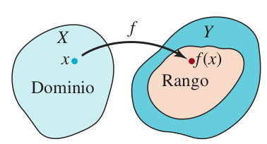
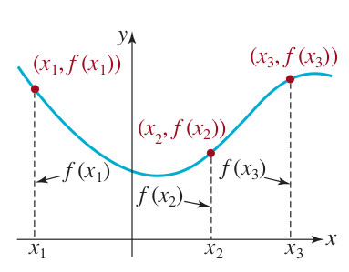
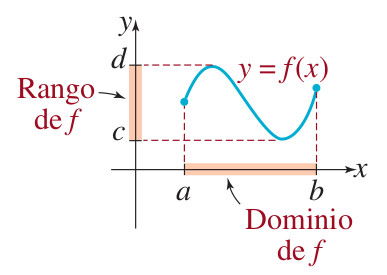
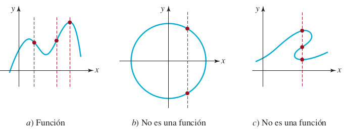
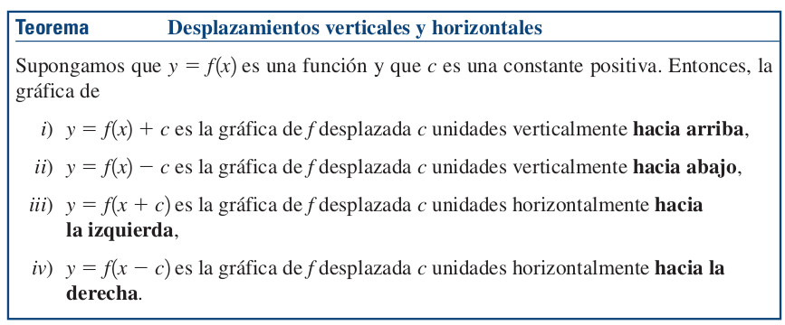
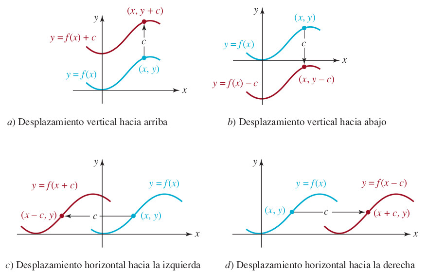
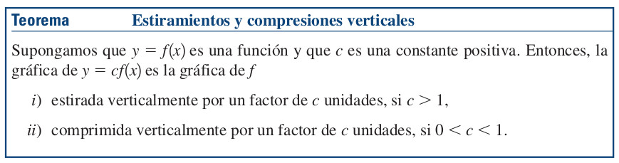

# Concepto de función {#FuncionExponencial-y-Logaritmica}

**Podcast**
<audio controls>
  <source src="podcasts/cap06_funciones.mp3" type="audio/mpeg">
</audio>

(\#fig:ConceptoDeFuncion01)Concepto de función real [Imagen tomada de [@zill2012algebra] pág $200$]

::: {.definition #def-funcion}
Una **función** $f$ es una relación especial entre dos conjuntos $A=D_{f}$ y $B=R_{f}$, donde a todo elemento $x$ del conjunto $A$ le corresponde uno y sólo un elemento $y$ del conjunto $B$. Se denota $y=f(x)$. Al conjunto $A$ se le llama **dominio** de $f$ y al conjunto $B$ se le llama **rango** (o codominio) de $f$.
:::

**Podcast explicativo**
<audio controls style="width:100%;max-width:600px;">
  <source src="podcasts/bloques/06-FuncionExponecial-y-Logaritmica_def-funcion.mp3" type="audio/mpeg">
</audio>

La siguiente gráfica ilustra la relación entre dos conjuntos en el plano $XY$, donde se muestra que cada punto de la gráfica es una pareja ordenada $(x_i,f(x_i))$.

(\#fig:ConceptoDeFuncion2)Correspondencia entre cada valor $x$ y $y$ [Imagen tomada de [@zill2012algebra] pág $202$]

::: {.definition #def-funcion-real}
Si los conjuntos $A=D_{f}$ y $B=R_{f}$ son subconjuntos del conjunto de los números reales, diremos que $f$ es una **función de variable real**. Al conjunto $A=D_{f}$ se le llama **dominio** de $f$ y al conjunto de todos los valores de salida se le llama **rango** de $f$.
:::

**Podcast explicativo**
<audio controls style="width:100%;max-width:600px;">
  <source src="podcasts/bloques/06-FuncionExponecial-y-Logaritmica_def-funcion-real.mp3" type="audio/mpeg">
</audio>

(\#fig:ConceptoDominioYRango1)Concepto de dominio y rango para una función de variable real [Imagen tomada de [@zill2012algebra] pág $203$]

## Ejemplos

[Link primer ejemplo dominio y rango](https://johnclasesuces.shinyapps.io/DominioYRango1/)

[Link segundo ejemplo dominio y rango](https://johnclasesuces.shinyapps.io/DominioYRangoPorTramos1/)

Existe un  **criterio gráfico** que se usa para determinar si una relación desde su gráfica representa una función, este criterio se llama **criterio de la recta vertical**.

En el siguiente link se puede ejemplificar el uso de este criterio. Haga clic en el link adjunto para poder ver dichos ejemplos.

## Criterio de la recta vertical

(\#fig:ConceptoDeFuncion1)Criterio de la recta vertical [Imagen tomada de [@zill2012algebra] pág $203$]

[Link para aplicar el criterio de la recta vertical](https://johnclasesuces.shinyapps.io/ConceptoFuncionGrafica1/)

## Desplazamiento horizontal y vertical de una gráfica en el plano $XY$

(\#fig:MovimientoDeUnaFuncion1)Teorema para la traslación de una función [Imagen tomada de [@zill2012algebra] pág $211$]

(\#fig:MovimientoDeUnaFuncion3)Ejemplo Teorema para la traslación de una función [Imagen tomada de [@zill2012algebra] pág $212$]

[Link para aplicar la traslación de funciones en el plano](https://estradajohncasa16feb2023.shinyapps.io/funcionesTraslacionVa20/)

Esta es una demostración de la identidad trigonométrica básica. El Autor: Jesús Plaza M. (https://www.geogebra.org/m/YwykhVjk) la elaboro usando geogebra.

<meta name=viewport content="width=device-width,initial-scale=1">
<meta charset="utf-8"/>

 

Esta es una demostración de transformación de funciones básicas. El autor Daniel Mentrard (https://www.geogebra.org/classic/hhnaqk79) la elaboro usando geogebra.

<meta name=viewport content="width=device-width,initial-scale=1">
<meta charset="utf-8"/>

 

## Estiramiento y comprensión de una gráfica en el plano $XY$

(\#fig:MovimientoDeUnaFuncion2)Teorema para la traslación de una función [Imagen tomada de [@zill2012algebra] pág $214$]

## Aplicaciones del concepto de función

## Ejemplos básicos

[Link Tiro parabólico como función aplicada al concepto físico](https://johneaces2020junio29.shinyapps.io/FuncionTiroParabolico1/)

## Función exponencial

::: {.definition #def-funcion-exponencial}
Una **función exponencial** tiene la forma
$$f(x)=b^x$$
donde la base $b$ es un número real tal que $b>0$ y $b \neq 1$, y $x$ es el exponente (variable independiente).
:::

**Podcast explicativo**
<audio controls style="width:100%;max-width:600px;">
  <source src="podcasts/bloques/06-FuncionExponecial-y-Logaritmica_def-funcion-exponencial.mp3" type="audio/mpeg">
</audio>

<!-- https://www.geogebra.org/m/YK6pcUsB -->

Esta es una simulación realizada por Author:Tim Brzezinski elaborada usando geogebra

<meta name=viewport content="width=device-width,initial-scale=1">
<meta charset="utf-8"/>

 

## Leyes de los exponentes

::: {.proposition #prop-leyes-exponentes}
Sean $b>0$ con $b \neq 1$, y sean $x,y$ números reales. Entonces se cumplen las siguientes leyes de los exponentes:

1). $b^x \cdot b^y=b^{x+y}$

2). $\dfrac{b^x}{b^y}=b^{x-y}$

3). $\dfrac{1}{b^x}=b^{-x}$

4). $({b^x})^y=b^{xy}=b^{yx}$

5). $({ab})^x=a^{x} \cdot b^{x}$

6). $\left(\dfrac{a}{b}\right)^x=\dfrac{a^x}{b^x}$
:::

**Podcast explicativo**
<audio controls style="width:100%;max-width:600px;">
  <source src="podcasts/bloques/06-FuncionExponecial-y-Logaritmica_prop-leyes-exponentes.mp3" type="audio/mpeg">
</audio>

## Gráfica de una función exponencial
  
[Link para obtener la gráfica de una función exponencial](https://marzojohnclasesuces2020.shinyapps.io/FuncionExponencial1/)

## Comparando dos funciones exponenciales

[Link para comparar dos funciones exponenciales](https://marzojohnclasesuces2020.shinyapps.io/FuncionExponencial2/)

## Propiedades de la función exponencial

::: {.proposition #prop-funcion-exponencial}
Sea $f(x)=b^x$ una función exponencial con $b>0$ y $b \neq 1$. Entonces se cumplen las siguientes propiedades:

1). El dominio de $f$ es $(-\infty, \infty)$ y su rango es $(0, \infty)$.

2). La intersección con el eje $Y$ está en $(0,1)$. No tiene intersección con el eje $X$.

3). El eje $X$ ($y=0$) es asíntota horizontal.

4). $f$ es creciente si $b>1$, y decreciente si $0<b<1$.

5). $f$ es continua en $(-\infty, \infty)$.

6). $f$ es una función uno a uno (biyectiva sobre su rango).
:::

**Podcast explicativo**
<audio controls style="width:100%;max-width:600px;">
  <source src="podcasts/bloques/06-FuncionExponecial-y-Logaritmica_prop-funcion-exponencial.mp3" type="audio/mpeg">
</audio>

## Función logarítmica

::: {.definition #def-funcion-logaritmica}
Una **función logarítmica** con base $b>0$ y $b \neq 1$, se define por
$$f(x)=\log_{b}(x)$$
donde $x>0$.
:::

**Podcast explicativo**
<audio controls style="width:100%;max-width:600px;">
  <source src="podcasts/bloques/06-FuncionExponecial-y-Logaritmica_def-funcion-logaritmica.mp3" type="audio/mpeg">
</audio>

<!-- https://www.geogebra.org/m/EUZVy9Br -->

Esta es una simulación realizada por Author:Tim Brzezinski elaborada usando geogebra

<meta name=viewport content="width=device-width,initial-scale=1">
<meta charset="utf-8"/>

 

## Gráfica de una función logarítmica
  
[Link para obtener la gráfica de una función logarítmica](https://johneaces2020junio29.shinyapps.io/FuncionLogaritmo1/)

## Comparando dos funciones logarítmicas

[Link para comparar dos funciones logarítmicas](https://johneaces2020junio29.shinyapps.io/Funcionlogaritmo2/)

## Propiedades de la función logarítmica

::: {.proposition #prop-funcion-logaritmica}
Sea $f(x)=\log_{b}(x)$ una función logarítmica con $b>0$ y $b \neq 1$. Entonces se cumplen las siguientes propiedades:

1). El dominio de $f$ es $(0, \infty)$ y su rango es $(-\infty, \infty)$.

2). La intersección con el eje $X$ está en $(1,0)$. No tiene intersección con el eje $Y$.

3). $f$ es creciente si $b>1$, y decreciente si $0<b<1$.

4). El eje $Y$ ($x=0$) es asíntota vertical.

5). $f$ es continua en $(0, \infty)$.

6). $f$ es una función uno a uno (biyectiva sobre su rango).
:::

**Podcast explicativo**
<audio controls style="width:100%;max-width:600px;">
  <source src="podcasts/bloques/06-FuncionExponecial-y-Logaritmica_prop-funcion-logaritmica.mp3" type="audio/mpeg">
</audio>

## Leyes de los logarítmos

::: {.proposition #prop-leyes-logaritmos}
Para toda base $b>0$ y $b \neq 1$, y para los números positivos $M$ y $N$, se cumplen las siguientes leyes de los logaritmos:

1). $\log_{b}(M \cdot N)=\log_{b}M+\log_{b}N$

2). $\log_{b}\left(\dfrac{M}{N}\right)=\log_{b}M-\log_{b}N$

3). $\log_{b}M^c=c \cdot \log_{b}M$, para cualquier número real $c$.
:::

**Podcast explicativo**
<audio controls style="width:100%;max-width:600px;">
  <source src="podcasts/bloques/06-FuncionExponecial-y-Logaritmica_prop-leyes-logaritmos.mp3" type="audio/mpeg">
</audio>

  

## Ecuación exponencial

Una ecuación de la forma:

\[
a^{2x}-b^{4x}=1
\]
se dice ecuación exponencial ya que es una ecuación que contiene funciones exponenciales.

::: {.example #unnamed-chunk-1}
Obtener la solución para la ecuación

\[
3^{2x-4}=1  
\]

:::

**Podcast explicativo**
<audio controls style="width:100%;max-width:600px;">
  <source src="podcasts/bloques/06-FuncionExponecial-y-Logaritmica_example9.mp3" type="audio/mpeg">
</audio>

  

::: {.solution}

Sabemos que $1=3^{0}$
  
Por lo tanto

\[
3^{2x-4}=3^{0}
\]

Entonces podemos igualar los exponentes de ambos lados así:

\[
2x-4=0\\
x=\dfrac{4}{2}\\
x=2
\]

Se concluye que la solución para la ecuación es $x=2$.

:::

  

::: {.example #unnamed-chunk-3}
Obtener la solución para la ecuación

\[
2^{2x-4}=4  
\]

:::

**Podcast explicativo**
<audio controls style="width:100%;max-width:600px;">
  <source src="podcasts/bloques/06-FuncionExponecial-y-Logaritmica_example10.mp3" type="audio/mpeg">
</audio>

  

::: {.solution}

Sabemos que $4=2^{2}$
  
Por lo tanto

\[
2^{2x-4}=2^{2}
\]

Entonces podemos igualar los exponentes de ambos lados así:

\[
2x-4=2\\
2x=2+4\\
2x=6\\
x=\dfrac{6}{2}\\
x=3
\]

Se concluye que la solución para la ecuación es $x=3$.

:::

  

::: {.example #unnamed-chunk-5 name="Crecimiento de la población"}
Supongamos una población de bacterias en un medio nutritivo homogéno, y que haciendo un muestreo de la población a ciertos intervalos, se determina que esa población se duplica cada hora. Si, en el instante $t$, la cantidad de bacterias es $p(t)$, donde $t$ se mide en horas, y la población inicial es $p(0)=10$, entonces obtener una fórmula para la población de bacterias en cualquier instante de tiempo $t$.
:::

**Podcast explicativo**
<audio controls style="width:100%;max-width:600px;">
  <source src="podcasts/bloques/06-FuncionExponecial-y-Logaritmica_example11.mp3" type="audio/mpeg">
</audio>

  

::: {.solution}
Sabemos que:
  
\[
p(1)=2p(0)=2(10)\\
p(2)=2p(1)=2^{2}(10)\\
p(3)=2p(2)=2^{3}(10)\\
p(4)=2p(3)=2^{4}(10)\\
p(5)=2p(4)=2^{5}(10)\\
\]
  
En general
$$p(t)=2^{t}(10)=10.2^{t} \qquad \text{población en cualquier instánte de tiempo } \ \ t.$$
  
:::

  

::: {.example #unnamed-chunk-7 name="Vida media del estroncio 90"}
La vida media del estroncio $90$. ${}^{90}Sr$ es de $25$ años. Esto significa que la mitad del cualquier cantidad dada de  ${}^{90}Sr$ se desintregrará en $25$ años. Si una muestra de  ${}^{90}Sr$ tiene una masa de $24 mg$, encuentre una expresión para la masa $m(t)$ que queda después de $t$ años.
:::

**Podcast explicativo**
<audio controls style="width:100%;max-width:600px;">
  <source src="podcasts/bloques/06-FuncionExponecial-y-Logaritmica_example12.mp3" type="audio/mpeg">
</audio>

  

::: {.solution}
Sabemos que:
  
\[
m(0)=24\\
m(25)=\dfrac{1}{2}(24)\\
m(50)=\dfrac{1}{2}\left(\dfrac{1}{2}(24)\right)=\dfrac{1}{2^2}(24)\\
m(75)=\dfrac{1}{2}\left(\dfrac{1}{2^2}(24)\right)=\dfrac{1}{2^3}(24)\\
m(100)=\dfrac{1}{2}\left(\dfrac{1}{2^3}(24)\right)=\dfrac{1}{2^4}(24)\\
\]

Y también conocemos que $4=\dfrac{100}{25}$, $3=\dfrac{75}{25}$, $2=\dfrac{50}{25}$. De donde

En general
$$m(t)=\dfrac{1}{2^{t/25}}(24)=24.2^{-t/25} \qquad \text{cantidad de masa en cualquier instánte de tiempo } \ \ t.$$
  
:::

  

### Actividad Geogebra: Ecuaciones exponenciales: Interpretación gráfica

Author: José María Arias Cabezas

<iframe scrolling="no" title="Ecuaciones exponenciales: Interpretación gráfica" src="https://www.geogebra.org/material/iframe/id/cfwqbegp/width/800/height/600/border/888888/sfsb/true/smb/false/stb/false/stbh/false/ai/false/asb/false/sri/true/rc/false/ld/false/sdz/true/ctl/false" width="800px" height="600px" style="border:0px;"> </iframe>

  

### Actividad Geogebra: Exponenciales con cambio de base [transformables en cúbicas]

Author: Javier Cayetano Rodríguez

<iframe scrolling="no" title="Exponenciales con cambio de base [transformables en cúbicas]" src="https://www.geogebra.org/material/iframe/id/nP28c32X/width/841/height/572/border/888888/sfsb/true/smb/false/stb/false/stbh/false/ai/false/asb/false/sri/false/rc/false/ld/false/sdz/false/ctl/false" width="841px" height="572px" style="border:0px;"> </iframe>

  

### Actividad Geogebra: Exponenciales con diferentes bases

Author: Javier Cayetano Rodríguez

<iframe scrolling="no" title="Exponenciales con diferentes bases" src="https://www.geogebra.org/material/iframe/id/hpqAGwaW/width/909/height/497/border/888888/sfsb/true/smb/false/stb/false/stbh/false/ai/false/asb/false/sri/false/rc/false/ld/false/sdz/false/ctl/false" width="909px" height="497px" style="border:0px;"> </iframe>

  

## Ecuación logaritmica

::: {.example #unnamed-chunk-9}
Resuelva para $x$ la ecuación logarítmica:

\[
ln(2)+ln(4x-1)=ln(2x+10)  
\]

:::

**Podcast explicativo**
<audio controls style="width:100%;max-width:600px;">
  <source src="podcasts/bloques/06-FuncionExponecial-y-Logaritmica_example13.mp3" type="audio/mpeg">
</audio>

  

::: {.solution}
Sabemos que $ln(2)+ln(4x-1)=ln(2(4x-1))=ln(8x-2)$
  
Entonces

\[
ln(8x-2)=ln(2x+10)  
\]

igualando los argumentos entre paréntesis se tiene:
  
\[
8x-2=2x+10\\
8x-2x=10+2\\
6x=12\\
x=\dfrac{12}{6}\\
x=2
\]
 

:::

  

::: {.example #unnamed-chunk-11}
Resolver para $x$ la ecuación:

\[
\left(log_{10}{2x}\right)^2=log_{10}(2x)^2
\]
:::

**Podcast explicativo**
<audio controls style="width:100%;max-width:600px;">
  <source src="podcasts/bloques/06-FuncionExponecial-y-Logaritmica_example14.mp3" type="audio/mpeg">
</audio>

  

::: {.solution}
\begin{equation}
\begin{split}
\left(log_{10}{(2x)}\right)^2 &=& log_{10}(2x)^2\\
& = & 2log_{10}(2x)\\
\left(log_{10}{(2x)}\right)^2-2log_{10}(2x) &=& 0\\
log_{10}(2x)\left(log_{10}(2x)-2\right) &=& 0
\end{split}
\end{equation}

Entonces tenemos dos opciones así:
  
$$
log_{10}(2x)=0  \qquad \text{ó} \qquad  log_{10}(2x)-2=0
$$
  
La primera:
  
$$
log_{10}(2x)=0  \qquad \text{implica que } \qquad 2x=1\\
x=\dfrac{1}{2}
$$
  
  
La segunda

$$
log_{10}(2x)-2=0  \qquad \text{implica que } \qquad log_{10}(2x)=2 \\
10^2=2x\\
100=2x\\
\dfrac{100}{2}=x\\
50=x
$$
:::

  

### Actividad Geogebra: Ecuaciones logarítmicas: Interpretación gráfica

Author: José María Arias Cabezas

<iframe scrolling="no" title="Ecuaciones logarítmicas: Interpretación gráfica" src="https://www.geogebra.org/material/iframe/id/dx2n4hyu/width/800/height/600/border/888888/sfsb/true/smb/false/stb/false/stbh/false/ai/false/asb/false/sri/true/rc/false/ld/false/sdz/true/ctl/false" width="800px" height="600px" style="border:0px;"> </iframe>

  

## Sistemas de ecuaciones exponenciales y logaritmicas

### Actividad Geogebra: Sistemas de ecuaciones exponenciales: Interpretación gráfica

Author: José María Arias Cabezas

<iframe scrolling="no" title="Sistemas de ecuaciones exponenciales: Interpretación gráfica" src="https://www.geogebra.org/material/iframe/id/asagsdfn/width/800/height/600/border/888888/sfsb/true/smb/false/stb/false/stbh/false/ai/false/asb/false/sri/true/rc/false/ld/false/sdz/true/ctl/false" width="800px" height="600px" style="border:0px;"> </iframe>

### Actividad Geogebra: Sistemas de ecuaciones logarítmicas: Interpretación gráfica

Author: José María Arias Cabezas

<iframe scrolling="no" title="Sistemas de ecuaciones logarítmicas: Interpretación gráfica" src="https://www.geogebra.org/material/iframe/id/y8uzg586/width/800/height/600/border/888888/sfsb/true/smb/false/stb/false/stbh/false/ai/false/asb/false/sri/true/rc/false/ld/false/sdz/true/ctl/false" width="800px" height="600px" style="border:0px;"> </iframe>

  
