# Trigonometria {#Trigonometria}


## ¿Qué es la trigonometría?

## Respuesta: Según WIKIPEDIA

La trigonometría es una rama de las matemáticas, cuyo significado etimológico es 'la medición de los triángulos'. Deriva de los términos griegos τριγωνοϛ trigōnos 'triángulo' y μετρον metron 'medida'.

En términos generales, la trigonometría es el estudio de las razones trigonométricas: seno, coseno, tangente, cotangente, secante y cosecante. Interviene directa o indirectamente en las demás ramas de la matemática y se aplica en todos aquellos ámbitos donde se requieren medidas de precisión. La trigonometría se aplica a otras ramas de la geometría, como es el caso del estudio de las esferas en la geometría del espacio.

Posee numerosas aplicaciones, entre las que se encuentran: las técnicas de triangulación, por ejemplo, son usadas en astronomía para medir distancias a estrellas próximas, en la medición de distancias entre puntos geográficos, y en sistemas globales de navegación por satélites. 

<center> 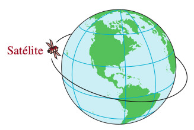{width=35%}
{width=35%}</center>
<center> 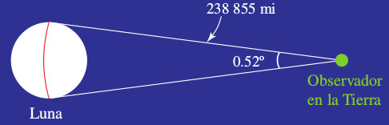{width=35%}
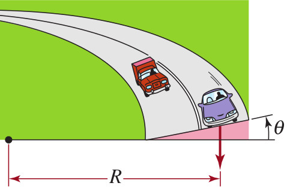{width=35%}</center>

**Medidas sátelitales ejemplo de aplicación trigonométrica**


Esta es una forma visual de ver aplicaciones trigonométicas; en especial las leyes de Kepler. El Autor:Mónica Juárez Jiménez (https://www.geogebra.org/m/cVHjK2t6) la elaboro usando geogebra.

<meta name=viewport content="width=device-width,initial-scale=1">
<meta charset="utf-8"/>
<script src="https://www.geogebra.org/apps/deployggb.js"></script>
<div id="ggb-elementTrigo8"></div> 
<script>  
       var ggbAppTrigo8 = new GGBApplet({"material_id":"cVHjK2t6",
       "width": 950,
       "height": 750,
       "showToolBar": false,
       "showAlgebraInput": false,
       "showMenuBar": false },
       true);
       
         window.addEventListener("load", function() {  
           ggbAppTrigo8.inject('ggb-elementTrigo8');
      });
</script>


**Ley de Kepler ejemplo de aplicación trigonométrica**


Esta es una forma visual de ver aplicaciones trigonométicas; en especial las leyes de Kepler. El Autor:Mónica Juárez Jiménez (https://www.geogebra.org/classic/dtwrfvhd) la elaboro usando geogebra.

<meta name=viewport content="width=device-width,initial-scale=1">
<meta charset="utf-8"/>
<script src="https://www.geogebra.org/apps/deployggb.js"></script>
<div id="ggb-elementTrigo7"></div> 
<script>  
       var ggbAppTrigo7 = new GGBApplet({"material_id":"dtwrfvhd",
       "width": 950,
       "height": 650,
       "showToolBar": false,
       "showAlgebraInput": false,
       "showMenuBar": false },
       true);
       
         window.addEventListener("load", function() {  
           ggbAppTrigo7.inject('ggb-elementTrigo7');
      });
</script>


## Definición de Ángulo

Un ángulo se forma con dos rayos o semirectas, que tienen un extremo común llamado vértice. A un rayo lo llammos lado inicial, y al otro,
lado terminal.

Es útil imaginar el ángulo como formado por una rotación, desde el lado inicial hasta el lado terminal como se puede ver en la gráfica.

<center> 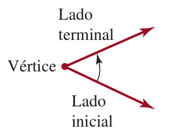{width=35%}</center>

## Medición de un ángulo en grados:

La medición de un ángulo en unidades de grados se basa en la asignación de 360 grados al ángulo formado por una rotación completa en el sentido
contrario a las manecillas del reloj.

<center> 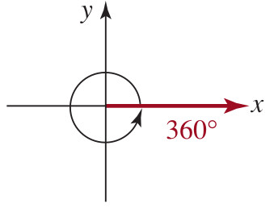{width=35%}</center>


## Simplificación de un ángulo medido en radianes 


Esta es una forma visual de ver el significado de la simplificación de una medida de ángulo en radianes. El autor Daniel Mentrard (https://www.geogebra.org/classic/x56q2sam) la elaboro usando geogebra.

<meta name=viewport content="width=device-width,initial-scale=1">
<meta charset="utf-8"/>
<script src="https://www.geogebra.org/apps/deployggb.js"></script>
<div id="ggb-elementTrigo5"></div> 
<script>  
       var ggbAppTrigo5 = new GGBApplet({"material_id":"x56q2sam",
       "width": 950,
       "height": 650,
       "showToolBar": false,
       "showAlgebraInput": false,
       "showMenuBar": false },
       true);
       
         window.addEventListener("load", function() {  
           ggbAppTrigo5.inject('ggb-elementTrigo5');
      });
</script>


Entonces un grado $1^{\circ}$ es el que se forma por $\dfrac{1}{360}$ de una rotación completa.

Si la rotación es contraria a la de las manecillas del reloj, se dice que la medida del ángulo es positiva.

Si es en el sentido de las manecillas del reloj se dice que la medida del ángulo es negativa.

<center> 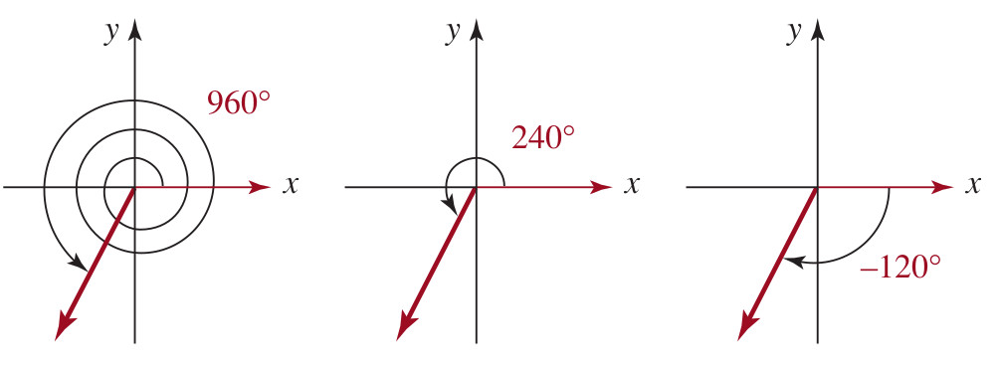{width=75%}</center>


## Notación para ángulos

\begin{equation}
\begin{array}{cccc}

\text{ángulo recto} &: & \text{ángulo que mide} \ \ 90^{\circ}\\
\text{ángulo agudo} &: & \text{ángulo que mide entre} \ \ 0^{\circ} \ \ \text{y} \ \ 90^{\circ}\\
\text{ángulo obtuso} &: & \text{ángulo que mide entre} \ \ 90^{\circ} \ \ \text{y} \ \ 180^{\circ}\\
\text{ángulos complementarios} &: & \text{ángulo que suman} \ \ 90^{\circ}\\
\text{ángulos suplementarios} &: & \text{ángulo que suman} \ \ 180^{\circ}\\

\end{array}
\end{equation}


## Minutos y segundos

La fracciones de grados se han expresado en minutos y segundos, donde.

$$
1^{\circ} = 60 \ \ \text{minutos} \ \ \ \ \ (\text{se escribe}) \ \ \ 60'
$$

$$
1' = 60 \ \ \text{segundos} \ \ \ \ \ (\text{se escribe}) \ \ \ 60''
$$


## **Ejemplo**  

Pasar la medida en grados a grados, minutos y segundos

$$
86.23^{\circ}
$$

**Solución:**

$$
86.23^{\circ}=86^{\circ}+0.23^{\circ}
$$

Entonces pasaremos la parte fraccionaria de grados a minutos y segundos asi:

$$
0.23^{\circ}= (0.23)(60')=13.8'
$$
Es decir:


$$
13.8'=13' + 0.8'
$$
Ahora pasaremos los $0.8'$ a segundos así:

$$
0.8'= (0.8)(60'')=48''
$$
Se concluye afirmando que:

$$
86.23^{\circ}=86^{\circ}13'48''
$$


## **Ejemplo**  

Pasar de grados, minutos y segundos a grados

$$
17^{\circ}47'13''
$$

**Solución:**


$$
17^{\circ}47'13''=17^{\circ} + 47' +13''
$$

$$
17^{\circ}47'13''=17^{\circ} + 47\left( \dfrac{1}{60} \right)^{\circ}  +13\left( \dfrac{1}{3600} \right)^{\circ} 
$$

$$
17^{\circ}47'13''=17^{\circ} + 0.7833^{\circ}  + 0.0036^{\circ} 
$$

$$
17^{\circ}47'13''=17.7869^{\circ} 
$$


## Trigonometría del triángulo rectángulo


### Actividad Geogebra: Círculo Unitario

Author: A B Cron


<iframe scrolling="no" title="Unit Circle - exact values (22 January 2018)" src="https://www.geogebra.org/material/iframe/id/ZngKpaNc/width/745/height/475/border/888888/sfsb/true/smb/false/stb/false/stbh/false/ai/false/asb/false/sri/false/rc/false/ld/false/sdz/false/ctl/false" width="745px" height="475px" style="border:0px;"> </iframe>


<center> 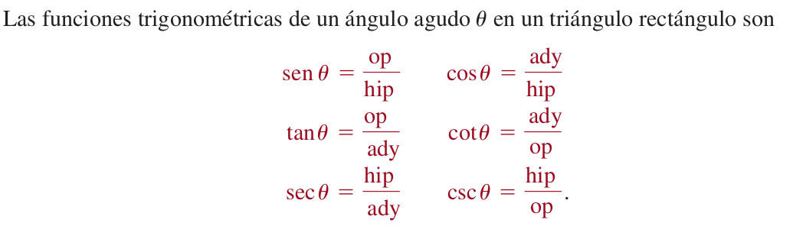{width=65%}</center>


<center> 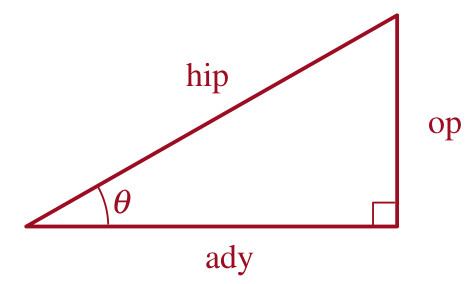{width=25%}</center>


## Modelo21 (Problema del triángulo)

  Determinar los valores exactos de las seis funciones trigonométricas del ángulo $\theta$ del triángulo rectángulo de la figura

<center> 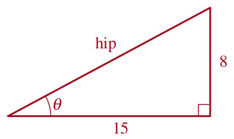{width=25%}</center>

**Solución**

A partir del teorma de Pitágoras:


$$
c^2=8^2+(15)^2 \ \ \ \ \  \ \ \ \ \ \Longrightarrow \ \ \ \ \  \ \ \ \ \ c=\sqrt{289}=17=\text{hip}
$$

Entonces:


$$
\begin{array}{cccc}
sen(\theta) & =  \dfrac{8}{17}=\dfrac{\text{op}}{\text{hip}}, & csc(\theta) & =  \dfrac{17}{8}=\dfrac{\text{hip}}{\text{op}}=\dfrac{1}{sen(\theta)}\\
cos(\theta) & =  \dfrac{15}{17}=\dfrac{\text{ady}}{\text{hip}}, & sec(\theta) & =  \dfrac{17}{15}=\dfrac{\text{hip}}{\text{ady}}=\dfrac{1}{cos(\theta)}\\
tan(\theta) & =  \dfrac{8}{15}=\dfrac{\text{op}}{\text{ady}}, & cot(\theta) & =  \dfrac{15}{8}=\dfrac{\text{ady}}{\text{op}}=\dfrac{1}{tan(\theta)}\\
\end{array}
$$


Como se muestra en la figura, si los dos ángulos agudos de un triángulo rectángulo $ABC$ se denominan $\alpha$ y $\beta$, entonces


<center> 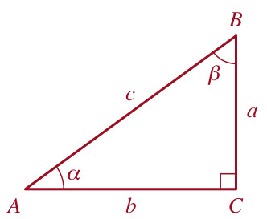{width=25%}</center>


$$
\begin{array}{cccc}
sen(\alpha) & =  \dfrac{a}{c}=cos(\beta), & csc(\alpha) & =  \dfrac{c}{a}=sec(\beta)\\
cos(\alpha) & =  \dfrac{b}{c}=sen(\beta), & sec(\alpha) & =  \dfrac{c}{b}=csc(\beta)\\
tan(\alpha) & =  \dfrac{a}{b}=cot(\beta), & cot(\alpha) & =  \dfrac{b}{a}=tan(\beta)\\
\end{array}
$$


<br></br>


### Actividad Geogebra: Resolver un triángulo rectángulo conociendo la hipotenusa y un ángulo agudo


Author: José María Arias Cabezas


<iframe scrolling="no" title="Resolver un triángulo rectángulo conociendo la hipotenusa y un ángulo agudo" src="https://www.geogebra.org/material/iframe/id/eecw8bcd/width/800/height/600/border/888888/sfsb/true/smb/false/stb/false/stbh/false/ai/false/asb/false/sri/true/rc/false/ld/false/sdz/true/ctl/false" width="800px" height="600px" style="border:0px;"> </iframe>


<br></br>


### Actividad Geogebra: Resolver un triángulo rectángulo conociendo la hipotenusa y un cateto


Author: José María Arias Cabezas


<iframe scrolling="no" title="Resolver un triángulo rectángulo conociendo la hipotenusa y un cateto" src="https://www.geogebra.org/material/iframe/id/xymtajf8/width/800/height/600/border/888888/sfsb/true/smb/false/stb/false/stbh/false/ai/false/asb/false/sri/true/rc/false/ld/false/sdz/true/ctl/false" width="800px" height="600px" style="border:0px;"> </iframe>


<br></br>


### Actividad Geogebra: Resolver un triángulo rectángulo conociendo los dos catetos


Author: José María Arias Cabezas


<iframe scrolling="no" title="Resolver un triángulo rectángulo conociendo los dos catetos" src="https://www.geogebra.org/material/iframe/id/rtzhm6kc/width/800/height/600/border/888888/sfsb/true/smb/false/stb/false/stbh/false/ai/false/asb/false/sri/true/rc/false/ld/false/sdz/true/ctl/false" width="800px" height="600px" style="border:0px;"> </iframe>


<br></br>


### Actividad Geogebra: Resolver un triángulo rectángulo conociendo un cateto y el ángulo opuesto


Author: José María Arias Cabezas


<iframe scrolling="no" title="Resolver un triángulo rectángulo conociendo un cateto y el ángulo opuesto" src="https://www.geogebra.org/material/iframe/id/fzdrgvfh/width/800/height/600/border/888888/sfsb/true/smb/false/stb/false/stbh/false/ai/false/asb/false/sri/true/rc/false/ld/false/sdz/true/ctl/false" width="800px" height="600px" style="border:0px;"> </iframe>


<br></br>


### Actividad Geogebra: Resolver un triángulo rectángulo conociendo un cateto y el ángulo contiguo

Author: José María Arias Cabezas


<iframe scrolling="no" title="Resolver un triángulo rectángulo conociendo un cateto y el ángulo contiguo" src="https://www.geogebra.org/material/iframe/id/krmeyvzk/width/800/height/600/border/888888/sfsb/true/smb/false/stb/false/stbh/false/ai/false/asb/false/sri/true/rc/false/ld/false/sdz/true/ctl/false" width="800px" height="600px" style="border:0px;"> </iframe>


<br></br>


## Seis funciones trigonometricas en el plano $XY$


Esta es una aplicación la cual muestra las seis funciones trigonométricas dado un punot $(x,y)$ en el plano cartesiano.El Author:Tim Brzezinski (https://www.geogebra.org/m/hK5QfXah) la elaboro usando geogebra.

<meta name=viewport content="width=device-width,initial-scale=1">
<meta charset="utf-8"/>
<script src="https://www.geogebra.org/apps/deployggb.js"></script>
<div id="ggb-elementTrigo9"></div> 
<script>  
       var ggbAppTrigo9 = new GGBApplet({"material_id":"hK5QfXah",
       "width": 1150,
       "height": 650,
       "showToolBar": false,
       "showAlgebraInput": false,
       "showMenuBar": false },
       true);
       
         window.addEventListener("load", function() {  
           ggbAppTrigo9.inject('ggb-elementTrigo9');
      });
</script>


## Teorema de Pítagoras e identidad trigonométrica


Esta es una demostración de la identidad trigonométrica básica. El autor Daniel Mentrard (https://www.geogebra.org/m/gdzedzvk) la elaboro usando geogebra.

<!-- <meta name=viewport content="width=device-width,initial-scale=1"> -->
<!-- <meta charset="utf-8"/> -->
<!-- <script src="https://www.geogebra.org/apps/deployggb.js"></script> -->
<!-- <div id="ggb-elementTrigo3"></div>  -->
<!-- <script>   -->
<!--        var ggbAppTrigo3 = new GGBApplet({"material_id":"gdzedzvk", -->
<!--        "width": 1320, -->
<!--        "height": 650, -->
<!--        "showToolBar": false, -->
<!--        "showAlgebraInput": false, -->
<!--        "showMenuBar": false }, -->
<!--        true); -->

<!--          window.addEventListener("load", function() {   -->
<!--            ggbAppTrigo3.inject('ggb-elementTrigo3'); -->
<!--       }); -->
<!-- </script> -->


<iframe scrolling="no" title="cos²x +sin²x =1" src="https://www.geogebra.org/material/iframe/id/q8a2g7ez/width/1356/height/626/border/888888/sfsb/true/smb/false/stb/false/stbh/false/ai/false/asb/false/sri/false/rc/false/ld/false/sdz/false/ctl/false" width="1356px" height="626px" style="border:0px;"> </iframe>


## Identidad trigonométrica básicas


Esta es una manera de memorizar las identidades trigonométricas básicas. El autor Daniel Mentrard (https://www.geogebra.org/m/t6ppq7gs) la elaboro usando geogebra.

<meta name=viewport content="width=device-width,initial-scale=1">
<meta charset="utf-8"/>
<script src="https://www.geogebra.org/apps/deployggb.js"></script>
<div id="ggb-elementTrigo4"></div> 
<script>  
       var ggbAppTrigo4 = new GGBApplet({"material_id":"t6ppq7gs",
       "width": 1350,
       "height": 650,
       "showToolBar": false,
       "showAlgebraInput": false,
       "showMenuBar": false },
       true);
       
         window.addEventListener("load", function() {  
           ggbAppTrigo4.inject('ggb-elementTrigo4');
      });
</script>


<br></br>


### Actividad Geogebra: Identidades trigonométricas


Author: José María Arias Cabezas


<iframe scrolling="no" title="Identidades trigonométricas" src="https://www.geogebra.org/material/iframe/id/eBwuzxrd/width/800/height/600/border/888888/sfsb/true/smb/false/stb/false/stbh/false/ai/false/asb/false/sri/true/rc/false/ld/false/sdz/true/ctl/false" width="800px" height="600px" style="border:0px;"> </iframe>


<br></br>


### Actividad Geogebra: Ecuaciones trigonométricas: Interpretación gráfica


Author: José María Arias Cabezas


<iframe scrolling="no" title="Ecuaciones trigonométricas: Interpretación gráfica" src="https://www.geogebra.org/material/iframe/id/VDqMvkkJ/width/800/height/600/border/888888/sfsb/true/smb/false/stb/false/stbh/false/ai/false/asb/false/sri/true/rc/false/ld/false/sdz/true/ctl/false" width="800px" height="600px" style="border:0px;"> </iframe>


<br></br>


## Ángulo de 45 grados
<center> 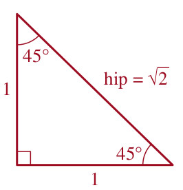{width=25%}</center>

Para obtener los valores de las funciones seno y coseno de un ángulo de $45^{\circ}$, consideramos el triángulo isóscels con dos lados iguales de longitud uno que se ilustra en la figura de arriba.

$$
(hip)^2=(1)^2+(1)^2=2 \ \ \ \ \ \ \text{da por resultado} \ \ \ \ \ \ hip=\sqrt{2}
$$


$$
\begin{array}{cc}
sen(45^{\circ}) &= \dfrac{\text{op}}{\text{hip}}=\dfrac{1}{\sqrt{2}}=\dfrac{\sqrt{2}}{2}\\
cos(45^{\circ}) &= \dfrac{\text{ady}}{\text{hip}}=\dfrac{1}{\sqrt{2}}=\dfrac{\sqrt{2}}{2}\\
\end{array}
$$


## Ángulo de 30 grados
<center> 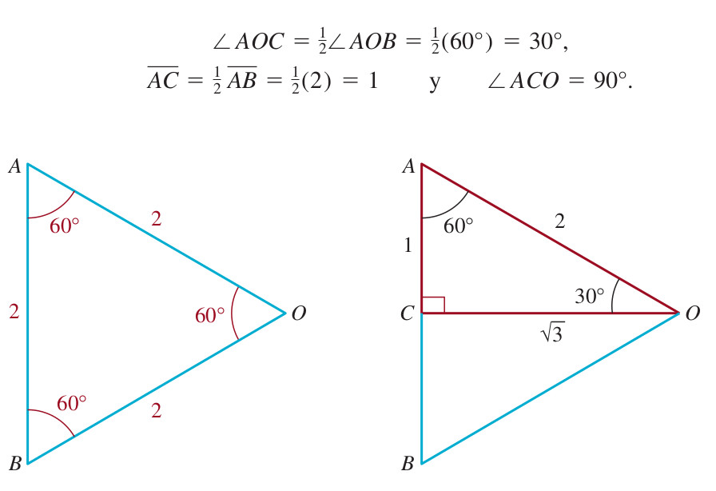{width=45%}</center>

$$
\begin{array}{cc}
sen(30^{\circ}) &= \dfrac{\text{op}}{\text{hip}}=\dfrac{1}{2}\\
cos(30^{\circ}) &= \dfrac{\text{ady}}{\text{hip}}=\dfrac{\sqrt{3}}{2}\\
\end{array}
$$


## Ángulo de 60 grados

$$
\begin{array}{cc}
sen(60^{\circ}) &= \dfrac{\text{op}}{\text{hip}}=\dfrac{\sqrt{3}}{2}\\
cos(60^{\circ}) &= \dfrac{\text{ady}}{\text{hip}}=\dfrac{1}{2}\\
\end{array}
$$


## Ángulos básicos y su representación desde la geometría


Esta es una manera de representar la deducción de los ángulos básicos en el primer cuadrante. El Autor Ignacio Larrosa Cañestro (https://www.geogebra.org/m/VkhUq6qc) la elaboro usando geogebra.

<meta name=viewport content="width=device-width,initial-scale=1">
<meta charset="utf-8"/>
<script src="https://www.geogebra.org/apps/deployggb.js"></script>
<div id="ggb-elementTrigo6"></div> 
<script>  
       var ggbAppTrigo6 = new GGBApplet({"material_id":"VkhUq6qc",
       "width": 900,
       "height": 550,
       "showToolBar": false,
       "showAlgebraInput": false,
       "showMenuBar": false },
       true);
       
         window.addEventListener("load", function() {  
           ggbAppTrigo6.inject('ggb-elementTrigo6');
      });
</script>


## Fórmulas de adición para coseno y seno

Esta es una demostración de las formulas de adición para el coseno y el seno, el autor Daniel Mentrard (https://www.geogebra.org/m/hxvswnyx) las elaboro usando geogebra.

<!-- <meta name=viewport content="width=device-width,initial-scale=1"> -->
<!-- <meta charset="utf-8"/> -->
<!-- <script src="https://www.geogebra.org/apps/deployggb.js"></script> -->
<!-- <div id="ggb-elementTrigo2"></div>  -->
<!-- <script>   -->
<!--        var ggbAppTrigo2 = new GGBApplet({"material_id":"hxvswnyx", -->
<!--        "width": 800, -->
<!--        "height": 600, -->
<!--        "showToolBar": false, -->
<!--        "showAlgebraInput": false, -->
<!--        "showMenuBar": false }, -->
<!--        true); -->

<!--          window.addEventListener("load", function() {   -->
<!--            ggbAppTrigo2.inject('ggb-elementTrigo2'); -->
<!--       }); -->
<!-- </script> -->


<iframe scrolling="no" title="Cosine and sine addition formulas" src="https://www.geogebra.org/material/iframe/id/fd9g6zxy/width/1339/height/610/border/888888/sfsb/true/smb/false/stb/false/stbh/false/ai/false/asb/false/sri/false/rc/false/ld/false/sdz/false/ctl/false" width="1339px" height="610px" style="border:0px;"> </iframe>


## Tabla $30^{\circ}$ $45^{\circ}$ y $60^{\circ}$

<center> 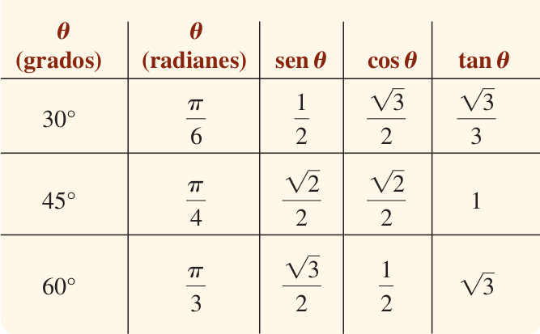{width=45%}
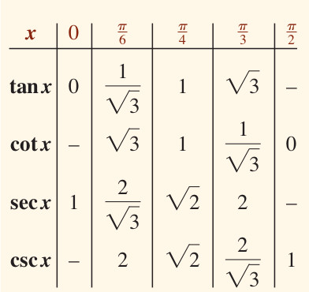{width=45%}</center>

<br></br>


## Ec. trigonométricas (factorizables)

Author:
    Javier Cayetano Rodríguez


<iframe scrolling="no" title="Ec. trigonométricas (factorizables)" src="https://www.geogebra.org/material/iframe/id/eNHRCmXD/width/675/height/480/border/888888/sfsb/true/smb/false/stb/false/stbh/false/ai/false/asb/false/sri/false/rc/false/ld/false/sdz/false/ctl/false" width="675px" height="480px" style="border:0px;"> </iframe>


<br></br>


## Ángulo de elevación y depresión

<center> 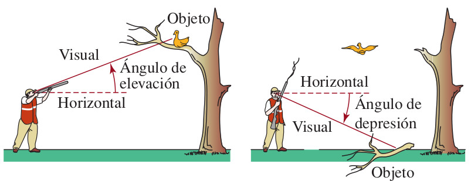{width=45%}</center>


# Ley del seno

Supongamos que los ángulos $\alpha$, $\beta$, y $\gamma$, y los lados opuestos de longitud $a$, $b$, y $c$ son como se muestra en la figura. Entonces

$$
\dfrac{sen(\alpha)}{a}=\dfrac{sen(\beta)}{b}=\dfrac{sen(\gamma)}{c}
$$
ó equivalentemente

$$
\dfrac{a}{sen(\alpha)}=\dfrac{b}{sen(\beta)}=\dfrac{c}{sen(\gamma)}
$$


<!-- https://www.geogebra.org/m/S4Uj4RXD -->


<meta name=viewport content="width=device-width,initial-scale=1">
<meta charset="utf-8"/>
<script src="https://www.geogebra.org/apps/deployggb.js"></script>
<div id="ggb-elementTrigoA11"></div> 
<script>  
       var ggbAppTrigo11 = new GGBApplet({"material_id":"S4Uj4RXD",
       "width": 800,
       "height": 400,
       "showToolBar": false,
       "showAlgebraInput": false,
       "showMenuBar": false },
       true);
       
         window.addEventListener("load", function() {  
           ggbAppTrigoA11.inject('ggb-elementTrigoA11');
      });
</script>


<center> 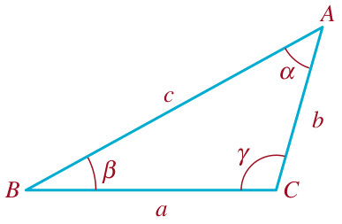{width=35%}</center>

# Ley del coseno

Sean los ángulos $\alpha$, $\beta$, y $\gamma$, y los lados opuestos de longitud $a$, $b$, y $c$ son como se muestra en la figura arriba. Entonces


$$
\begin{array}{cc}
a^2 &=b^2+c^2-2.b.c.cos(\alpha)\\
b^2 &=a^2+c^2-2.a.c.cos(\beta)\\
c^2 &=a^2+b^2-2.a.b.cos(\gamma)
\end{array}
$$


**Ejemplo de aplicación uno**


Esta es una aplicación de la ley del coseno, el Author:Ken Schwartz (https://www.geogebra.org/m/ep8ukrnv) las elaboro usando geogebra.

<meta name=viewport content="width=device-width,initial-scale=1">
<meta charset="utf-8"/>
<script src="https://www.geogebra.org/apps/deployggb.js"></script>
<div id="ggb-elementTrigo11"></div> 
<script>  
       var ggbAppTrigo11 = new GGBApplet({"material_id":"ep8ukrnv",
       "width": 800,
       "height": 400,
       "showToolBar": false,
       "showAlgebraInput": false,
       "showMenuBar": false },
       true);
       
         window.addEventListener("load", function() {  
           ggbAppTrigo11.inject('ggb-elementTrigo11');
      });
</script>


## Modelo22 (Problema del triángulo)

**Enunciado pág 446 texto guía**

Una cometa queda atorada en las ramas de la copa de un árbol. Si el hilo de 90 pies de la cometa forma un ángulo de $22^{\circ}$ con el suelo, estime la altura del árbol, calculando la distancia de la cometa al suelo.


<center> 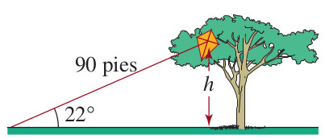{width=35%}</center>


**Proceso de solución**

Sea $h$ la altura de la cometa. En la figura se ve que

$$
\dfrac{h}{90}=sen(22^{\circ}) \ \ \ \text{y así} \ \ \ \ h=90sen(22^{\circ})\approx33.71 pies
$$
**Respuesta**: La distancia de la cometa al suelo es de $33.71 pies$


## Modelo24 (Problema del triángulo)

**Enunciado pág 447 texto guía**

Un topógrafo usa un instrumento llamdo teodolito para medir el ángulo de elevación entre el nivel del piso y la cumbre de una montaña. En un punto, se mide un ángulo de elevación de $41^{\circ}$. Medio kilómetro más lejos de la base de la montaña, el ángulo de elevación medido es de $37^{\circ}$. ¿Qué altura tiene la montaña?

<center> 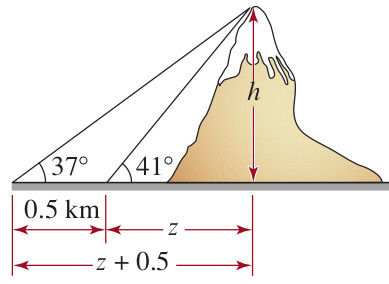{width=35%}</center>


**Proceso de solución**

A partir de la gráfica se puede deducir la geometría de dos triángulos rectágulos, uno con ángulo de $37^{\circ}$, y otro con ángulo de $41^{\circ}$. Entonces


Para el triángulo de $37^{\circ}$:

$$
(1) \ \ \ tan(37^{\circ})=\dfrac{\text{lado op}}{\text{lado ady}}=\dfrac{h}{z+0.5}
$$
Simplificando la $ec(1)$, tenemos

$$
(1) \ \ tan(37^{\circ})(z+0.5)=h
$$

Para el triángulo de $41^{\circ}$:

$$
(2) \ \ \ tan(41^{\circ})=\dfrac{\text{lado op}}{\text{lado ady}}=\dfrac{h}{z}
$$
Simplificando la $ec(2)$, tenemos

$$
(2) \ \ tan(41^{\circ}).z=h
$$
Despejando $z$ de la $ec(2)$ y sustituyendo en la $ec(1)$, se obtiene una ecuación sólo en términos de $h$, así:

$$
z=\dfrac{h}{tan(41^{\circ})}
$$
Sustituyento en $(1)$

$$
 tan(37^{\circ})\left(\dfrac{h}{tan(41^{\circ})}+0.5\right)=h
$$
Despejando la variable $h$ se tiene:


\begin{equation}
\begin{split}

tan(37^{\circ})\left(\dfrac{h}{tan(41^{\circ})}+0.5\right) & = & h\\

\dfrac{tan(37^{\circ})}{tan(41^{\circ})}h+(0.5).tan(37^{\circ}) & = & h\\

\dfrac{tan(37^{\circ})}{tan(41^{\circ})}h-h & = & -(0.5).tan(37^{\circ})\\

h\left(\dfrac{tan(37^{\circ})}{tan(41^{\circ})}-1\right) & = & -(0.5).tan(37^{\circ})\\

h & = & \dfrac{-(0.5).tan(37^{\circ})}{\left(\dfrac{tan(37^{\circ})}{tan(41^{\circ})}-1\right)}\\

h & \approx & \dfrac{-0.376777}{-0.133135}\\

h & \approx & 2.83003718 km \ \ \ \text{es decir} \ \ \ 2830.04 metros

\end{split}
\end{equation}


## Modelo32 (Problema del triángulo)

Unos observadores en dos pueblos $A$ y $B$, a cada lado de una montaña de $12000 pies$ de altura, miden los ángulos de elevación entre el suelo y la cumbre de la montaña. Vea la Figura. Suponiendo que los pueblos y la cumbre de la montaña están en el mismo plano vertical, calcule la distancia entre ellos.


<center> {width=25%}</center>

**Proceso de solución**:

Sea $C$ el punto donde cae la altura perpendicular de la montaña.

Sea $x$ la distancia entre el punto $A$ y el punto $C$.

Sea $y$ la distancia entre el punto $C$ y el punto $B$.

Entonces la distancia entre ambos pueblos es $x+y$.

Además por la gráfica puede verse:

$$
tan(28^{\circ})=\dfrac{12000}{x} \ \ \ \text{de donde} \ \ \ \ x=\dfrac{12000}{tan(28^{\circ})}
$$

$$
tan(46^{\circ})=\dfrac{12000}{y} \ \ \ \text{de donde} \ \ \ \ y=\dfrac{12000}{tan(46^{\circ})}
$$
Por lo tanto

$$
\text{distancia entre los pueblos}=x+y=\dfrac{12000}{tan(46^{\circ})}+\dfrac{12000}{tan(28^{\circ})}=34156.98 pies
$$
**Respuesta**: La distancia entre ambos pueblos se de $34156.98 pies$

## Modelo33 (Problema del triángulo)

Una bandera está en la orilla de un acantilado de $50 pies$ de altura, en la orilla de un río de $40 pies$ de ancho. Véase la Figura. Un osbserador en la orilla opuesta del río mide un ángulo de $9$ grados entre su visual a la punta del asta y su visual a la base del asta. Obtenga la altura del asta.

<center> {width=25%}</center>

**Proceso de solución**


Sea $h$ la altura del asta.

Sea $\alpha$ el ángulo desde la visual del obtervador  a la base del asta.

Entonces

Primero:

$$
tan(\alpha)=\dfrac{50}{40}=\dfrac{5}{4}
$$

$$
tan(\alpha + 9^{\circ})=\dfrac{50+h}{40}   \ \ \ \Rightarrow  \ \ \ \ \  (40).tan(\alpha + 9^{\circ})=50+h    \ \ \ \Rightarrow  \ \ \ \ \ (40).tan(\alpha + 9^{\circ})-50=h
$$
Sabemos por identidades básicas trigonometricas que: 

$$
tan(\alpha + 9^{\circ})=\dfrac{tan(\alpha)+tan(9^{\circ})}{1-tan(\alpha).tan(9^{\circ})}=\dfrac{\dfrac{5}{4}+tan(9^{\circ})}{1-tan(9^{\circ}).\left(\dfrac{5}{4}\right)}\approx 1.756047
$$

Entonces el valor de $h$ es:

$$
(40).(1.756047)-50\approx h \ \ \ \ \ \Rightarrow  \ \ \ \ \ 20.24188 pies    \approx h
$$

**Respuesta**: El asta mide $\approx 20.24188 pies$ de altura


## Modelo34 (Problema del triángulo)

Un puente levadizo mide $7.5 m$ de orilla a orilla, y cuando se abre por completo forma un ángulo de $43$ grados con la hoirzontal. Véase la Figura. Cuando el puente se cierra, el ángulo de depresión de la orilla a un punto en la superficie del agua bajo el extremo opuesto es de $27$ grados. Cuando el puente está totalmente abierto, cuál es la distancia $d$ entre el punto más alto del puente y el agua?

<center> {width=25%}</center>

**Proceso de solución**:

Sea $d=x+y$ la distancia del punto más alto del puente y el agua.

Sea $x$ la distancia entre el agua y el puente, al momento de estar cerrado.

Sea $y =d-x$.

Sea $z$ la distancia entre ambas orillas del puente, al momento de estar cerrado.


Por la gráfica se puede deducir que:

$$
sen(43^{\circ})=\dfrac{y}{7.5} \ \ \ \text{de donde} \ \ \ \ y=(7.5)sen(43^{\circ})
$$

$$
cos(43^{\circ})=\dfrac{z}{7.5} \ \ \ \text{de donde} \ \ \ \ z=(7.5)cos(43^{\circ})
$$

$$
tan(27^{\circ})=\dfrac{x}{z} \ \ \ \text{de donde} \ \ \ \ x=ztan(27^{\circ})
$$

Entonces 


$$
d=x+y=ztan(27^{\circ})+(7.5)sen(43^{\circ})=(7.5)cos(43^{\circ})tan(27^{\circ})+(7.5)sen(43^{\circ})=7.909813 m
$$

**Respuesta**: La distancia del punto más lejano del puente y el agua es de $7.909813 m$


## Modelo35 (Problema del triángulo)

Desde el suelo de un cañon se necesitan $62 pies$ de soga para alcanza la cima de la pared del cañon y $86 pies$ para alcanzar la cima de la pared opuesta.  Véase la Figura. Si las dos sogas forman un ángulo de $123$ grados, cuál es la distancia $d$ desde la cima de una pared del cañon a la otra?


<center> 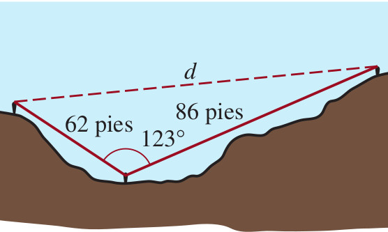{width=25%}</center>


**Proceso de solución**:

Aplicando la ley de cosenos tenemos:

Sea $a=62 pies$, $b=86 pies$, y $\gamma=123^{\circ}$

Entonces aplicando la fórmula:

$$
c^2 =a^2+b^2-2.a.b.cos(\gamma)
$$


$$
c^2 =(62)^2+(86)^2-2.(62).(86).cos(123^{\circ})
$$
de donde


$$
c^2 \approx 17048.03 \ \ \ \ \text{entonces} \ \ \ \ c \approx \sqrt{17048.03}\approx 130.5681 pies
$$

**Respuesta**: La distancia $d$ desde la cima de una pared del cañon a la otra es: $d \approx 130.5681 pies$


<!-- ```{r echo=FALSE} -->
<!-- a <- 62 -->
<!-- b <- 86 -->
<!-- A <- 123 -->
<!-- d <- a^2+b^2-2*a*b*cos((A/180)*pi) -->
<!-- d -->
<!-- sqrt(d) -->
<!-- ``` -->


## Modelo36 (Problema del triángulo)

Un hombre de $5 pies$ $9$ pulgadas de estatura está parado en una acera que baja en ángulo constante. Un poste de alumbrado vertical, directamente atrás de  él, forma una sombra de $25 pies$ de longitud. El ángulo de depresión desde la parte superior del hombre hasta la inclinación de su sombra es de $31$ grados. Calcule el ángulo $\alpha$, que se indica en la Figura, el cual esta formado por la acera y la horizontal.

<center> {width=25%}</center>


## Modelo37 (Problema del triángulo)

Use la ley de senos para resolver cada uno de los triángulos.  Véase la Figura abajo.


(1) $\alpha =80^{\circ}$, $\beta =20^{\circ}$, $b=7UL$

(2) $\alpha =60^{\circ}$, $\beta =15^{\circ}$, $c=30UL$
	


<center> {width=25%}</center>


## Modelo38 (Problema del triángulo)

Use la ley de cosenos para resolver cada uno de los triángulos.  Véase la Figura arriba.


(1) $\alpha=162^{\circ}$, $b=11UL$, $c=8UL$

(2)	$\alpha=22^{\circ}$, $b=3UL$, $c=9UL$


	
