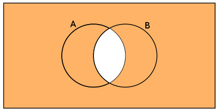
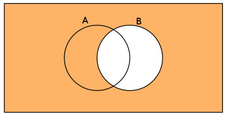
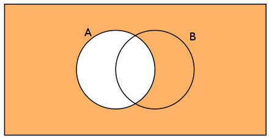
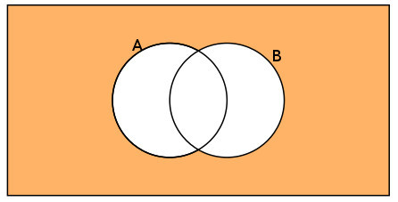
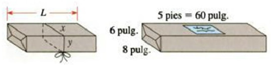

# Taller Uno {#Taller-Uno}

(\#fig:Conjunto1)Ejercicio Uno [Imagen tomada de [@zill2012algebra] pág $197$]

## Ejercicio (1) 

Usando la Figura \@ref(fig:Conjunto1) seleccione la notación de conjunto que le corresponde para representar la región sombreada.

  + $(A\cap B)'$
  + $B'$
  + $A'\cup B$
  + $(A\cup B)'$
  
  

(\#fig:Conjunto2)Ejercicio Dos [Imagen tomada de [@zill2012algebra] pág $197$]

## Ejercicio (2)

Usando la Figura \@ref(fig:Conjunto2) seleccione la notación de conjunto que le corresponde para representar la región sombreada.

  + $A\cup B'$
  + $B'$
  + $A'\cup B$
  + $(A\cup B)'$

(\#fig:Conjunto3)Ejercicio Tres [Imagen tomada de [@zill2012algebra] pág $197$]

## Ejercicio (3) 

Usando la Figura \@ref(fig:Conjunto3) seleccione la notación de conjunto que le corresponde para representar la región sombreada.

  + $A\cup B'$
  + $A'$
  + $A'\cup B$
  + $(A\cup B)'$

(\#fig:Conjunto4)Ejercicio Cuatro [Imagen tomada de [@zill2012algebra] pág $197$]

## Ejercicio (4)

Usando la Figura \@ref(fig:Conjunto4) seleccione la notación de conjunto que le corresponde para representar la región sombreada.

  + $A\cup B'$
  + $A'$
  + $A'\cup B$
  + $(A\cup B)'$

## Ejercicio (5)

Considere los conjuntos $A_{1}=\{2,3,5\}$,$A_{2}=\{1,4\}$,$A_{3}=\{1,2,3\}$,$A_{4}=\{1,3,5,7\}$,$A_{5}=\{3,5,8\}$,$A_{6}=\{1,7\}$,$U=\{1,2,3,4,5,6,7,8,9\}$. Determine 

  + $\bigcup_{i=1}^{6}A_{i}$
  + $\bigcup_{i=3}^{6}A'_{i}$
  + $\bigcap_{i=4}^{6}A_{i}$

##  Ejercicio (6)

Considere los conjuntos $A=\{a,b,c,d,e\}$,$B=\{d,e,f,g\}$,$C=\{e,f,g,h,i\}$,$D=\{a,c,e,g,i\}$,\break $E=\{b,d,f,h\}$,$F=\{a,e,i\}$,\break $U=\{a,b,c,d,e,f,g,h,i\}$. Determine 

  + $A\cup B$
  + $A\cap B$
  + $E\cup F$
  + $C\cap D$
  + $A'$
  + $B'$
  + $B-A$
  + $E'\cap F'$
  + $(E\cup F)'$

## Ejercicio (7) 

Considere los conjuntos $A=\{2,3,5\}$,$B=\{1,4\}$,$C=\{1,2,3\}$,$D=\{1,3,5,7\}$,$E=\{3,5,8\}$,$F=\{1,7\}$,$U=\{1,2,3,4,5,6,7,8,9\}$. Determine

  + $A\cup B$
  + $A\cap B$
  + $E\cup F$
  + $C\cap D$
  + $A'$
  + $B'$
  + $B-A$
  + $E'\cap F'$
  + $(E\cup F)'$

## Ejercicio (8) 

Una encuesta hecha a $100$ músicos populares mostró que $40$ de ellos usaban guantes en la mano izquierda y $39$ usaban guantes en la mano derecha. Si $60$ de ellos no usaban guantes.

  +  cuántos usaban guantes en la mano derecha solamente?
  +  cuántos usaban guantes en la mano izquierda solamente?
  +  cuántos usaban guantes en ambas manos?
  

## Ejercicio (9)

Un total de $35$ sastres fueron entrevistados para un trabajo; $25$ sabían hacer trajes, $28$ sabían hacer camisas, y dos no sabían hacer ninguna de las dos cosas. Cuántos sabían hacer trajes y camisas?.

## Ejerciciio (10)

De un grupo de 80 personas de las cuales se tiene la informaci\'on de que 27 leían la revista A, pero no leían la revista B; 26 leían la revista B, pero no C; 19 leían C pero no A; 2 las tres revistas mencionadas. cuantos preferían otras revistas?

## Ejercicio (11) 

Reescriba el número sin usar el simbolo de valor absoluto, y simplique

  + $\left| -3-4 \right|$
  + $\left| -11+1 \right|$
  + $(-5)\left| 3-6 \right|$
  + $(4)\left| 6-7 \right|$
  + $\left| 4-\pi \right|$
  + $\left| \pi-4 \right|$
  + $\left| \sqrt{2}-1.5 \right|$
  + $\left| \sqrt{3}-1.7 \right|$
  + $\left| 1.5-\sqrt{2}\right|$
  + $\left| 1.7-\sqrt{3}\right|$
  + $\frac{\left|-6\right|}{(-2)}$
  + $\frac{5}{\left|-2\right|}$

## Ejercicio (12) 

Determinar el signo en la operacion real si conocemos que $x<0$ y $y>0$

  + $xy$
  + $x^2y$
  + $\frac{x}{y}+x$
  + $y-x$
  + $\frac{x}{y}$
  + $xy^2$
  + $\frac{y-x}{xy}$
  + $y(y-x)$

Para los siguientes enunciados determinar los falsos o verdaderos

## Ejercicio (13) 

¿Cuál de los siguientes números NO es una solución de la inecuación $5x-4<12$?

  + (A)$-2$
  + (B)$3$
  + (C)$0$
  + (D)$1.8$
  + (E)$4$

## Ejercicio (14)

¿Qué inecuación NO representa el mismo conjunto solución?

  + (A) $-2x>4$
  + (B) $-4>2x$
  + (C) $-x<2$
  + (D) $8<-4x$
  + (E) $-2>x$

## Ejercicio (15)

Si $7$ veces un número se disminuye en 5 unidades resulta un número menor que $47$, entonces el número debe ser menor que:

  + (A) $42$
  + (B) $49$
  + (C) $52$
  + (D) $\frac{82}{7}$
  + (E) $\frac{52}{7}$
  

## Ejercicio (16)

El conjunto solución de la inecuación $3x-8<+5x+5$ es:

  + (A) $x<\frac{13}{2}$
  + (B) $x>\frac{13}{2}$
  + (C) $x<-\frac{13}{2}$
  + (D) $x>-\frac{13}{2}$
  + (E) $x>-\frac{2}{13}$

## Ejercicio (17)

El conjunto solución de la inecuación $\frac{2x+1}{8}<\frac{3x-4}{3}$

  + $x>0$
  + $x>\frac{35}{18}$
  + $x<\frac{35}{18}$
  + $x=\frac{35}{18}$
  + $x>\frac{18}{35}$

## Ejercicio (18)

La temperatura en escala Fahrenheit y Celsius (centigrados) están relacionados por la fórmula $C=\frac{5}{9}(F-32)$. ¿A qué temperatura Fahrenheit corresponde una temperatura en escala centígrada que se encuentra? $40\leq C \leq 50$

## Ejercicio (19)

En general, se considera que una persona tiene fiebre si tiene una temperatura oral mayor que $98.6°F$.
¿Qué temperatura en la escala Celsius indica fiebre? [Pista: recuerde que $T_{F}=\frac{9}{5}T_{c}+32$, donde $T_{C}$ es grados Celsius y $T_{F}$ es
grados Fahrenheit].

## Ejercicio (20)

Un taxi cobra $90 pesos$ por el primer cuarto de milla y $30 pesos$ por cada cuarto de milla adicional. ¿Qué distancia en cuartos de milla puede viajar una persona y deber
entre $3 pesos$ y $6 pesos$?

## Ejercicio (21)

Durante cierto período, la temperatura en grados Celsius varió entre 25 y 30 grados Celsius. ¿Cuál fue el intervalo en grados Fahrenheit para este período?. Recordar que $F=\frac{9C}{5}+32$

## Ejercicio (22)

Para determinar el coeficiente intelectual de una persona se usa la fórmula: $I=\frac{100M}{C}$,\break donde $I$ es el coefienciente interlectual, $M$ es la edad mental (determinada mediente un test) y $C$ es la edad cronológica. Si la variación de $I$ de un grupo de niños de 11 años está dada por $80\leq I \leq 140$, encuentre el intervalo de edad mental de este grupo.

## Ejercicio (23)

La necesidad diaria de agua calculada para cierta ciudad esta dada por $\left|c-3725\right|<100$ donde $c$ es el número de galones de agua utilizados por día. Determinar la mayor y menor necesidad diaria de agua.

## Ejercicio (24)

Los lados de un cuadrado se extienden para formar un rectángulo, un lado se alarga $2cm$, y el otro $6cm$. El área del rectángulo resultante debe ser menor que $130cm^2$. ¿Cuáles son las posibles longitudes del lado del cuadrado original?

## Ejercicio (25)

La oficina de correos sólo aceptará paquetes para los cuales el largo más lo que mida alrededor no sea mayor que $108 pulg$. Por consiguiente, para el paquete de la Figura \ref{fig:Figura_enunciado09}, debemos tener: 

$$L+2(x+y)\leq 108$$

(\#fig:CajaOficina1)La oficina de correos [Imagen tomada de [@zill2012algebra] pág $197$]

  + ¿La oficina de correos aceptará un paquete que mide $6 pulg$ de ancho, $8 pulg$ de alto y $5 pies$ de largo?
  + ¿Aceptará un paquete que mide $2$ por $2$ por $4 pies$?
  + ¿Cual es el mayor largo aceptable para un paquete que tiene base cuadrada y mide $9$ por $9 pulg$?

## Ejercicio (26)

Hallar el intervalo entre los que se encuentra la ganancia $P>0$, si $\left|P-1000\right|<300$.

## Ejercicio (27)

Si $x\leq 1$, entonces $x^2\leq 1$.¿es VERDADERA? Explique.

## Ejercicio (28)

Si $x\geq 2$, entonces $x^2\geq 4$.¿es VERDADERA? Explique.

## Ejercicio (29)

En que rango de valores cae la ganancia $P>0$, si $(2P-100)^2<250000$?

## Ejercicio (30)

¿Qué rango de valores toma la ganancia $P>0$, cuando $(2P+10)^2<6400$?

## Ejercicio (31)

Hallar el rango de valores para el costo $C>0$, sabiendo que $\left|\frac{C}{C-12}\right|<1$

## Ejercicio (32)

Escriba la expresión sin usar el símbolo de valor absoluto y simplifique el resultado.
 
  + Si $x<-3$, entonces $\left|3+x\right|=?$
  + Si $x>5$, entonces $\left|5-x\right|=?$
  + Si $x<2$, entonces $\left|2-x\right|=?$
  + Si $x\geq -7$, entonces $\left|7+x\right|=?$
  + Si $a<b$, entonces $\left|a-b\right|=?$
  + Si $a>b$, entonces $\left|a-b\right|=?$
  + $\left|x^2+4\right|=?$
  + $\left|-x^2-1\right|=?$

## Ejercicio (33)

Exprese el enunciado como una desiguialdad.

  + $x$ es negativo.
  + $y$ es no negativo.
  + $q$ es menor o igual $\pi$
  + $d$ está entre $4$ y $5$.
  + $t$ no es menor que $5$.
  + El negativo de $z$ no es mayor a $3$.
  + El cociente de $p$ y $q$ es a lo más $7$.
  + El recíproco de $w$ es al menos $9$.
  + El valor absoluto de $x$ es mayor que $7$.
  + $b$ es positivo.
  + $s$ es no positivo.
  + $w$ es mayor o igual a $-4$
  + $c$ está entre $\frac{1}{5}$ y $\frac{1}{3}$
  + $p$ es no mayor que $-2$
  + EL negativo de $m$ no es menor que $-2$
  + El cociente de $r$ y $s$ es al menos $\frac{1}{5}$.

## Ejercicio (34)

Usando las propiedades de los números reales y de las desigualdades, obtener el conjunto solución en  los real para cada inecuación.

  + $\Large \mid x-3\mid<8$
  + $\Large \mid x-6\mid>6$
  + $\Large \mid x-1\mid \leq 5$
  + $\Large \mid2x-5\mid \geq 3$
  + $\left|  \dfrac{2(x+5)}{3} \right|  \leq \frac{4}{5}$
  + $\Large \dfrac{2(x+5)}{3}\leq \frac{4}{5}$
  + $\Large 5x-4<3x+5$
  + $\Large \frac{x-5}{3}+\frac{x+4}{2}\geq \frac{x+3}{6}$
  + $\Large \frac{2x-1}{5}-\frac{3x+1}{2}\geq \frac{x-5}{10}$
  + $\Large \frac{x-5}{3}+\frac{x+4}{5}\geq \frac{x+3}{15}$
  + $\Large \frac{x-5}{3}+\frac{x+4}{2}\geq \frac{x+3}{12}$
  + $\Large \frac{x-5}{5}+\frac{x+4}{2}\geq \frac{x+3}{20}$
  + $\Large \dfrac{x-3}{x+2} < 0$
  + $\Large \dfrac{2x+4}{x-2} > 0$
  + $\Large \dfrac{x-4}{x-3}\geq 2$
  + $\Large \dfrac{2x+4}{x-3}\leq 2$

## Ejercicio (35)

Un grupo de estudiantes decide asistir a un concierto. el costo de contratar a un autobús para que los lleve al concierto es de 450 dólares, lo cual se debe repartir en forma uniforme entre los estudiantes. Los promotores del concierto ofrecen descuentos a grupos que lleguen en autobús. Los boletos cuestan normalmente 50 dólares cada uno, pero se reducen $10$ centavos de dólar del precio del boleto por cada persona que vaya en el grupo (hasta la capacidad máxima del autobús).¿Cuántos estudiantes deben ir en el grupo para que el costo total por estudiante sea menor a 54 dólares?

## Ejercicio (36)

Un carnaval tiene dos planes de boletos.
Plan $A$: tarifa de entrada de $5$ dólares y $25$ centavos cada vuelta en los juegos.
Plan $B$: tarifa de entrada de $2$ dólares y $50$ centavos cada vuelta en los juegos.
¿Cuántas vueltas tendria que dar para que el plan $A$ resultara menos caro que el plan $B$?

## Ejercicio (37)

Una compañía que renta vehículos ofrece dos planes para rentar un automóvil. Plan $A$: $30$ dólares por día y $10$ centavos por milla. Plan $B$: $50$ dólares por día y gratis millas recorridas ilimitadas. ¿Para qué valor de millas el plan $B$ le hará ahorrar dinero?

## Ejercicio (38)

Una compañía telefónica ofrece dos planes de larga distancia. Plan $A$: $25$ dólares por mes y $5$ centavos por minuto. Plan $B$: $5$ dólares por mes y $12$ centavos por minuto. ¿Para cuántos minutos de llamadas de larga distancia el plan $B$ sería ventajoso desde el punto de vista financiero?

## Ejercicio (39)

Una compañía telefónica ofrece dos planes de larga distancia. Plan $A$: $25$ dólares por mes y $5$ centavos por minuto. Plan $B$: $5$ dólares por mes y $12$ centavos por minuto. ¿Para cuántos minutos de llamadas de larga distancia el plan $B$ sería ventajoso desde el punto de vista financiero?

## Ejercicio (40)

Los lados de un cuadrado se extienden para formar un rectángulo. Como se muestra en la Figura \@ref(fig:Rectangulo1), un lado se extiende $2 cm$ y el otro $5 cm$. Si el área del rectángulo resultante es menor de $130 cm^2$, cuál es la posible longitud de un lado del cuadrado original?

(\#fig:Rectangulo1)Rectángulo que extiende dos de sus lados [Imagen tomada de [@zill2012algebra] pág $197$]

## Ejercicio (41)

Los lados de un cuadrado se extienden para formar un rectángulo. Un lado se extiende $2 cm$ y el otro $6 cm$. Si el área del rectángulo resultante es menor de $130 cm^2$, y mayor que $80 cm^2$, ¿cuáles son las posibles longitudes de un lado del cuadrado original?

## Ejercicio (42)

Obtener el conjunto solución para la desigualdad usando el concepto de valor absoluto y las propiedades de desigualdades

$$
|x-2|+|x+5| \leq 10, \ \ \ \ \ \text{Respuesta:} \ \ \left[\dfrac{-13}{2},\dfrac{7}{2}\right] 
$$

## Ejercicio (43)

Obtener el conjunto solución para la desigualdad usando el concepto de valor absoluto y las propiedades de desigualdades

$$
|4x+1| \geq |2x-3|, \ \ \ \ \ \text{Respuesta:} \ \ \left(-\infty,-2 \right]  \cup \left[\dfrac{1}{3},+\infty\right) 
$$

## Ejercicio (44)

Una compañía que fabrica escritorios  puede vender todos los que produce a $\$400$ cada uno. Si  $x$  escritorios se venden cada semana, entonces el número de dólares en el costo total de producción semanal es $2x^2+ 80x +3000$. Cuántos escritorios deberán construirse semanalmente de tal manera que la compañía garantice una ganancia?

## Ejercicio (45)

Un campo rectangular  cercado esta ubicado en la orilla de un río; el lado largo del río no requiere de cerca. El costo del  material para la cerca es de $\$8$ por pie lineal para los dos lados opuestos con cerca y $\$16$ por pie lineal para el lado paralelo al río. Si el área del campo es de $\$12000$ pies cuadrado y el costo de la cerca  no debe exceder de $\$3520$, Cuáles son las restricciones en las dimensiones del campo?

## Ejercicio (46)

Una parcela rectangular de terreno será encerrada por una cerca, luego, dividida a la mitad por otro tipo de cerca. La cerca que divide a la mitad la parcela cuesta $\$3$ por pie lineal y la otra cerca tiene un costo de $\$6$ por pie lineal. Si el área del terreno es $1800$ pies cuadrado y costo total de la cerca no debe ser mayor que $\$2310$, Cuáles son las restricciones en las dimensiones del terreno?

## Ejercicio (47)

Un inversionista tiene invertidos $\$8000$ al $9\%$ y piensa invertir dinero adicional al $16\%$ con el fin de lograr un rendimiento de al menos $12\%$ de la inversión total. Que cantidad de dinero deberá ser invertida?

## Ejercicio (48)

Si en un curso en particular, un estudiante tiene un promedio de calificaciones, en cuatro exámenes, de menos de $90$ pero no debajo de $80$, recibe una calificación de $B$ en el curso. Si sus calificaciones en los tres primeros exámenes son $87$, $94$ y $73$, que calificación en el cuarto examen dará como resultado la calificación de $B$?

## Ejercicio (49)

Que cantidad de alcohol puro debe ser agregado a $24$ litros de una solución de alcohol al $20\%$ para obtener una mezcla que al menos tenga $30\%$ de alcohol?

## Ejercicio (50)

Obtener el conjunto solución para la desigualdad usando el concepto de valor absoluto y las propiedades de desigualdades

$$
\left|\dfrac{x+1}{x-3}\right| \geq 2, \ \ \ \ \ \text{Respuesta:} \ \ \left[\dfrac{5}{3},3 \right)  \cup \left(3,7\right) 
$$

## Ejercicio (51)

Obtener el conjunto solución para la desigualdad usando el concepto de valor absoluto y las propiedades de desigualdades

$$
\left|\dfrac{2x-1}{x+1}\right| <5, \ \ \ \ \ \text{Respuesta:} \ \ \left(-\infty,-2 \right)  \cup \left(\dfrac{-4}{7},+\infty\right) 
$$

## Ejercicio (52)

Encuentre $a$ y $b$

Si $0<x<4$, entonces $$a<2x+3<b$$

## Ejercicio (53)

Encuentre $a$ y $b$

Si $-3<x<3$, entonces $$a<1-2x<b$$

## Ejercicio (54)

Encuentre $a$ y $b$

Si $2<x<4$, entonces $$a<\dfrac{1}{x-6}<b$$

## Ejercicio (55)

Encuentre $a$ y $b$

Si $-3<x<0$, entonces $$a<\dfrac{1}{x+4}<b$$

## Ejercicio (56)

Para $0<a<b$, definimos $h$ por $$\dfrac{1}{h}=\dfrac{1}{2}\left(\dfrac{1}{a}+\dfrac{1}{b}\right)$$
Demuestre que $a<h<b$. El número $h$ se llama media armónica de $a$ y $b$.

## Ejercicio (57)

Encuentre $a$ y $b$

Si $|x-1|<3$, entonces $$a<x+4<b$$

## Ejercicio (57)

Encuentre $a$ y $b$

Si $|x+4| \leq 2$, entonces $$a<2x-3<b$$

## Ejercicio (58)

Encuentre $a$ y $b$

Si $|x+1| \leq 3$, entonces $$a<\dfrac{1}{x+5}<b$$

