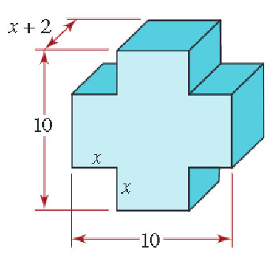
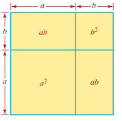
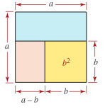
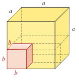

# Taller Dos {#Taller-Dos}

## Ejercicio (1b)

Obtener la solución si existe para el sistema

\begin{equation}
\begin{array}{clrr} %      
x & - & 4y+1=0 & (1) \\       
3x & +  & 2y-1=0  & (2) 
\end{array}
\end{equation}

## Ejercicio (2b)

Obtener la solución si existe para el sistema.

\begin{equation}
\begin{array}{clrr} %      
x & - & 2y=6 & (1) \\       
-0.5x & +  & y=1  & (2) 
\end{array}
\end{equation}

## EJERCICIO (3b) 

Obtener la solución si existe para el sistema.

\begin{equation}
\begin{array}{clrrr} %      
x & + & y & -z=0 & (1) \\       
x & - & y & +z=2 & (2) \\
2x & + & y & -4z=-8 & (3)  
\end{array}
\end{equation}

## Ejercicio (4b)

Obtener la solución si existe para el sistema.

\begin{equation}

\begin{array}{clrrr} %      
2x & + & 6y & +z=-2 & (1) \\       
3x & - & 4y & -z=2 & (2) \\
5x & - & 2y & -2z=0 & (3)  
\end{array}

\end{equation}

## Ejercicio (5b)

Obtener la solución si existe para el sistema.

\begin{equation}
\begin{array}{clrrr} %      
2x &  &  & -z=12 & (1) \\       
x & + & y & =7 & (2) \\
5x &  &  & +4z=-9 & (3)  
\end{array}
\end{equation}

## Ejercicio (6b)

Obtener la solución si existe para el sistema.

\begin{equation}
\begin{array}{clrrr} %      
x & + & y & +z=4 & (1) \\       
2x & - & y & +2z=11 & (2) \\
4x & + & 3y  & -6z=-18 & (3)  
\end{array}
\end{equation}

## Ejercicio (7b)

Obtener la solución si existe para el sistema.

\begin{equation}
\begin{array}{clrrr} %      
-x & + & 3y & +2z=2 & (1) \\       
\frac{1}{2}x & - & \frac{3}{2}y & -z=-1 & (2) \\
-\frac{1}{3}x & + & y  & +\frac{2}{3}z=\frac{2}{3} & (3)  
\end{array}
\end{equation}

## Ejercicio (8b)

Resuelva el sistema no lineal si existe solución.

\begin{equation}
\begin{array}{clrr} %      
x & = & 5 & (1) \\       
x & = & y^2 & (2)
\end{array}
\end{equation}

## Ejercicio (9b)

Resuelva el sistema no lineal si existe solución.

\begin{equation}
\begin{array}{clrr} %      
y & = & 3 & (1) \\       
(x+1)^2+y^2 & = & 10 & (2)
\end{array}
\end{equation}

## Ejercicio (10b)

Resuelva el sistema no lineal si existe solución.

\begin{equation}
\begin{array}{clrr} %      
xy & = & 3 & (1) \\       
x+y & = & 4 & (2)
\end{array}
\end{equation}

## Ejercicio (11b)

Escriba el polinomios de forma estándar para el volumen del objeto sólido que se muestra en la Figura \@ref(fig:Ejercicio10)

(\#fig:Ejercicio10)Volumen del sólido [Imagen tomada de [@zill2012algebra] pág $197$]

## ejercicio (12b)

Escriba el polinomios de forma estándar para la superficie del objeto sólido que se muestra en la Figura \@ref(fig:Ejercicio11)

(\#fig:Ejercicio11)Área lateral (ó superficie lateral) del sólido [Imagen tomada de [@zill2012algebra] pág $197$]

## Ejercicio (13b)

En los siguientes enunciados vuelva a escribir la expresión usando exponentes racionales.

  + ${\Large \sqrt[3]{ab}}$
  + ${\Large \sqrt[5]{7x}}$
  + ${\Large \frac{1}{(\sqrt[3]{x})^{4}}}$
  + ${\Large \frac{1}{(\sqrt[4]{x})^{3}}}$
  + ${\Large \sqrt[7]{x+y}}$
  + ${\Large \sqrt[3]{a^{2}+b^{2}}}$

## Ejercicio (14b)

En los siguientes enunciados vuelva a escribir la expresión usando notación radical.

  + ${\Large a^{\frac{2}{3}}}$
  + ${\Large 2a^{\frac{1}{3}}}$
  + ${\Large (3a)^{\frac{2}{3}}}$
  + ${\Large 3+ a^{\frac{2}{3}}}$
  + ${\Large (3+ a)^{\frac{2}{3}}}$
  + ${\Large (3a)^{\frac{-3}{2}}}$

## Ejercicio (15b

Demuestre el producto notable usando conceptos geométricos y la información que se expresa en la Figura \@ref(fig:SumaCuadrado1).

$$a^{2}+2ab+b^{2}=(a+b)^{2}$$

(\#fig:SumaCuadrado1)Suma al cuadrado [Imagen tomada de [@zill2012algebra] pág $197$]

## Ejercicio (16b)

Demuestre el producto notable usando conceptos geométricos y la información que se expresa en la Figura \"ref(fig:DiferenciaCuadrado1).

$$a^{2}-b^{2}=(a+b)(a-b)$$

(\#fig:DiferenciaCuadrado1)Diferencia de cuadrados [Imagen tomada de [@zill2012algebra] pág $197$]

## Ejercicio (17b)

Demuestre el producto notable usando conceptos geométricos y la información que se expresa en la Figura \@ref(fig:DiferenciadeCubos).

$$a^{3}-b^{3}=(a-b)(a^{2}+ab+b^{2}), a>b>0$$

(\#fig:DiferenciadeCubos)Diferencia de cubos[Imagen tomada de [@zill2012algebra] pág $197$]

## Ejercicio (18b)

En los siguientes enunciados simplificar usando propiedades.

  + ${\Large \sqrt[n]{\dfrac{4^{n}.6}{4^{2n+1}+2^{4n+1}}}}$
  + ${\Large \dfrac{2^{n+3}-2^{n}+7}{2^{n+1}-2^{n}+1}}$
  + ${\Large \dfrac{2.2^{4n}-4.4^{n}}{2^3.2^{4n}-8.2^{2n+1}}}$

## Ejercicio (19b)

En los siguientes enunciados simplificar usando propiedades.

  + ${\Large (-8)^{\frac{1}{3}}}$
  + ${\Large (-64)^{\frac{1}{5}}}$
  + ${\Large (512)^{\frac{1}{4}}}$
  + ${\Large (-216)^{\frac{1}{3}}}$
  + ${\Large (0.04)^{\frac{-7}{2}}}$
  + ${\Large (-32)^{\frac{1}{5}}}$
  + ${\Large (27)^{\frac{-7}{3}}}$

## Ejercicio (20b)

En los siguientes enunciados simplificar de forma apropiada usando propiedades.

  + ${\Large \Biggl(\Biggl(-27a^{3}b^{-6}\Biggl)^{\frac{1}{3}}\Biggl)^{2}}$
  + ${\Large {\frac{a^\frac{-1}{3}b^{\frac{2}{9}}c^{\frac{1}{6}}}{a^{\frac{1}{6}}b^{\frac{-2}{3}}}}}$
  + ${\Large \Biggl(\dfrac{r^{2}s^{-4}t^{6}}{r^{-4}s^{2}t^{6}}\Biggl)^{\frac{1}{6}}}$
  + ${\Large \Biggl(\dfrac{-x^\frac{1}{2}y^\frac{1}{4}}{8x^{2}y^{4}}\Biggl)^{\frac{1}{3}}}$
  + ${\Large \Biggl(\dfrac{-y^{\frac{1}{2}}}{y\frac{-1}{2}}\Biggl)^{-1}}$
  + ${\Large \Biggl(\dfrac{-x^{2}y^{4}}{8x^{2}y^{4}}\Biggl)^{\frac{-1}{2}}}$
  + ${\Large \Biggl(\dfrac{8x^{3}}{y^{4}}\Biggl)^{\frac{1}{5}}\Biggl(\dfrac{4x^{4}}{y^{2}}\Biggl)^{\frac{1}{5}}}$
  + ${\Large \Biggl(\dfrac{2x^{4}y^{4}}{27x^{2}}\Biggl)^{\frac{1}{4}}}$

## Ejercicio (21b)

En los siguientes enunciados realice la operación y simplifique de forma apropiada usando propiedades.

  + ${\Large (4\sqrt{x}+1)(6\sqrt{x}-2)}$
  + ${\Large (x^{2}y^{3}-3)^{3}}$
  + ${\Large {(x^{\frac{2}{3}}-x^{\frac{1}{3}})(x^{\frac{2}{3}}+x^{\frac{1}{3}})}}$
  + ${\Large \biggr(\dfrac{1}{y^{2}}-\dfrac{1}{x^{2}}\biggr)\biggr(\dfrac{1}{y^{2}}+\dfrac{1}{y^{2}x^{2}}+\dfrac{1}{x^{2}}\biggr)}$
  + ${\Large \biggr(x+y+1\biggr)^{2}}$
  + ${\Large \biggr(x^{5}-x^{2}\biggr)\biggr(x-1\biggr)}$
  

## Ejercicio (22b)

En los siguientes enunciados realice la factorización de forma apropiada.

  + ${\Large 2uv-5wz+2uz-5wv}$
  + ${\Large 2p^{3}-p^{2}+2p-1}$
  + ${\Large x^{10}-5x^{5}-6}$
  + ${\Large 16x^{2}-24yx+9y^{2}}$
  + ${\Large 36x^{2}+12yx+y^{2}}$
  + ${\Large x^{2}-2\sqrt{2}xy+2y^{2}}$
	

## Ejercicio (23b)

En los siguientes enunciados combine terminos y realice la simplificación de la expresión racional.

  + ${\Large \dfrac{q^{2}-1}{q^{2}+2q-3}\div\dfrac{q-4}{q+3}}$
  + ${\Large \dfrac{s^{2}-5s+6}{s^{2}+7s+10}\div\dfrac{2-s}{s+2}}$
  + ${\Large \dfrac{x^{2}+xy+y^{2}}{\dfrac{x^{2}}{y}-\dfrac{y^{2}}{x}}}$
  + ${\Large \dfrac{u^{-2}-v^{-2}}{u^{2}v^{2}}}$
  + ${\Large \dfrac{1+\dfrac{1}{\sqrt{x}}}{1+\dfrac{1}{\sqrt{y}}}}$
  + ${\Large \dfrac{\dfrac{1}{(x+h)^{2}}-\dfrac{1}{x^{2}}}{h}}$
  + ${\Large \dfrac{v}{\sqrt{z}}-\dfrac{z}{\sqrt{v}}}$
  + ${\Large \dfrac{\dfrac{1}{x^{2}}-x}{\dfrac{1}{x^{2}}+x}}$
  + ${\Large \dfrac{x^{2}+3x+2}{x^{2}+6x+8}}$
  + ${\Large \dfrac{x^{4}+4x^{2}+4}{4-x^{4}}}$
  + ${\Large \dfrac{x^{2}-2yx-3y^{2}}{x^{2}-yx+3y^{2}}}$
  + ${\Large \dfrac{3x^{2}-7x-20}{3x^{3}+5x^{2}}}$
  + ${\Large \dfrac{x^{3}-9x}{x^{3}-6x^{2}+9x}}$
  + ${\Large \dfrac{yx^{2}+xy^{2}}{x^{2}-y^{2}}}$

## Ejercicio (24b)

En los siguientes enunciados despeje la variable indicada en términos de las variables restantes.

  + ${\Large V=\frac{1}{3}\pi h(r^{2}+R^{2}+rR)}$ despeje $R$
  + ${\Large C=2\pi r}$ despeje $r$
  + ${\Large P=2w+2l}$ despeje $l$
  + ${\Large l=Prt}$ despeje $t$
  + ${\Large S=2\pi rh}$ despeje $h$
  + ${\Large A=\frac{1}{2}bh}$ despeje $h$
  + ${\Large V=\frac{1}{3}\pi r^{2}h}$ despeje $h$
  + ${\Large F=g\dfrac{mM}{d^{2}}}$ despeje $m$
  + ${\Large A=\frac{1}{2}(b_{1}+b_{2})}$ despeje $b_{1}$
  + ${\Large A=P+Prt}$ despeje $r$
  + ${\Large s=\frac{1}{2}gt^{2}+v_{0}t}$ despeje $v_{0}$
  + ${\Large s=\frac{1}{2}gt^{2}+v_{0}t}$ despeje $t$
  + ${\Large S=\dfrac{p}{q+p(1-q)}}$ despeje $q$
  + ${\Large A=2\pi r(r+h)}$ despeje $r$
  + ${\Large P+N=\dfrac{C+2}{C}}$ despeje $C$
  + ${\Large A=B\sqrt[3]{\dfrac{C}{D}}-E}$ despeje $D$
  + ${\Large F=\dfrac{\pi PR^{4}}{8VL}}$ despeje $R$
	
	

## Ejercicio (25b)

En los siguientes enunciados obtener la solución en el conjunto de los números reales.

  + ${\Large \frac{2}{3}x+\frac{4}{3}=x -\frac{1}{3}}$
  + ${\Large 4(1-x)=x-3(x+1)}$
  + ${\Large \dfrac{4}{r+1}-5=4-\dfrac{3}{r+1}}$
  + ${\Large x(2x-1)=3}$
  + ${\Large 0=x^{\frac{1}{4}}-2x^{\frac{1}{2}}+1}$
  + ${\Large 3+\sqrt{3x+1}=x}$
  + ${\Large \sqrt[3]{x^{2}+17}=4}$
  + ${\Large \sqrt{x+2}-\sqrt{x-3}=\sqrt{x-6}}$
  + ${\Large x+3-28x^{-1}=0}$
  + ${\Large \dfrac{1}{\sqrt{x}}+\sqrt{x}=\dfrac{5}{\sqrt{x}}-2\sqrt{x}}$
  + ${\Large \dfrac{2}{5}+\dfrac{4}{10x+5}=\dfrac{7}{2x+1}}$
  + ${\Large \dfrac{3x+1}{6x-2}=\dfrac{2x+5}{4x-13}}$
  + ${\Large \dfrac{2x-9}{4}=2+\dfrac{x}{12}}$

## Ejercicio (26b)

En los siguientes enunciados obtener la solución en el conjunto de los números reales.

  + ${\Large x=4+\sqrt{4x-19}}$
  + ${\Large \sqrt{7-2x}-\sqrt{5+x}=\sqrt{4+3x}}$
  + ${\Large \sqrt{2\sqrt{x+1}}=\sqrt{3x-5}}$
  + ${\Large \sqrt{1+4\sqrt{x}}=\sqrt{x}+1}$

## Ejercicio (27b)

En los siguientes enunciados a partir de un cambio de variable, obtener la solución en el conjunto de los números reales.

  + ${\Large x^{4}-34x^{2}+225=0}$
  + ${\Large x^{4}-10x^{2}+8=0}$
  

## Ejercicio (28b)

En los siguientes enunciados obtener la descomposición en fracciones parciales propias para cada fracción dada. **Recordar**: Una fracción parcial se dice **propia** ó **expresión racional propia** si y sólo si el grado del numerador es menor que el grado del denominador, donde tanto el numerador como el denominador no tienen factores comunes.

  + ${\Large \dfrac{1}{x(x+2)}}$
  + ${\Large \dfrac{-9x+27}{x^{2}-4x-5}}$
  + ${\Large \dfrac{2x^{2}-x}{(x+1)(x+2)(x+3)}}$
  + ${\Large \dfrac{5x^{2}-25x+28}{x^{2}(x-7)}}$
  + ${\Large \dfrac{6x^{2}-7x+11}{(x-1)(x^{2}+9)}}$
  + ${\Large \dfrac{(x+2)^{2}}{x(x+3)}}$
  + ${\Large \dfrac{x^{4}+3x}{x^{2}+2x+1}}$
  + ${\Large \dfrac{x^{3}+x^{2}-x+1}{3x^{3}+x^{2}+3x+1}}$

