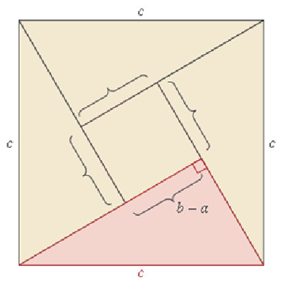
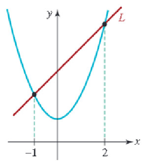
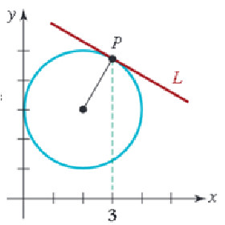
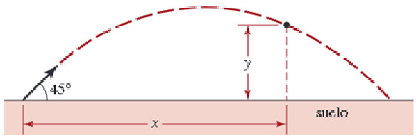
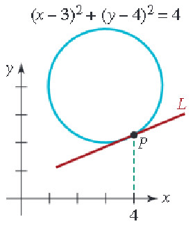
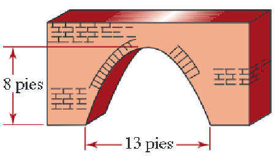

# Taller Tres {#Taller-Tres}

## Ejercicio (1c)

**(Regla de tres simple)**
A un adulto de $65kg$ de peso se le coloca una dosis de cierto medicamento equivalente a $650 mg$ por día, cuánto debería aplicarsele a un niño cuyo peso es de $20kg$?

## Ejercicio (2c)

**(Regla de tres simple)**
Un carro lleva una velocidad constante. En $6$ horas ha recorrido $360km$. Cuántas horas tardaría en recorrer $270km$?

## Ejercicio (3c)

**(Regla de tres simple)**
Si un poste proyecta una sombra de 190,5 cm de largo y al mismo tiempo un hombre de 1,54 cm de estatura proyecta una sombra de 1,06 cm de largo. Qué altura tiene la torre?

## Ejercicio (4c)

**(Regla de tres simple)**
Los $\dfrac{3}{7}$ de la capacidad de un tanque son 8136 litros. Hallar la capacidad del tangue.

## Ejercicio (5c)

**(Regla de tres simple inversa)**
Para cercar un lote se necesitan $15$ rollos de alambre de $45m$ de largo. Cuántos rollos se necesitan si el largo fuera de $75m$?

## Ejercicio (6c)

**(Regla de tres simple inversa)**
A razón de 70 km por hora un automovilista emplea 2 horas, 30 minutos para recorrer cierta distancia. Qué tiempo empleará para recorrer la misma distancia a razón de 50 km por hora?

## Ejercicio (7c)

**(Regla de tres simple inversa)**
Cuatro enfermeros realizan turnos de urgencias en $12$ días. En cuántos días podrían hacer los mismos turnos siete enfermeros?

## Ejercicio (8c)

**(Regla de tres simple inversa)**
Un terapeuta respiratorio tiene $36$ pacientes y medicamentos para nebulización por un término de 28 días. Con veinte pacientes más, sin disminuir la ración diaria de medicamentos y sin agregar más medicamento, durante cuántos días prodría aplicar la terapia respiratoria?

## Ejercicio (9c)

**(Regla de tres simple inversa)**
Una lente para anteojos puede ser hecha por dos trabajadores en $15$ días. si el plazo para entregarla es sólo de $10$ días, cuántos trabajadores deberán aumentarse?

## Ejercicio (10c)

**(Regla de tres compuesta)**
Un terapeuta respiratorio ha comprado para el consumo de $15$ pacientes durante $45$ días, $21$ litros de cierto medicamento para pruebas de respiración. Al cabo de $20$ días llegan $6$ pacientes más. Cuántos litros más tendrá que comprar?

## Ejercicio (11c)

**(Regla de tres compuesta)**
Tres radiólogos trabajando 8 horas diarias han practicado exámenes a 80 trabajadores de una empresa Pereirana en 10 días. Cuántos días necesitarán 5 radiólogos, trabajando 6 horas diarias para atender 60 personas de la misma empresa?

## Ejercicio (12c)

**(Regla de tres compuesta)**
Un atleta marchando a $12 km$ por hora recorre en viarias etapas un camino, empleando $9$ días a razón de $7$ horas por día. A qué velocidad tendrá que ir si desea emplear sólo 6 días a razón de 9 horas?

## Ejercicio (13c)

**(Regla de tres compuesta)**
Una torre de $25,05 m$ da una sombrea de $33,40 m$. Cuál será a la misma hora, la sombra de una persona cuya estatura es $1,80 m$?

## Ejercicio (14c)

La hipotenusa de un triángulo rectángulo mide $20 cm$. Obtenga la longitud de los dos lados restantes si el más corte mide la mitad del lado más largo.

## Ejercicio (15c)

La proporción áurea del rectángulo ilustrado en la Figura \ref{fig:ImagenAurea} se define por:
$$\frac{x}{y}=\frac{y}{x+y}$$
Esta proporción se usa a menudo en arquitectura y pintura. Obtenga las dismensiones de la hoja de papel rectángular que contiene 100 $pulg^2$ que satisfacen la proporción áurea.

(\#fig:Planteo1)Ejercicio quince [Imagen tomada de [@zill2012algebra] pág $197$]

## Ejercicio (16c)

El radiador de un automóvil contiene $10$ cuartos de galón de una mezcla de agua y $20 \%$ de anticongelante. ¿Qué cantidad de esta mezcla debe vaciarse y reemplazarse por anticongelante puro para obtener una mezcla de $50 \%$ en el radiador?

## Ejercicio (17c)

Encuentre dos números enteros cuya suma sea $50$ y cuya diferencia sea $26$.

## Ejercicio (18c)

La diferencia de los cuadrados de dos números pares consecutivos es $92$. Halle los dos números.

## Ejercicio (19c)

Enucentre tres números entreros consecuetivos cuya suma sea $48$.

## Ejercicio (20c)

Un auto viaja de $A$ a $B$ a una velocidad promedio de $55 mph$, y regresa a una velocidad de $50 mph$. En todo el viaje se lleva $7$ horas. Halle la distancia recorrida entre $A$ y $B$.

## Ejercicio (21c)

Un jet vuela con el viento a favor entre Los Ángeles y Chicago en $3.5 h$, y contra el viento de Chicago a Los Ángeles en $4 h$. La velocidad del avión sin viento es de $600 mi/h$. Calcule la velocidad del viento. ¿Qué distancia hay entre Los Ángeles y Chicago?

## Ejercicio (22c)

Una mujer puede caminar al trabajo a una velocidad de $3 mph$, o ir en bicicleta a $12 mph$. Demora una hora más caminando que yendo en bicicleta. Encuentre el tiempo que se tarda en llegar al trabajo caminando.

## Ejercicio (23c)

Obtenga el área del triángulo rectángulo que se ilustra (ver la Figura \@ref(fig:Planteo2))

(\#fig:Planteo2)Triángulo ejercicio $23$ [Imagen tomada de [@zill2012algebra] pág $197$]

## Ejercicio (24c)

Cierta marca de tierra para macetas contiene $10 \%$ de humus y otra marca contiene $30 \%$. ¿Cuánto  de cada tierra debe mezclarse para producir $2 pies$ cúbicos de tierra para macetas compuesta por $25 \%$ de humus?

## Ejercicio (25c)

Un carnicero vende carne molida de res de cierta calidad a $\$ 3.95$ y de otra calidad a $\$ 4.20$ la libra. Quiere mezclar las dos calidades para obtener una mezcla que se venda a $\$ 4.15$ la libra. ¿Qué porcentaje de carne de cada calidad debe usar?.

## Ejercicio (26c)

El lado mayor de un triángulo es $2 cm$ más largo que el lado menor, el tercer lado tiene $5 cm$ menos que el doble de la longitud del lado menor. si el perímetro es $21 cm$, ¿cuál es la longitud de cada lado?.

## Ejercicio (27c)

El área de un trapecio es de $250 pies^2$ y la altura es de $10 pies$. ¿cuál es la longitud de la base mayor si la base menor mide $20 pies$?.

## Ejercicio (28c)

Un granjero desea encerrar un campo rectangular y dividirlo en tres partes iguales con cercado (ver la Figura \@ref(fig:Planteo3)). Si la longitud del campo es tres veces el ancho y se requieren $1000$ metros de cercado, ¿cuáles son las dimensiones del campo?

(\#fig:Planteo3)Rectángulo ejercicio $28$ [Imagen tomada de [@zill2012algebra] pág $197$]

## Ejercicio (29c)

Si Megan puede completar una tarea en $50$ minutos trabajando sola y Colleen puede hacerlo en $25$ min, ¿cuánto tiempo tardarán trabajando juntas?

## Ejercicio (30c)

Si Karen puede recoger un sembradío de frambuesas en $6$ horas y Stan puede hacerlo en $8$ horas, ¿cuán rápido puede recoger el sembradío juntos?

## Ejercicio (31c)

Con dos mangueras de distinto diámetro se llena una tina en $40$ minutos. Una manguera llena la tina en $90$ minutos. Determine en cuánto tiempo la llenaría la otra manguera.

## Ejercicio (32c)

Margot limpia su habitación en $50$ minutos ella sola. Si Jeremy la ayuda, tarda $30$ minutos.¿Cuánto tiempo tardará Jeremy en limpiar la habitación él sólo?

## Ejercicio (33c)

El perímetro de un rectángulo es de $50 cm$ y el ancho es $\frac{2}{3}$ de la longitud. Encuentre las dimensiones del rectángulo.

## Ejercicio (34c)

Un jet voló de Nueva York a los Ángeles, una distancia de $4200$ kilómetros. La rapidez del viaje de regreso fue de $100$ kilómetros por hora mayor que la ida. Si el total del viaje tomó $13$ horas, cuál fue la rapidez de Nueva York a los Ángeles?

## Ejercicio (35c)

Un fabricante de refrescos produce uno de naranja que es anunciado como de sabor natural aunque sólo contiene el $5\%$ de jugo. Una nueva reglamentación gubernamental estipula que para que una bebida se anuncie como natural deberá contener por lo menos $10\%$ de jugo de fruta. Cuánto jugo de naranja debe agregar el fabricante a $900$ galones de refresco de naranja, para cumplir con la nueva reglamentación?

## Ejercicio (36c)

Un cartel tiene impresa un área rectangular de $100$ por $140$ centímetros, enmarcada con una banda de ancho constante. El perímetro del cartel es $1.5$ veces el del área impresa. Cuál es el ancho de banda, y cuáles son las dimensiones del cartel?

## Ejercicio (37c)

Mary hereda $\$100.000$ y los invierte en dos certfificados de depósito. Un certificado paga $6\%$ y el otro $4.5\%$ anual de interéres simple. Si el interés total es de $\$5025$ al añno, cuánto dinero está invertido a cada una de las tasas?

## Ejercicio (38c)

Los ornitólogos han determinado que algunas especies de pájaros tienden a evitar volar sobre grandes extensiones de agua durante el día, porque durante estas horas el aire generalmente se eleva sobre tierra y cae sobre el agua, lo que hace que volar sobre el agua requiera de más energía. En una isla se libera un pájaro desde el punto $A$ que se encuentra a $5$ millas (en línea recta) del punto $B$ más cercano de una costa. El ave vuela al punto $C$ de la costa y luego a lo largo de la misma hasta su área de anidación en $D$. Suponga que el pájaro tiene una reserva de energía de $170$ kilocalorías, y que utiliza $10$ kilocalorías por milla al volar sobre la tierra y $14$ kilocalorías por milla al hacerlo sobre el agua.

* Dónde deberá estar localizado el punto $C$, de manera que utilice exactamente $170$ kilocalorías durante su vuelo?

* Tiene el ave suficiente reserva de energía para volar directamente de $A$ hasta $D$?

## Ejercicio (39c)

Se hace un recipiente con una pequeña hoja de estaño cuadrada cortando un cuadrado de $3$ pulgadas de cada esquina y doblando los lados (ver la Figura \@ref(fig:Planteo4)). La caja va a tener un volumen de $4$8 pulgadas cúbicas. Halle la longitud de uno de los lados de la hoja de estaño original.

(\#fig:Planteo4)Hoja de estaño cuadrada ejercicio $39$ [Imagen tomada de [@zill2012algebra] pág $197$]

## Ejercicio (40c)

Una de las pruebas más concisas del teorema de Pitágoras la dio el erudito indio Bhaskara (alrededor de $1150 AC$). Presentó el diagrama que muestra la Figura (\@ref(fig:Planteo5)) sin indicaciones que ayudaran al lector; su única explicación fue la palabra Mirad. Suponga que un cuadrado de lado $c$ puede dividirse en cuatro triángulos rectángulos congruentes y un cuadrado de longitud $b-a$ como se muestra en la Figura \@ref(fig:Planteo5). Demuestre que $a^2+b^2=c^2$

(\#fig:Planteo5)Prueba teorema de Pitágoras ejercicio $40$ [Imagen tomada de [@zill2012algebra] pág $197$]

## Ejercicio (41c)

Se corta un borde uniforme de un pedazo de tela rectangular. El pedazo de tela resultante es de $20$ por $30 cm$ ver la Figura \@ref(fig:Planteo6). Si el área original era el doble de la actual, halle el ancho del borde que se cortó.

(\#fig:Planteo6)Pedazo de tela ejercicio $41$ [Imagen tomada de [@zill2012algebra] pág $197$]

## Ejercicio (42c)

Halle una ecuación de la recta $L$ que es secante a la curva $y=x^2+1$ como se muestra en la Figura \@ref(fig:Planteo7).

(\#fig:Planteo7)Parábola y recta ejercicio $42$ [Imagen tomada de [@zill2012algebra] pág $197$]

## Ejercicio (43c)

La tangente de un círculo se define como la línea recta que toca el círculo en un sólo punto $P$. Halle la ecuación de la tangente $L$ que se muestra en la Figura \@ref(fig:Planteo8).

(\#fig:Planteo8)Círculo y recta ejercicio $43$ [Imagen tomada de [@zill2012algebra] pág $197$]

## Ejercicio (44c)

Si se lanza desde el suelo un objeto hacia arriba con un ángulo de $45^o$ y una velocidad inicial de $v_0$ metros por segundo, entonces la altura $y$ en metros arriba del suelo a una distancia horizontal de $x$ metros desde el punto del lanzamiento está dada por la fórmula (ver la Figura \@ref(fig:Planteo9)):
$$y=x-\frac{9.8}{v^{2}_{0}}x^2$$
Si se lanza un proyectil con un ángulo de $45^o$ y una velociad inicial de $12 m/s$, ¿a qué distancia del punto de lanzamiento aterrizará?

(\#fig:Planteo9)Tiro parabólico ejercicio $44$ [Imagen tomada de [@zill2012algebra] pág $197$]

## Ejercicio (45c)

La tangente de un círculo en el punto $P$ del círculo es la que pasa por $P$ y es perpendicular a la recta que pasa por $P$ y el centro del círculo. Halle la ecuación de la recta tangente $L$ que se indica en la Figura \@ref(fig:Planteo10)

(\#fig:Planteo10)Círculo y recta ejercicio $45$ [Imagen tomada de [@zill2012algebra] pág $197$]

## Ejercicio (46c)

La relación de la velocidad de un avión con la velocidad del sonido se llama número de Mack, $M$, del avión. Si $M>1$, el avion produce ondas sonoras que forma un cono en movimiento, como se ve en la Figura \@ref(fig:Planteo11). Un estampido sónico se oye en la intersección del cono con el suelo. Si el ángulo del vértice del cono es $\theta$, entonces
$$
sen(\frac{\theta}{2})=\frac{1}{M}
$$
Si $\theta=\frac{\pi}{6}$, calcule el valor exacto del número de Mach.

(\#fig:Planteo11)Cono y plano ejercicio $46$ [Imagen tomada de [@zill2012algebra] pág $197$]

## Ejercicio (47c)

Determine la función cuadrática que describe el arco parabólico que se ilustra  en la Figura \@ref(fig:Planteo12).

(\#fig:Planteo12)Puente con arco parabólico ejercicio $47$ [Imagen tomada de [@zill2012algebra] pág $197$]

## Ejercicio (48c)

Un alambre de $32 cm$ de longitud se cortó en dos pedazos, y cada parte se dobló para formar un cuadrado. El área total encerrada es de $34 cm^{2}$. Determine la longitud de cada pedazo de alambre.

## Ejercicio (49c)

Para un gas ideal a baja presión, el volumen $V$ a $T$ grados Celsius está dada por

$$
V=V_{0}\Big(1+\dfrac{T}{273.15}\Big)
$$

donde $V_{0}$ es el volumen a cero grados Celsius. A qué temperatura es $V=\dfrac{3}{4}V_{0}$ para un gas ideal a baja presión?

