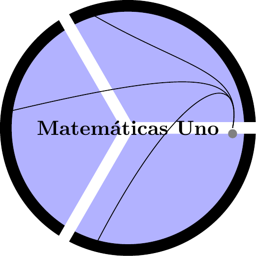

--- 
title: "Curso básico de Matemáticas Uno"
author: "Carlos Andrés Escobar Guerra - Juan Alberto Arias Quiceno - John Jairo Estrada Alvarez"
date: "2026-04-29"
site: bookdown::bookdown_site
output:
  bookdown::gitbook:
    css: style.css
documentclass: book
bibliography: [book.bib, packages.bib, mi_biblio.bib, mibib.bib]
#bibliography: book.bib
csl: apa.csl
biblio-style: apalike
link-citations: yes
cover-image: images/portada.jpg
description: "Este texto se realizó usando bookdown package para escribir libros digitales."
url: "https://jestrada2020.github.io/MatematicaUno/"
github-repo: "jestrada2020/MatematicaUno"

# title: "Curso básico de Matemáticas Uno"
# author:  "Carlos Andrés Escobar Guerra - Juan Alberto Arias Quiceno - John Jairo Estrada Alvarez"
# date: "2026-04-29"
# site: bookdown::bookdown_site
# output: 
#   bookdown::gitbook:
#     # split_by: "section+number"
#     css: misEstilos.css
# documentclass: book
# bibliography: book.bib
# csl: apa.csl
# biblio-style: apalike
# link-citations: yes
# cover-image: images/portada.jpg
# description: "Este texto se realizó usando bookdown package para escribir libros digitales."
---


``` r
bookdown::serve_book()
```


<!-- https://www.geogebra.org/classic/afwb2p5f -->

# Prerrequisitos {-}

El curso de matemáticas uno sólo tiene los siguientes prerrequisitos básicos.




## Link de asistencia a clase

Este link es para realizar la asistencia y contribuir al medio ambiente. Recordar que debes generar tu asistencia entre las 8:00am y 10:00am
cada día que tenemos clase.

 1. Link [Grupo Martes-Jueves ](https://forms.gle/JB2AhNwFpAS3pzK29)

 2. Link [Grupo Miércoles-Viernes ](https://forms.gle/ii7gwsd1vxohxC4m6)

<!-- <meta name=viewport content="width=device-width,initial-scale=1"> -->
<!-- <meta charset="utf-8"/> -->
<!-- <script src="https://www.geogebra.org/apps/deployggb.js"></script> -->
<!-- <div id="ggb-elementSuperficieJJA02"></div> -->
<!-- <script> -->
<!--        var ggbAppSuperficieJJA02 = new GGBApplet({"material_id":"afwb2p5f", -->
<!--        "width": 600, -->
<!--        "height": 400, -->
<!--        "showToolBar": false, -->
<!--        "showAlgebraInput": false, -->
<!--        "showMenuBar": false }, -->
<!--        true); -->

<!--          window.addEventListener("load", function() { -->
<!--            ggbAppSuperficieJJA02.inject('ggb-elementSuperficieJJA02'); -->
<!--       }); -->
<!-- </script> -->

## Comportamentales


- Tener disposición para hacer silencio y generar un buen ambiente de escucha en el aula de clase.

- Tener la capacidad de acatar sugerencias para mejorar las técnicas de estudio ya adquiridas en procesos educativos pasados.

- Saber tomar nota mientras el profesor explica los temas de ese día.

- Repasar las notas de clase y complementar con la lectura del texto guía
según se avanza en el desarrollo temático del curso.


## Evaluativos

Tener los implementos básicos para una evaluación:

- Lapicero.

- Lapiz.

- Borrador.

- Calculadora.

- Todos los celulares apagados.

- Ir al baño antes de iniciar la evalualción.

- No hay preguntas en el desarrollo de la evaluación.

- Todas la maletas deben estar adelante.

## Fechas de evaluación Grupo A


* Primer parcial **Presencial** (25 $\%$) - **Fecha: Viernes $24$ de Febrero**

* Segundo Parcial **Presencial** (25 $\%$) - **Fecha: Viernes $31$ de Marzo**

* Tercer Parcial **Presencial** (25 $\%$) - **Fecha: Viernes $28$ de Abril**

* Cuarto Parcial **Presencial** (ó Parcial Final) (25 $\%$) - **Fecha: Viernes $31$ de Mayo**


## Fechas de evaluación Grupo B


* Primer parcial **Presencial** (25 $\%$) - **Fecha: Jueves $23$ de Febrero**

* Segundo Parcial **Presencial** (25 $\%$) - **Fecha: Jueves $30$ de Marzo**

* Tercer Parcial **Presencial** (25 $\%$) - **Fecha: Jueves $27$ de Abril**

* Cuarto Parcial **Presencial** (ó Parcial Final) (25 $\%$) - **Fecha: Jueves $30$ de Mayo**


<!-- ### Talleres evaluativos -->

<!-- * Primer Taller (5 $\%$) - **Fecha: Viernes $18$ de Febrero** -->

<!-- * Segundo Taller (5 $\%$) - **Fecha: Viernes $18$ de Marzo** -->

<!-- * Tercer Taller (5 $\%$) - **Fecha: Viernes $22$ de Abril** -->

<!-- * Cuarto Taller (5 $\%$) - **Fecha: Viernes $28$ de Mayo** -->


<!-- ```{r echo=FALSE, message=FALSE, warning=FALSE} -->
<!-- library(calendR) -->
<!-- # calendR() -->
<!-- # calendR(year = 2020, month =8) -->
<!-- calendR(year = 2023, month = 02,        # Año y mes -->
<!--         start = "M",                   # Empezar la semana en lunes -->
<!--         text = c("1PGpB","1PGpA"), -->
<!--         text.pos = c(23,24),       # Días en los que poner los textos -->
<!--         text.size = 3.5,               # Tamaño de fuente de los textos -->
<!--         text.col = 2, -->
<!--         special.days =  c(23,24), -->
<!--         special.col = rgb(0, 0, 1,  alpha = 0.25),) -->
<!-- ``` -->


<!-- ```{r echo=FALSE, message=FALSE, warning=FALSE} -->
<!-- library(calendR) -->
<!-- # calendR() -->
<!-- # calendR(year = 2020, month =8) -->
<!-- calendR(year = 2023, month = 03,        # Año y mes -->
<!--         start = "M",                   # Empezar la semana en lunes -->
<!--         text = c("2PGpB","2PGpA"), -->
<!--         text.pos = c(30,31),       # Días en los que poner los textos -->
<!--         text.size = 3.5,               # Tamaño de fuente de los textos -->
<!--         text.col = 2, -->
<!--         special.days =  c(30,31), -->
<!--         special.col = rgb(0, 0, 1,  alpha = 0.25),) -->
<!-- ``` -->


<!-- ```{r echo=FALSE, message=FALSE, warning=FALSE} -->
<!-- library(calendR) -->
<!-- # calendR() -->
<!-- # calendR(year = 2020, month =8) -->
<!-- calendR(year = 2023, month = 04,        # Año y mes -->
<!--         start = "M",                   # Empezar la semana en lunes -->
<!--         text = c("3PGpB","3PGpA"), -->
<!--         text.pos = c(27,28),       # Días en los que poner los textos -->
<!--         text.size = 3.5,               # Tamaño de fuente de los textos -->
<!--         text.col = 2, -->
<!--         special.days =  c(27,28), -->
<!--         special.col = rgb(0, 0, 1,  alpha = 0.25),) -->
<!-- ``` -->


<!-- ```{r echo=FALSE, message=FALSE, warning=FALSE} -->
<!-- library(calendR) -->
<!-- # calendR() -->
<!-- # calendR(year = 2020, month =8) -->
<!-- calendR(year = 2023, month = 05,        # Año y mes -->
<!--         start = "M",                   # Empezar la semana en lunes -->
<!--         text = c("4PGpB","4PGpA"), -->
<!--         text.pos = c(30,31),       # Días en los que poner los textos -->
<!--         text.size = 3.5,               # Tamaño de fuente de los textos -->
<!--         text.col = 2, -->
<!--         special.days =  c(30,31), -->
<!--         special.col = rgb(0, 0, 1,  alpha = 0.25),) -->
<!-- ``` -->


<!-- ```{r echo=FALSE, message=FALSE, warning=FALSE} -->
<!-- library(calendR) -->
<!-- # calendR() -->
<!-- # calendR(year = 2020, month =8) -->
<!-- calendR(year = 2023, month = 06,        # Año y mes -->
<!--         start = "M",                   # Empezar la semana en lunes -->
<!--         text = c("4PGpB","4PGpA"), -->
<!--         text.pos = c(8,9),       # Días en los que poner los textos -->
<!--         text.size = 3.5,               # Tamaño de fuente de los textos -->
<!--         text.col = 2, -->
<!--         special.days =  c(8,9), -->
<!--         special.col = rgb(0, 0, 1,  alpha = 0.25),) -->
<!-- ``` -->


## Video motivacional

```{=html}
<table style="width:100%; border-collapse:separate; border-spacing:0.8rem; margin-bottom:1rem;">
  <tr>
    <td style="width:50%; vertical-align:top; padding:0;">
      <div style="text-align:center; font-weight:bold; color:#1a5276; font-size:0.95rem; margin-bottom:0.5rem;">Todos tenemos un matemático interno</div>
      <a href="https://www.youtube.com/watch?v=BbA5dpS4CcI" target="_blank" rel="noopener noreferrer" style="display:block; position:relative; border-radius:0.75rem; overflow:hidden; box-shadow:0 4px 12px rgba(0,0,0,0.15); text-decoration:none;">
        
        <div style="position:absolute; top:0; left:0; width:100%; height:100%; display:flex; align-items:center; justify-content:center; pointer-events:none;">
          <div style="width:60px; height:60px; background:rgba(255,0,0,0.92); border-radius:50%; display:flex; align-items:center; justify-content:center; box-shadow:0 4px 24px rgba(0,0,0,0.6);">
            <div style="width:0; height:0; border-top:12px solid transparent; border-bottom:12px solid transparent; border-left:20px solid white; margin-left:4px;"></div>
          </div>
        </div>
      </a>
    </td>
    <td style="width:50%; vertical-align:top; padding:0;">
      <div style="text-align:center; font-weight:bold; color:#1a5276; font-size:0.95rem; margin-bottom:0.5rem;">Así ve el mundo un matemático</div>
      <a href="https://www.youtube.com/watch?v=eAcf73ulv9E" target="_blank" rel="noopener noreferrer" style="display:block; position:relative; border-radius:0.75rem; overflow:hidden; box-shadow:0 4px 12px rgba(0,0,0,0.15); text-decoration:none;">
        
        <div style="position:absolute; top:0; left:0; width:100%; height:100%; display:flex; align-items:center; justify-content:center; pointer-events:none;">
          <div style="width:60px; height:60px; background:rgba(255,0,0,0.92); border-radius:50%; display:flex; align-items:center; justify-content:center; box-shadow:0 4px 24px rgba(0,0,0,0.6);">
            <div style="width:0; height:0; border-top:12px solid transparent; border-bottom:12px solid transparent; border-left:20px solid white; margin-left:4px;"></div>
          </div>
        </div>
      </a>
    </td>
  </tr>
  <tr>
    <td style="width:50%; vertical-align:top; padding:0;">
      <div style="text-align:center; font-weight:bold; color:#1a5276; font-size:0.95rem; margin-bottom:0.5rem;">El tipo que te convencerá de que las matemáticas son la profesión del futuro</div>
      <a href="https://www.youtube.com/watch?v=NILudp6hti8" target="_blank" rel="noopener noreferrer" style="display:block; position:relative; border-radius:0.75rem; overflow:hidden; box-shadow:0 4px 12px rgba(0,0,0,0.15); text-decoration:none;">
        
        <div style="position:absolute; top:0; left:0; width:100%; height:100%; display:flex; align-items:center; justify-content:center; pointer-events:none;">
          <div style="width:60px; height:60px; background:rgba(255,0,0,0.92); border-radius:50%; display:flex; align-items:center; justify-content:center; box-shadow:0 4px 24px rgba(0,0,0,0.6);">
            <div style="width:0; height:0; border-top:12px solid transparent; border-bottom:12px solid transparent; border-left:20px solid white; margin-left:4px;"></div>
          </div>
        </div>
      </a>
    </td>
    <td style="width:50%; vertical-align:top; padding:0;">
      <div style="text-align:center; font-weight:bold; color:#1a5276; font-size:0.95rem; margin-bottom:0.5rem;">Neil Degrasse: Los responsables de enseñar ciencia...</div>
      <a href="https://www.youtube.com/watch?v=CVe8narE2PI" target="_blank" rel="noopener noreferrer" style="display:block; position:relative; border-radius:0.75rem; overflow:hidden; box-shadow:0 4px 12px rgba(0,0,0,0.15); text-decoration:none;">
        
        <div style="position:absolute; top:0; left:0; width:100%; height:100%; display:flex; align-items:center; justify-content:center; pointer-events:none;">
          <div style="width:60px; height:60px; background:rgba(255,0,0,0.92); border-radius:50%; display:flex; align-items:center; justify-content:center; box-shadow:0 4px 24px rgba(0,0,0,0.6);">
            <div style="width:0; height:0; border-top:12px solid transparent; border-bottom:12px solid transparent; border-left:20px solid white; margin-left:4px;"></div>
          </div>
        </div>
      </a>
    </td>
  </tr>
  <tr>
    <td style="width:50%; vertical-align:top; padding:0;">
      <div style="text-align:center; font-weight:bold; color:#1a5276; font-size:0.95rem; margin-bottom:0.5rem;">Cuando ya no esté: Neil Degrasse</div>
      <a href="https://www.youtube.com/watch?v=MmHsKnjgGC4" target="_blank" rel="noopener noreferrer" style="display:block; position:relative; border-radius:0.75rem; overflow:hidden; box-shadow:0 4px 12px rgba(0,0,0,0.15); text-decoration:none;">
        
        <div style="position:absolute; top:0; left:0; width:100%; height:100%; display:flex; align-items:center; justify-content:center; pointer-events:none;">
          <div style="width:60px; height:60px; background:rgba(255,0,0,0.92); border-radius:50%; display:flex; align-items:center; justify-content:center; box-shadow:0 4px 24px rgba(0,0,0,0.6);">
            <div style="width:0; height:0; border-top:12px solid transparent; border-bottom:12px solid transparent; border-left:20px solid white; margin-left:4px;"></div>
          </div>
        </div>
      </a>
    </td>
    <td style="width:50%; vertical-align:top; padding:0;">
      <div style="text-align:center; font-weight:bold; color:#1a5276; font-size:0.95rem; margin-bottom:0.5rem;">Jack Andraka - Ingredientes clave para innovar</div>
      <a href="https://www.youtube.com/watch?v=lFgQszLE6vM" target="_blank" rel="noopener noreferrer" style="display:block; position:relative; border-radius:0.75rem; overflow:hidden; box-shadow:0 4px 12px rgba(0,0,0,0.15); text-decoration:none;">
        
        <div style="position:absolute; top:0; left:0; width:100%; height:100%; display:flex; align-items:center; justify-content:center; pointer-events:none;">
          <div style="width:60px; height:60px; background:rgba(255,0,0,0.92); border-radius:50%; display:flex; align-items:center; justify-content:center; box-shadow:0 4px 24px rgba(0,0,0,0.6);">
            <div style="width:0; height:0; border-top:12px solid transparent; border-bottom:12px solid transparent; border-left:20px solid white; margin-left:4px;"></div>
          </div>
        </div>
      </a>
    </td>
  </tr>
  <tr>
    <td style="width:50%; vertical-align:top; padding:0;">
      <div style="text-align:center; font-weight:bold; color:#1a5276; font-size:0.95rem; margin-bottom:0.5rem;">Dan Kaminski: En internet hay siete llaves de seguridad...</div>
      <a href="https://www.youtube.com/watch?v=B-icPvF3RG8" target="_blank" rel="noopener noreferrer" style="display:block; position:relative; border-radius:0.75rem; overflow:hidden; box-shadow:0 4px 12px rgba(0,0,0,0.15); text-decoration:none;">
        
        <div style="position:absolute; top:0; left:0; width:100%; height:100%; display:flex; align-items:center; justify-content:center; pointer-events:none;">
          <div style="width:60px; height:60px; background:rgba(255,0,0,0.92); border-radius:50%; display:flex; align-items:center; justify-content:center; box-shadow:0 4px 24px rgba(0,0,0,0.6);">
            <div style="width:0; height:0; border-top:12px solid transparent; border-bottom:12px solid transparent; border-left:20px solid white; margin-left:4px;"></div>
          </div>
        </div>
      </a>
    </td>
    <td style="width:50%; vertical-align:top; padding:0;">
      <div style="text-align:center; font-weight:bold; color:#1a5276; font-size:0.95rem; margin-bottom:0.5rem;">Cómo se Inventaron los Números Imaginarios</div>
      <a href="https://www.youtube.com/watch?v=VN7nipynE0c" target="_blank" rel="noopener noreferrer" style="display:block; position:relative; border-radius:0.75rem; overflow:hidden; box-shadow:0 4px 12px rgba(0,0,0,0.15); text-decoration:none;">
        
        <div style="position:absolute; top:0; left:0; width:100%; height:100%; display:flex; align-items:center; justify-content:center; pointer-events:none;">
          <div style="width:60px; height:60px; background:rgba(255,0,0,0.92); border-radius:50%; display:flex; align-items:center; justify-content:center; box-shadow:0 4px 24px rgba(0,0,0,0.6);">
            <div style="width:0; height:0; border-top:12px solid transparent; border-bottom:12px solid transparent; border-left:20px solid white; margin-left:4px;"></div>
          </div>
        </div>
      </a>
    </td>
  </tr>
  <tr>
    <td colspan="2" style="width:50%; vertical-align:top; padding:0;">
      <div style="max-width:560px; margin:0 auto;">
        <div style="text-align:center; font-weight:bold; color:#1a5276; font-size:0.95rem; margin-bottom:0.5rem;">Técnica de Po Shen Loh</div>
        <a href="https://www.youtube.com/watch?v=GFO6FCbSCyo" target="_blank" rel="noopener noreferrer" style="display:block; position:relative; border-radius:0.75rem; overflow:hidden; box-shadow:0 4px 12px rgba(0,0,0,0.15); text-decoration:none;">
          
          <div style="position:absolute; top:0; left:0; width:100%; height:100%; display:flex; align-items:center; justify-content:center; pointer-events:none;">
            <div style="width:60px; height:60px; background:rgba(255,0,0,0.92); border-radius:50%; display:flex; align-items:center; justify-content:center; box-shadow:0 4px 24px rgba(0,0,0,0.6);">
              <div style="width:0; height:0; border-top:12px solid transparent; border-bottom:12px solid transparent; border-left:20px solid white; margin-left:4px;"></div>
            </div>
          </div>
        </a>
      </div>
    </td>
  </tr>
</table>
```


## Página para reforzar conceptos básicos

El siguiente link es una página para repasar conceptos basicos que requieras en tu formación. [Página Web ](https://www.thatquiz.org/)


## Matemáticas del planeta tierra

El siguiente link es una página para ver las matemáticas del planeta tierra, como sus conceptos basicos influyen en el aprendizaje continuo y sus implicaciones en nuestro planeta. [Página Web ](http://www.mpe2013.org/)


# Desarrollo temático

## Objetivo general

Resolver problemas matemáticos para desarrollar el pensamiento lógico y deductivo, utilizando las leyes y principios de la lógica de la matemática, para que le permita razonar de manera adecuada con creatividad.

## Objetivos específicos 

* Iniciar el estudio de los conjuntos numéricos y caracterizar sus 
  propiedades básicas para resolver desigualdades y sus diversas aplicaciones
* Resolver desigualdades entre números reales para aplicar su soluciones en 
  diferentes escenarios de la Química Farmacéutica.
* Efectuar operaciones de aritmética básica
* Fundamentar la proporcionalidad directa e inversa
* Efectuar simplificar expresiones algebraicas.
* Categorizar el número de raíces reales de un polinomio, calcular algunas de ellas.
* Describir las funciones trigonométricas a partir de la relación existente entre  el triángulo rectángulo, y el círculo unitario, para resolver problemas trigonométricos en diversas disciplinas de la ciencias aplicadas.


## **Clase a clase**

#### **Sistema numérico de la línea Real**

* Concepto de conjunto y sus propiedades básicas
* Conjuntos numéricos y su clasificaciòn
* Concepto de distancia en la linea real
* Desigualdades y sus propiedades
* concepto de valor absoluto y sus propiedades
* Desigualdades con valor absoluto

#### **Algebra**

* Productos notables
* Factorización. 
* Simplificación de expresiones racionales 
* Expresiones racionales compuestas 
* Potenciación y radicación 
* Polinomios 
* Teorema del residuo y teorema del factor 
* Raíces racionales de un polinomio Teorema fundamental del álgebra 
* Ley de signos de Descartes 
* Factorización sobre complejos 
* Aproximación de raíces irracionales (Métodos de Bisección, Regla Falsa y Secante). 


#### **Sistema de coordenadas cartesianas**

* Distancia 
* Ecuación de la recta 
* Ecuación de la circunferencia 
* Funciones (Dominio y Rango) 
* Operaciones con funciones 
* Problemas de aplicación

#### **Funciones  exponencial y logarítmica**

* Propiedades de la función exponencial. 
* Representación gráfica de la función exponencial.
* Ecuaciones exponenciales y su solución.
* Propiedades de la funcion logaritmica. 
* Representición gráfica de la función logaritmica.
* Ecuaciones logaritmicas y su solución. 
* Problemas de la función exponencial y logaritmica.

#### **Trigonometría**

* Definiciones básicas
* Definición de las funciones trigonometricas a partir del triángulo rectángulo.
* Aplicaciones trigonometricas usando el triángulo rectángulo.
* Relación entre el triangulo rectángulo y el círculo unitario.
* Valores trigonometricos para los ángulos básicos en el círculo unitario.
* Identidades básicas.
* funciones trigonometricas inversas básicas.
* Ecuaciones trigonometricas.
* Teorema del seno.
* Teorema del coseno.


## Bibliografía

* Dennis Zill, Algebra y trigonometría con Geometría Analítica, 8 ed. Mc Graw Hill

* SWOKOWSKI, Earl. Álgebra y Trigonometría con Geometría Analítica. 9ª ed. México. Thomson. 1998. 976p.

* DIEZ, Luis. Matemáticas Operativas. 15ª ed. Medellín. Zona Dinámica. 1998, 289p.

* ALLENDOFER, Carl & Oakley, Cletus. Matemáticas Universitarias. 4ª ed. Bogotá. McGraw-Hill. 2003. 383p.

* STEWART, JAMES. precálculo. Matemáticas para el Cálculo. 5ª ed. México. Thomson. 2007. 933 p.

* SPIEGEL, Murray. Álgebra Superior. México. McGraw-Hill. 1997. 312p.


## Video manejo de la Casio $f_{x}350MS$

En esta sección se presentan videos con pautas de cómo usar la calculadora Casio (incluyendo versiones como $f_{x}82MS$) y videos de repaso sobre métodos algebraicos.

```{=html}
<table style="width:100%; border-collapse:separate; border-spacing:0.8rem; margin-bottom:1rem;">
  <tr>
    <td style="width:50%; vertical-align:top; padding:0;">
      <div style="text-align:center; font-weight:bold; color:#1a5276; font-size:0.95rem; margin-bottom:0.5rem;">USAO GENERAL</div>
      <a href="https://www.youtube.com/watch?v=lZ54IR5pSyc" target="_blank" rel="noopener noreferrer" style="display:block; position:relative; border-radius:0.75rem; overflow:hidden; box-shadow:0 4px 12px rgba(0,0,0,0.15); text-decoration:none;">
        
        <div style="position:absolute; top:0; left:0; width:100%; height:100%; display:flex; align-items:center; justify-content:center; pointer-events:none;">
          <div style="width:60px; height:60px; background:rgba(255,0,0,0.92); border-radius:50%; display:flex; align-items:center; justify-content:center; box-shadow:0 4px 24px rgba(0,0,0,0.6);">
            <div style="width:0; height:0; border-top:12px solid transparent; border-bottom:12px solid transparent; border-left:20px solid white; margin-left:4px;"></div>
          </div>
        </div>
      </a>
    </td>
    <td style="width:50%; vertical-align:top; padding:0;">
      <div style="text-align:center; font-weight:bold; color:#1a5276; font-size:0.95rem; margin-bottom:0.5rem;">Sistema 2 por 2 usando Regla de Cramer</div>
      <a href="https://www.youtube.com/watch?v=qXm2DK9XTRg" target="_blank" rel="noopener noreferrer" style="display:block; position:relative; border-radius:0.75rem; overflow:hidden; box-shadow:0 4px 12px rgba(0,0,0,0.15); text-decoration:none;">
        
        <div style="position:absolute; top:0; left:0; width:100%; height:100%; display:flex; align-items:center; justify-content:center; pointer-events:none;">
          <div style="width:60px; height:60px; background:rgba(255,0,0,0.92); border-radius:50%; display:flex; align-items:center; justify-content:center; box-shadow:0 4px 24px rgba(0,0,0,0.6);">
            <div style="width:0; height:0; border-top:12px solid transparent; border-bottom:12px solid transparent; border-left:20px solid white; margin-left:4px;"></div>
          </div>
        </div>
      </a>
    </td>
  </tr>
  <tr>
    <td style="width:50%; vertical-align:top; padding:0;">
      <div style="text-align:center; font-weight:bold; color:#1a5276; font-size:0.95rem; margin-bottom:0.5rem;">Ecuación cuadrática</div>
      <a href="https://www.youtube.com/watch?v=4M_L66oECa0" target="_blank" rel="noopener noreferrer" style="display:block; position:relative; border-radius:0.75rem; overflow:hidden; box-shadow:0 4px 12px rgba(0,0,0,0.15); text-decoration:none;">
        
        <div style="position:absolute; top:0; left:0; width:100%; height:100%; display:flex; align-items:center; justify-content:center; pointer-events:none;">
          <div style="width:60px; height:60px; background:rgba(255,0,0,0.92); border-radius:50%; display:flex; align-items:center; justify-content:center; box-shadow:0 4px 24px rgba(0,0,0,0.6);">
            <div style="width:0; height:0; border-top:12px solid transparent; border-bottom:12px solid transparent; border-left:20px solid white; margin-left:4px;"></div>
          </div>
        </div>
      </a>
    </td>
    <td style="width:50%; vertical-align:top; padding:0;">
      <div style="text-align:center; font-weight:bold; color:#1a5276; font-size:0.95rem; margin-bottom:0.5rem;">Regla de Sarrus - Matriz 3 por 3</div>
      <a href="https://www.youtube.com/watch?v=vBNBkth3YE0" target="_blank" rel="noopener noreferrer" style="display:block; position:relative; border-radius:0.75rem; overflow:hidden; box-shadow:0 4px 12px rgba(0,0,0,0.15); text-decoration:none;">
        
        <div style="position:absolute; top:0; left:0; width:100%; height:100%; display:flex; align-items:center; justify-content:center; pointer-events:none;">
          <div style="width:60px; height:60px; background:rgba(255,0,0,0.92); border-radius:50%; display:flex; align-items:center; justify-content:center; box-shadow:0 4px 24px rgba(0,0,0,0.6);">
            <div style="width:0; height:0; border-top:12px solid transparent; border-bottom:12px solid transparent; border-left:20px solid white; margin-left:4px;"></div>
          </div>
        </div>
      </a>
    </td>
  </tr>
  <tr>
    <td colspan="2" style="width:50%; vertical-align:top; padding:0;">
      <div style="max-width:560px; margin:0 auto;">
        <div style="text-align:center; font-weight:bold; color:#1a5276; font-size:0.95rem; margin-bottom:0.5rem;">Sistema 3 por 3</div>
        <a href="https://www.youtube.com/watch?v=EpSmyXrbwWc" target="_blank" rel="noopener noreferrer" style="display:block; position:relative; border-radius:0.75rem; overflow:hidden; box-shadow:0 4px 12px rgba(0,0,0,0.15); text-decoration:none;">
          
          <div style="position:absolute; top:0; left:0; width:100%; height:100%; display:flex; align-items:center; justify-content:center; pointer-events:none;">
            <div style="width:60px; height:60px; background:rgba(255,0,0,0.92); border-radius:50%; display:flex; align-items:center; justify-content:center; box-shadow:0 4px 24px rgba(0,0,0,0.6);">
              <div style="width:0; height:0; border-top:12px solid transparent; border-bottom:12px solid transparent; border-left:20px solid white; margin-left:4px;"></div>
            </div>
          </div>
        </a>
      </div>
    </td>
  </tr>
</table>
```


